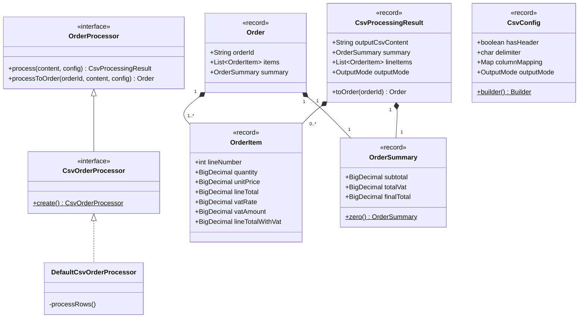

# CSV Order Processor Library (`csv-order-processor`)

[](https://openjdk.org/projects/jdk/17/)
[](LICENSE)
[-brightgreen.svg)]()
[]()

> **Thư viện Java 17 độc lập, hiệu năng cao dùng để đọc, bóc tách, chuẩn hóa dữ liệu, tính toán thuế VAT và tổng hợp số liệu đơn hàng từ các tệp CSV theo Chuẩn Siêu Thị (Supermarket Standard).**

---

## 🌟 Tính Năng Nổi Bật (Key Features)

1. **Chuẩn Tính Toán Siêu Thị (Supermarket VAT Standard):**
   - Làm tròn nửa lên (`RoundingMode.HALF_UP`) với độ chính xác cố định 2 chữ số thập phân (`scale = 2`).
   - Tổng thuế VAT (`totalVat`) và Tổng trước thuế (`subtotal`) là tổng của các dòng chi tiết đã được làm tròn $\rightarrow$ **Triệt tiêu hoàn toàn sai số tích lũy (Cumulative Rounding Drift)**.
2. **Tuân Thủ Tuyệt Đối RFC 4180 & Chuẩn Excel:**
   - Hỗ trợ ký tự phân cách linh hoạt (dấu phẩy `,`, chấm phẩy `;`, tab `\t`).
   - Xử lý mượt mà các trường có dấu ngoặc kép bọc chuỗi (quoted fields), dấu nháy kép escaping (`""`), và văn bản chứa ký tự xuống dòng (`CRLF` / `LF`).
3. **Ánh Xạ Metadata Động (Flexible Mapping):**
   - Hỗ trợ cả file CSV có Header (ánh xạ theo tên cột `String`) hoặc không có Header (ánh xạ theo vị trí cột 0-based `Integer`).
   - Tự động nhận diện tỷ lệ thuế có hoặc không có ký tự `%` (ví dụ: `10` hoặc `10%`).
4. **Phòng Vệ 2 Lớp (Two-Tier Encapsulation):**
   - **JPMS Module Boundary (`module-info.java`):** Chỉ xuất bản duy nhất gói `com.gpc.order.processor.api.*`.
   - **Package-Private:** Toàn bộ động cơ kỹ thuật nội bộ (`internal.csv`, `internal.calculator`, `internal.validator`) bị ẩn giấu hoàn toàn, ngăn chặn việc rò rỉ mã nguồn hoặc phụ thuộc trái phép.
5. **Zero Runtime Dependencies:**
   - Sử dụng $100\%$ thư viện chuẩn của Java 17 (`java.base`), không phụ thuộc vào Apache Commons CSV, OpenCSV, Jackson hay bất kỳ thư viện bên ngoài nào $\rightarrow$ **Không bao giờ gây xung đột version dependency khi tích hợp vào dự án khác.**
6. **Kiểm Tra Tính Toàn Vẹn Khắt Khe (Strict Validation):**
   - Ngắt tiến trình ngay lập tức và ném `CsvProcessingException` khi phát hiện dữ liệu rác, thiếu cột hoặc sai định dạng số, thông báo chính xác số dòng (1-indexed) và tên/vị trí cột lỗi.

---

## 📦 Cài Đặt (Installation)

### Yêu cầu môi trường
- **Java Development Kit (JDK):** Phiên bản 17 trở lên.
- **Apache Maven:** Phiên bản 3.6+ (nếu build từ mã nguồn).

### Maven Dependency
Thêm dependency sau vào tệp `pom.xml` của dự án sử dụng:

```xml
<dependency>
    <groupId>com.gpc.order</groupId>
    <artifactId>csv-order-processor</artifactId>
    <version>0.0.1</version>
</dependency>
```

---

## 🚀 Hướng Dẫn Sử Dụng Nhanh (Quickstart)

### 1. Xử Lý Tệp CSV Có Header (Chế Độ Tích Hợp - `DATA_MODE`)

Chế độ `DATA_MODE` thích hợp khi tích hợp API/MQ, trả về chuỗi CSV đã bổ sung cột "Tiền VAT" và đối tượng `OrderSummary` chứa 3 con số tổng hợp:

```java
import com.gpc.order.processor.api.CsvOrderProcessor;
import com.gpc.order.processor.api.config.ColumnKey;
import com.gpc.order.processor.api.config.CsvConfig;
import com.gpc.order.processor.api.config.OutputMode;
import com.gpc.order.processor.api.model.CsvProcessingResult;

public class DemoDataMode {
    public static void main(String[] args) {
        String csvData = """
                Mã SP,Tên SP,Số lượng,Đơn giá,% VAT
                SP01,Sữa tươi tiệt trùng,2,25000.00,10
                SP02,Bánh mì sandwich,1,30000.00,8
                """;

        // Cấu hình ánh xạ cột
        CsvConfig config = CsvConfig.builder()
                .hasHeader(true)
                .delimiter(',')
                .mapColumn("Số lượng", ColumnKey.QUANTITY)
                .mapColumn("Đơn giá", ColumnKey.UNIT_PRICE)
                .mapColumn("% VAT", ColumnKey.VAT_RATE)
                .outputMode(OutputMode.DATA_MODE)
                .build();

        // Khởi tạo processor và xử lý
        CsvOrderProcessor processor = CsvOrderProcessor.create();
        CsvProcessingResult result = processor.process(csvData, config);

        // 1. In chuỗi CSV kết quả (đã làm giàu thêm cột Tiền VAT)
        System.out.println("=== CSV KẾT QUẢ ===");
        System.out.println(result.outputCsvContent());

        // 2. Lấy 3 chỉ số tài chính tổng hợp
        System.out.println("Tổng trước thuế: " + result.summary().subtotal());   // 80000.00
        System.out.println("Tổng tiền VAT:   " + result.summary().totalVat());    // 7400.00
        System.out.println("Tổng thanh toán: " + result.summary().finalTotal());  // 87400.00
    }
}
```

---

### 2. Xử Lý Tệp CSV Không Có Header (Chế Độ Báo Cáo - `REPORT_MODE`)

Chế độ `REPORT_MODE` tự động chèn thêm 3 dòng Footer tổng cộng ở cuối file CSV:

```java
import com.gpc.order.processor.api.CsvOrderProcessor;
import com.gpc.order.processor.api.config.ColumnKey;
import com.gpc.order.processor.api.config.CsvConfig;
import com.gpc.order.processor.api.config.OutputMode;
import com.gpc.order.processor.api.model.CsvProcessingResult;

public class DemoReportMode {
    public static void main(String[] args) {
        // Dữ liệu CSV dùng dấu chấm phẩy ';' và không có dòng tiêu đề
        String csvData = """
                SP01;Bút bi Thiên Long;10;5000.00;10
                SP02;Vở kẻ ngang 200 trang;5;12000.00;8
                """;

        // Ánh xạ bằng chỉ số index 0-based
        CsvConfig config = CsvConfig.builder()
                .hasHeader(false)
                .delimiter(';')
                .mapColumn(2, ColumnKey.QUANTITY)
                .mapColumn(3, ColumnKey.UNIT_PRICE)
                .mapColumn(4, ColumnKey.VAT_RATE)
                .outputMode(OutputMode.REPORT_MODE)
                .build();

        CsvOrderProcessor processor = CsvOrderProcessor.create();
        CsvProcessingResult result = processor.process(csvData, config);

        // CSV trả về sẽ có 2 dòng sản phẩm + 3 dòng footer tổng cộng ở cuối:
        // SP01;Bút bi Thiên Long;10;5000.00;10;5000.00
        // SP02;Vở kẻ ngang 200 trang;5;12000.00;8;4800.00
        // Tổng trước thuế;;;;;110000.00
        // Tổng VAT;;;;;9800.00
        // Tổng thanh toán;;;;;119800.00
        System.out.println(result.outputCsvContent());
    }
}
```

---

### 3. Tích Hợp Hướng Đối Tượng: Ánh Xạ Sang Aggregate Root `Order`

Thư viện cho phép chuyển đổi trực tiếp kết quả xử lý thành đối tượng bất biến [Order](file:///c:/ai-native-oms-api/csv-order-processor/src/main/java/com/gpc/order/processor/api/model/Order.java):

```java
import com.gpc.order.processor.api.CsvOrderProcessor;
import com.gpc.order.processor.api.config.ColumnKey;
import com.gpc.order.processor.api.config.CsvConfig;
import com.gpc.order.processor.api.model.Order;
import com.gpc.order.processor.api.model.OrderItem;

import java.nio.file.Path;

public class DemoDomainModel {
    public static void main(String[] args) {
        CsvConfig config = CsvConfig.builder()
                .hasHeader(true)
                .delimiter(',')
                .mapColumn("SL", ColumnKey.QUANTITY)
                .mapColumn("Gia", ColumnKey.UNIT_PRICE)
                .mapColumn("VAT", ColumnKey.VAT_RATE)
                .build();

        CsvOrderProcessor processor = CsvOrderProcessor.create();

        // Xử lý trực tiếp từ file và nhận về Order
        Order order = processor.processToOrder("ORD-2026-001", Path.of("order_input.csv"), config);

        System.out.println("Mã đơn hàng: " + order.orderId());
        System.out.println("Số lượng mặt hàng: " + order.items().size());
        for (OrderItem item : order.items()) {
            System.out.printf("Dòng %d: Tiền hàng = %s, VAT = %s (thuế suất %s%%)%n",
                    item.lineNumber(), item.lineTotal(), item.vatAmount(), item.vatRate());
        }
        System.out.println("Tổng thanh toán đơn: " + order.summary().finalTotal());
    }
}
```

---

### 4. Bắt và Xử Lý Lỗi Dữ Liệu Rác (Strict Validation)

Khi một dòng dữ liệu bị lỗi (thiếu cột, sai định dạng số...), thư viện ném ngoại lệ [CsvProcessingException](file:///c:/ai-native-oms-api/csv-order-processor/src/main/java/com/gpc/order/processor/api/exception/CsvProcessingException.java) chứa chi tiết vị trí lỗi:

```java
import com.gpc.order.processor.api.CsvOrderProcessor;
import com.gpc.order.processor.api.config.ColumnKey;
import com.gpc.order.processor.api.config.CsvConfig;
import com.gpc.order.processor.api.exception.CsvProcessingException;

public class DemoErrorHandling {
    public static void main(String[] args) {
        String dirtyCsv = """
                Mã SP,Số lượng,Đơn giá,% VAT
                SP01,10,5000.00,10
                SP02,KhôngPhảiSố,20000.00,10
                """;

        CsvConfig config = CsvConfig.builder()
                .hasHeader(true)
                .delimiter(',')
                .mapColumn("Số lượng", ColumnKey.QUANTITY)
                .mapColumn("Đơn giá", ColumnKey.UNIT_PRICE)
                .mapColumn("% VAT", ColumnKey.VAT_RATE)
                .build();

        try {
            CsvOrderProcessor.create().process(dirtyCsv, config);
        } catch (CsvProcessingException ex) {
            System.err.println("❌ Phát hiện dòng dữ liệu không hợp lệ!");
            System.err.println("-> Số thứ tự dòng lỗi: " + ex.getLineNumber());        // 3
            System.err.println("-> Cột phát sinh lỗi:    " + ex.getColumnIdentifier()); // Số lượng
            System.err.println("-> Thông báo chi tiết:   " + ex.getMessage());
        }
    }
}
```

---

## 🏛️ Kiến Trúc Hệ Thống (Architecture & Domain Model)



### Các Khối Package Chính:
- **`com.gpc.order.processor.api`**: Giao diện công khai chính ([OrderProcessor](file:///c:/ai-native-oms-api/csv-order-processor/src/main/java/com/gpc/order/processor/api/OrderProcessor.java), [CsvOrderProcessor](file:///c:/ai-native-oms-api/csv-order-processor/src/main/java/com/gpc/order/processor/api/CsvOrderProcessor.java)).
- **`com.gpc.order.processor.api.config`**: Cấu hình metadata ([CsvConfig](file:///c:/ai-native-oms-api/csv-order-processor/src/main/java/com/gpc/order/processor/api/config/CsvConfig.java), [ColumnKey](file:///c:/ai-native-oms-api/csv-order-processor/src/main/java/com/gpc/order/processor/api/config/ColumnKey.java), [OutputMode](file:///c:/ai-native-oms-api/csv-order-processor/src/main/java/com/gpc/order/processor/api/config/OutputMode.java)).
- **`com.gpc.order.processor.api.model`**: Mô hình miền bất biến ([Order](file:///c:/ai-native-oms-api/csv-order-processor/src/main/java/com/gpc/order/processor/api/model/Order.java), [OrderItem](file:///c:/ai-native-oms-api/csv-order-processor/src/main/java/com/gpc/order/processor/api/model/OrderItem.java), [OrderSummary](file:///c:/ai-native-oms-api/csv-order-processor/src/main/java/com/gpc/order/processor/api/model/OrderSummary.java), [CsvProcessingResult](file:///c:/ai-native-oms-api/csv-order-processor/src/main/java/com/gpc/order/processor/api/model/CsvProcessingResult.java)).
- **`com.gpc.order.processor.api.exception`**: Ngoại lệ miền ([CsvProcessingException](file:///c:/ai-native-oms-api/csv-order-processor/src/main/java/com/gpc/order/processor/api/exception/CsvProcessingException.java)).
- **`com.gpc.order.processor.internal.*`**: *(Package-Private)* Động cơ parser, calculator, validator, writer.

---

## ⚙️ Bảng Tùy Chọn Cấu Hình (`CsvConfig`)

| Phương thức Builder | Kiểu dữ liệu | Mặc định | Mô tả |
|---|---|---|---|
| `hasHeader(boolean)` | `boolean` | `true` | `true` nếu dòng đầu tiên của file CSV là dòng tiêu đề. |
| `delimiter(char)` | `char` | `','` | Ký tự phân cách các cột (chấp nhận `,`, `;`, `\t`...). |
| `mapColumn(Object, ColumnKey)` | `Object, ColumnKey` | Bắt buộc | Gán tên cột (`String`) hoặc vị trí cột 0-based (`Integer`) vào khóa nghiệp vụ. |
| `columnMapping(Map)` | `Map<?, ColumnKey>` | Bắt buộc | Thiết lập toàn bộ bản đồ ánh xạ. |
| `outputMode(OutputMode)` | `OutputMode` | `DATA_MODE` | `REPORT_MODE` (có 3 dòng footer ở cuối) hoặc `DATA_MODE` (thuần danh sách mặt hàng). |

### Các khóa cột nghiệp vụ (`ColumnKey`):
- `ColumnKey.QUANTITY`: Cột Số lượng (bắt buộc nếu không có `TOTAL`).
- `ColumnKey.UNIT_PRICE`: Cột Đơn giá (bắt buộc nếu không có `TOTAL`).
- `ColumnKey.TOTAL`: Cột Thành tiền dòng có sẵn (nếu có sẽ ưu tiên dùng).
- `ColumnKey.VAT_RATE`: Cột % thuế VAT (**bắt buộc**).

---

## 🛠️ Biên Dịch & Kiểm Thử (Build & Test)

Thư viện đi kèm bộ kiểm thử tự động 21 test cases bao quát mọi kịch bản tính toán, parsing RFC 4180 và tính bất biến:

```bash
# Chạy toàn bộ Unit & Integration tests
mvn clean test

# Đóng gói file JAR và Sources JAR
mvn package
```

Kết quả đóng gói:
- `target/csv-order-processor-0.0.1.jar`
- `target/csv-order-processor-0.0.1-sources.jar`

---

## 📄 Tài Liệu Tham Khảo Liên Quan
- [Đặc Tả Kỹ Thuật Chi Tiết (Technical Specification)](../docs/csv-order-processor-technical-spec.md)
- [Mô Hình Miền & Biểu Đồ Lớp (Domain Model & PlantUML)](../docs/csv-order-domain-model.md)
- [Đặc Tả OpenAPI / REST API Wrapper](../docs/csv-order-api-spec.md)
- [Bộ Tiêu Chuẩn Lập Trình (Coding Standards)](../docs/csv-library-coding-standards.md)
