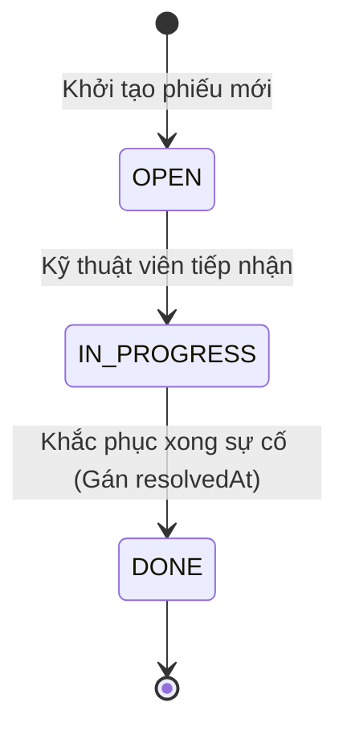

<!--
Role: Principal Domain Architect & Modeling Lead
Task: Core Domain Model, Invariants, State Machine, and Target File Mapping for Outage Work Order
Context files: docs/00-coding-rules.md, docs/00-api-rules.md, docs/02-database-migration-spec.md
Constraints: JPA Entity, UUID PK, Instant UTC, strict UPPER_SNAKE Enums, One-way State Machine
Target Files:
- src/main/java/com/gpc/oms/domain/WorkOrder.java
- src/main/java/com/gpc/oms/domain/WorkOrderStatus.java
- src/main/java/com/gpc/oms/domain/Priority.java
- src/main/java/com/gpc/oms/repository/WorkOrderRepository.java
-->
# Khung Kiến trúc Nghiệp vụ (Domain Model)

Tài liệu này xác định các thực thể cốt lõi, thuộc tính dữ liệu và quy tắc bất biến (Invariants) bắt buộc tuân thủ của microservice Outage Work Order.

---

## 1. Thực thể `WorkOrder` (Phiếu Sự Cố Lưới Điện)

- **Target File:** `src/main/java/com/gpc/oms/domain/WorkOrder.java`
- **Bảng CSDL:** `work_orders`

### Bảng Cấu trúc Thuộc tính (Table-Driven Schema)

| Thuộc tính | Kiểu Dữ liệu (Java) | Ràng buộc & Annotation | Mô tả Nghiệp vụ |
|---|---|---|---|
| `id` | `java.util.UUID` | `@Id @GeneratedValue(strategy = GenerationType.UUID)` | Định danh duy nhất toàn hệ thống của phiếu sự cố |
| `equipmentId` | `java.lang.String` | `@Column(nullable = false, length = 50)` | Mã thiết bị lưới điện xảy ra sự cố (Trạm biến áp, Recloser) |
| `description` | `java.lang.String` | `@Column(nullable = false, length = 500)` | Nội dung mô tả chi tiết nguyên nhân/hiện trường sự cố |
| `priority` | `com.gpc.oms.domain.Priority` | `@Enumerated(EnumType.STRING), @Column(nullable = false, length = 20)` | Mức độ ưu tiên xử lý: `LOW`, `MEDIUM`, `HIGH`, `CRITICAL` |
| `status` | `com.gpc.oms.domain.WorkOrderStatus` | `@Enumerated(EnumType.STRING), @Column(nullable = false, length = 20)` | Trạng thái vòng đời: `OPEN`, `IN_PROGRESS`, `DONE` |
| `createdAt` | `java.time.Instant` | `@Column(nullable = false, updatable = false)` | Thời điểm tạo phiếu, chuẩn UTC, gán tự động khi khởi tạo |
| `resolvedAt` | `java.time.Instant` | `@Column(nullable = true)` | Thời điểm khắc phục sự cố, tự động gán khi `status = DONE` |

---

## 2. Máy Trạng Thái Đơn Hướng (One-way State Machine)

- **Target File:** `src/main/java/com/gpc/oms/domain/WorkOrderStatus.java`

Vòng đời của `WorkOrder` tuân thủ nguyên tắc tuyến tính nghiêm ngặt. **Cấm tuyệt đối mọi hành vi lùi trạng thái.**

### Sơ đồ Chuyển đổi Trạng thái

### Bảng Ma trận Chuyển đổi Hợp lệ

| Trạng thái Hiện tại (`current`) | Trạng thái Đích (`target`) | Hợp lệ? | Xử lý Kèm theo | Mã Ngoại lệ khi Vi phạm |
|---|---|---|---|---|
| `OPEN` | `IN_PROGRESS` | **Hợp lệ** | Cập nhật `status = IN_PROGRESS` | N/A |
| `OPEN` | `DONE` | **Không hợp lệ** | Không được nhảy cóc giai đoạn | `422 Unprocessable Entity` |
| `IN_PROGRESS` | `DONE` | **Hợp lệ** | Gán `resolvedAt = Instant.now()` | N/A |
| `IN_PROGRESS` | `OPEN` | **Không hợp lệ** | Cấm lùi trạng thái | `422 Unprocessable Entity` |
| `DONE` | Bất kỳ trạng thái nào | **Không hợp lệ** | Trạng thái đóng băng (Terminal State) | `422 Unprocessable Entity` |

---

## 3. Thuật toán Nghiệp vụ Chuyển Trạng thái (Step-by-step Logic)

### Phương thức `WorkOrder.advanceStatus(WorkOrderStatus newStatus)`

1. **Kiểm tra Tính Chuyển tiếp:** Gọi `this.status.canTransitionTo(newStatus)`.
2. **Rẽ nhánh Vi phạm:**
   - Nếu kết quả là `false`: Ném ngoại lệ `IllegalStateException("Invalid state transition from " + this.status + " to " + newStatus)`.
3. **Thực thi Chuyển đổi:**
   - Cập nhật `this.status = newStatus`.
4. **Tự động Gán Thời gian Hoàn tất:**
   - Nếu `newStatus == WorkOrderStatus.DONE`: Gán `this.resolvedAt = Instant.now()`.
5. **Trả về:** Bản ghi `WorkOrder` đã cập nhật.

---

## 4. Ràng buộc Kiến trúc (Architectural Constraints)

1. **Bảo toàn Bất biến (Domain Invariant Encapsulation):** Mọi thay đổi trạng thái phải đi qua method `advanceStatus()`. Tuyệt đối không sinh method `setStatus()` công khai (Public Setter).
2. **Trách nhiệm Tầng:**
   - Controller $\rightarrow$ Ủy quyền 100% cho `WorkOrderService`.
   - Service $\rightarrow$ Gọi Entity Domain để kiểm tra luật nghiệp vụ và lưu thông qua `WorkOrderRepository`.
