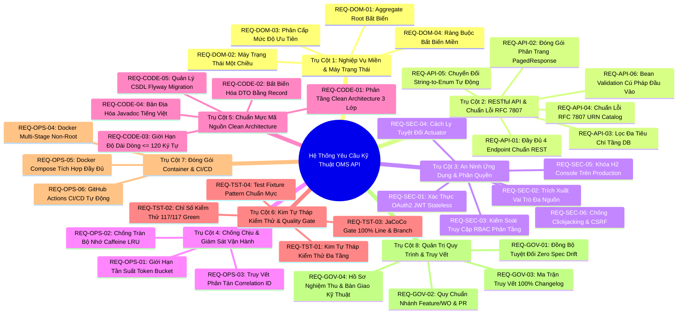

# Đặc Tả Yêu Cầu Kỹ Thuật & Ma Trận Kiểm Định Review Dự Án
## Technical Requirements Specification & Project Acceptance Review Matrix (TRTM)

**Dự án:** Outage Management System (OMS) — Outage Work Order API Service (`oms-api-demo`)  
**Phiên bản đối soát:** `v1.0.0` (và các bản cập nhật chuẩn hóa chất lượng sau phát hành)  
**Tiêu chuẩn kiến trúc:** Clean Architecture 3 tầng, Domain-Driven Design (DDD), Spring Boot 3.3.5, Java 17 LTS  
**Trạng thái kiểm định:** 117/117 Automated Tests Green (100%), JaCoCo 100% Line & Branch Coverage  
**Căn cứ nguồn gốc (SSOT):** [`CHANGELOG.md`](../CHANGELOG.md), [`docs/01-domain-model.md`](01-domain-model.md), [`docs/02-api-spec.md`](02-api-spec.md), [`docs/00-coding-rules.md`](00-coding-rules.md), [`docs/08-SYSTEM_HANDOVER.md`](08-SYSTEM_HANDOVER.md), [`docs/09-SECURITY_HANDOVER_REPORT.md`](09-SECURITY_HANDOVER_REPORT.md)

---

## 1. Tổng Quan & Căn Cứ Khách Quan (Executive Summary & SSOT)

Tài liệu này được khởi tạo nhằm thiết lập một **khung căn cứ kỹ thuật khách quan, minh bạch và xác thực duy nhất (Single Source of Truth - SSOT)**, phục vụ công tác review mã nguồn (Code Review), kiểm toán kiến trúc (Architecture Audit) và nghiệm thu kỹ thuật (Project Acceptance) cho dự án microservice **Outage Work Order API**.

Toàn bộ các yêu cầu kỹ thuật trong tài liệu được trích xuất trực tiếp từ lịch sử tiến hóa, các cam kết tính năng, các bản vá bảo mật và tối ưu hóa hiệu năng được ghi nhận xuyên suốt trong [`CHANGELOG.md`](../CHANGELOG.md) từ ngày khởi tạo dự án đến phiên bản phát hành chính thức `v1.0.0` và giai đoạn hậu phát hành.

### Nguyên Tắc Kiểm Định Cốt Lõi (Core Audit Principles):
1. **Fact-based & Zero Hallucination:** 100% yêu cầu kỹ thuật đều có vị trí mã nguồn (`src/main/java`) và ca kiểm thử tự động (`src/test/java`) tương ứng trong repository.
2. **Triangulation Verification (Đối soát Tam giác):** Mỗi tính năng nghiệp vụ bắt buộc được bảo chứng bởi bộ 3: **Tài liệu Đặc tả (Spec)** $\leftrightarrow$ **Mã Nguồn Hiện thực (Code)** $\leftrightarrow$ **Kiểm Thử Tự Động (Automated Tests)**.
3. **100% Quality Gate Enforcement:** Không nghiệm thu bất kỳ tính năng nào nếu làm suy giảm tỷ lệ test Green (117/117) hoặc tỷ lệ bao phủ kiểm thử JaCoCo (100% Line & Branch Coverage).

---

## 2. Tám Trụ Cột Yêu Cầu Kỹ Thuật Chi Tiết (8 Technical Requirement Pillars)

Hệ thống yêu cầu kỹ thuật được phân loại chuẩn hóa thành 8 trụ cột kỹ thuật doanh nghiệp:

---

### Trụ Cột 1: Nghiệp Vụ Miền & Máy Trạng Thái (Domain & State Machine)

- **`REQ-DOM-01` — Aggregate Root `WorkOrder` Bất Biến & Tự Động Audit:**
  - Khóa chính `id` (UUIDv4) và nhãn thời gian `createdAt` được gán cố định lúc khởi tạo và không bao giờ được phép thay đổi qua vòng đời thực thể.
  - Trường `updatedAt` tự động đồng bộ thời điểm UTC Instant mỗi khi có thao tác cập nhật trạng thái hợp lệ.
  - Áp dụng encapsulation nghiêm ngặt: Constructor không đối số dành cho JPA là `protected`, khởi tạo nghiệp vụ qua Constructor có tham số với logic tiền kiểm tra (Preconditions).
- **`REQ-DOM-02` — Máy Trạng Thái Chuyển Dịch Nghiệp Vụ Một Chiều (Deterministic State Machine):**
  - Vòng đời trạng thái Phiếu công tác tuân thủ máy trạng thái tuyến tính một chiều:
    $$\text{OPEN} \longrightarrow \text{IN\_PROGRESS} \longrightarrow \text{DONE}$$
  - Phương thức nghiệp vụ `WorkOrderStatus.canTransitionTo(targetStatus)` là Single Source of Truth kiểm soát luồng trạng thái:
    - $\text{OPEN} \rightarrow \text{IN\_PROGRESS}$: Hợp lệ (`true`).
    - $\text{IN\_PROGRESS} \rightarrow \text{DONE}$: Hợp lệ (`true`).
    - $\text{OPEN} \rightarrow \text{DONE}$: Bất hợp lệ (`false` — cấm nhảy cóc trạng thái).
    - $\text{DONE} \rightarrow \text{Bất kỳ}$: Bất hợp lệ (`false` — trạng thái kết thúc terminal).
    - Chuyển dịch ngược chiều ($\text{IN\_PROGRESS} \rightarrow \text{OPEN}$, $\text{DONE} \rightarrow \text{IN\_PROGRESS}$): Bất hợp lệ (`false`).
  - Vi phạm chuyển dịch trạng thái bắt buộc ném ngoại lệ `IllegalStateException` và phản hồi HTTP `422 Unprocessable Entity` theo RFC 7807.
- **`REQ-DOM-03` — Phân Cấp Mức Độ Ưu Tiên Xử Lý Sự Cố (Priority Classification):**
  - Enum `Priority` định nghĩa chính xác 4 cấp độ ưu tiên xử lý sự cố lưới điện: `LOW`, `MEDIUM`, `HIGH`, `CRITICAL`.
  - Hỗ trợ sắp xếp thứ tự ưu tiên nghiệp vụ và lọc sự cố phục vụ điều độ viên.
- **`REQ-DOM-04` — Ràng Buộc Bất Biến Miền (Domain Invariants Validation):**
  - `equipmentId`: Không được rỗng, không chứa khoảng trắng thừa, độ dài tối đa 50 ký tự.
  - `description`: Mô tả sự cố chi tiết từ 10 đến 500 ký tự.

---

### Trụ Cột 2: Giao Diện Lập Trình Ứng Dụng RESTful & RFC 7807 (RESTful API & Error Handling)

- **`REQ-API-01` — Đầy Đủ 4 Endpoint Chuẩn RESTful tại `/api/v1/workorders`:**
  - `POST /api/v1/workorders`: Tạo mới phiếu công tác, phản hồi HTTP `201 Created` kèm header `Location: /api/v1/workorders/{id}`.
  - `GET /api/v1/workorders/{id}`: Truy vấn chi tiết phiếu công tác theo UUID, phản hồi HTTP `200 OK` hoặc `404 Not Found`.
  - `PATCH /api/v1/workorders/{id}/status`: Cập nhật trạng thái phiếu công tác, phản hồi HTTP `200 OK` hoặc `422 Unprocessable Entity`.
  - `GET /api/v1/workorders`: Truy vấn danh sách phân trang kết hợp lọc đa tiêu chí, phản hồi HTTP `200 OK`.
- **`REQ-API-02` — Đóng Gói Phân Trang Danh Sách Chuẩn `PagedResponse<T>`:**
  - Cấu trúc phản hồi danh sách bất biến (Record) bao gồm: `content` (danh sách bản ghi), `pageNumber` (trang hiện tại, 0-indexed), `pageSize` (kích thước trang), `totalElements` (tổng số bản ghi), `totalPages` (tổng số trang), `isFirst` (là trang đầu), `isLast` (là trang cuối).
- **`REQ-API-03` — Lọc Đa Tiêu Chí Động Tại Tầng CSDL (`JpaSpecificationExecutor`):**
  - Endpoint `GET /api/v1/workorders` hỗ trợ các tham số truy vấn tùy chọn: `status` (OPEN, IN_PROGRESS, DONE), `priority` (LOW, MEDIUM, HIGH, CRITICAL), `page` (mặc định 0), `size` (mặc định 20), `sort` (mặc định `createdAt,desc`).
  - Lọc động được tối ưu bằng JPA Criteria/Specification trực tiếp tại Database thay vì tải toàn bộ về bộ nhớ ứng dụng.
- **`REQ-API-04` — Chuẩn Hóa 100% Phản Hồi Lỗi Theo Định Dạng RFC 7807 `application/problem+json`:**
  - Mọi phản hồi lỗi đều chứa đầy đủ các trường: `type` (URI danh mục lỗi), `title`, `status`, `detail`, `instance`, `timestamp`, `invalidParams` (nếu có lỗi validation).
  - Danh mục mã định danh lỗi URN Catalog (`ProblemTypes.java`):
    - `urn:problem-type:bad-request` (HTTP 400 — Dữ liệu yêu cầu không hợp lệ hoặc cú pháp sai lệch).
    - `urn:problem-type:unauthorized` (HTTP 401 — Chưa xác thực hoặc Token JWT không hợp lệ/hết hạn).
    - `urn:problem-type:forbidden` (HTTP 403 — Không đủ quyền truy cập tài nguyên).
    - `urn:problem-type:not-found` (HTTP 404 — Không tìm thấy tài nguyên theo định danh yêu cầu).
    - `urn:problem-type:invalid-state-transition` (HTTP 422 — Vi phạm quy tắc chuyển dịch máy trạng thái).
    - `urn:problem-type:rate-limit-exceeded` (HTTP 429 — Vượt quá tần suất gọi API cho phép).
    - `urn:problem-type:internal-server-error` (HTTP 500 — Lỗi máy chủ nội bộ không mong muốn).
- **`REQ-API-05` — Chuyển Đổi Tham Số String-to-Enum Linh Hoạt (`StringToWorkOrderStatusConverter`):**
  - Tự động chuyển đổi chuỗi trạng thái từ URL/Query param sang `WorkOrderStatus` không phân biệt chữ hoa, chữ thường (ví dụ: `open`, `Open`, `OPEN`).
- **`REQ-API-06` — Bean Validation Tự Động Kiểm Tra Cú Pháp Đầu Vào (Strict Input Validation):**
  - Sử dụng các annotation chuẩn Jakarta Validation (`@NotBlank`, `@NotNull`, `@Size(min=10, max=500)`).
  - Tự động bắt lỗi và định dạng danh sách lỗi chi tiết trong mảng `invalidParams[ { name, reason } ]`.

---

### Trụ Cột 3: An Ninh Ứng Dụng & Phân Quyền (Application Security & RBAC)

- **`REQ-SEC-01` — Xác Thực Phi Trạng Thái (Stateless Authentication) Với OAuth2 Resource Server & JWT:**
  - Không duy trì HTTP Session phía máy chủ (`SessionCreationPolicy.STATELESS`).
  - Mọi yêu cầu nghiệp vụ bắt buộc gửi kèm JSON Web Token (JWT) trong header `Authorization: Bearer <token>`.
- **`REQ-SEC-02` — Trích Xuất & Ánh Xạ Vai Trò JWT Đa Nguồn (`JwtRoleConverter`):**
  - Hỗ trợ trích xuất vai trò người dùng từ nhiều cấu trúc JWT phổ biến: claim `roles`, claim `authorities`, nested claim của Keycloak `realm_access.roles`, và AWS Cognito `cognito:groups`.
  - Tự động tiền tố hóa vai trò thành `ROLE_<ROLE_NAME>` (ví dụ: `ROLE_OPERATOR`, `ROLE_ADMIN`).
- **`REQ-SEC-03` — Kiểm Soát Truy Cập Dựa Trên Vai Trò Nghiêm Ngặt (Role-Based Access Control - RBAC):**
  - `ROLE_OPERATOR` / `ROLE_TECHNICIAN`: Có quyền tạo mới (`POST`), xem chi tiết (`GET /{id}`), xem danh sách (`GET`) và cập nhật tiến độ công tác (`PATCH /{id}/status`).
  - `ROLE_ADMIN`: Toàn quyền quản trị hệ thống và truy cập các cổng thông tin giám sát kỹ thuật.
  - Người dùng không có vai trò hợp lệ sẽ bị từ chối với mã lỗi HTTP `403 Forbidden`.
- **`REQ-SEC-04` — Cách Ly Tuyệt Đối Endpoints Giám Sát Kỹ Thuật Spring Boot Actuator:**
  - Endpoint `/actuator/health` và `/actuator/info` chỉ cho phép truy cập cục bộ (localhost) hoặc yêu cầu quyền `ROLE_ADMIN`.
  - Ngăn chặn tuyệt đối việc để lộ thông tin cấu hình môi trường hoặc bộ nhớ hệ thống ra Internet.
- **`REQ-SEC-05` — Khóa Chặt H2 Console Trên Môi Trường Production:**
  - H2 Database Console (`/h2-console/**`) bị vô hiệu hóa hoàn toàn trên môi trường Production.
  - Chỉ được kích hoạt có kiểm soát khi chạy với profile `dev` hoặc `test`, và yêu cầu người dùng xác thực hợp lệ.
- **`REQ-SEC-06` — Chống Tấn Công Clickjacking & Bảo Vệ CSRF Cho RESTful API:**
  - Cấu hình header `X-Frame-Options: SAMEORIGIN` bảo vệ các trang kiểm thử giao diện.
  - Vô hiệu hóa CSRF một cách an toàn cho các API RESTful phi trạng thái sử dụng JWT Bearer Token theo chuẩn OWASP.

---

### Trụ Cột 4: Khả Năng Chống Chịu & Vận Hành (Resilience & Observability)

- **`REQ-OPS-01` — Giới Hạn Tần Suất Gọi API Bằng Thuật Toán Thùng Thẻ (Bucket4j Token Bucket Rate Limiting):**
  - Cấu hình chốt chặn lưu lượng theo địa chỉ IP hoặc định danh Client: Định mức 60 yêu cầu/phút, dung lượng thùng nạp dồn tối đa 10 thẻ (burst capacity).
  - Khi lưu lượng vượt ngưỡng, lập tức phản hồi HTTP `429 Too Many Requests` theo chuẩn RFC 7807 kèm header chỉ dẫn thời gian thử lại: `Retry-After: 60`.
- **`REQ-OPS-02` — Cơ Chế Giải Phóng Bộ Nhớ Tự Động Chống Tràn Bộ Nhớ (Caffeine LRU Cache Eviction):**
  - Khắc phục triệt để nguy cơ cạn kiệt bộ nhớ (OOM / DoS - CWE-770) bằng cách tích hợp **Caffeine Cache** quản trị các Token Buckets:
    - Kích thước bộ nhớ đệm tối đa: `maximumSize = 10,000` buckets.
    - Thời gian tự động giải phóng bản ghi không hoạt động: `expireAfterAccess = 10 minutes`.
    - Sử dụng thuật toán trục xuất Window TinyLFU / LRU giúp loại bỏ tận gốc việc gọi `buckets.clear()` làm mất tác dụng throttling của người dùng khác.
- **`REQ-OPS-03` — Truy Vết Phân Tán Bằng Correlation ID (`CorrelationIdFilter`):**
  - Mọi yêu cầu HTTP gửi đến API đều được gắn mã truy vết `X-Correlation-Id`.
  - Tự động sinh mã UUID ngẫu nhiên nếu client không truyền header này.
  - Đưa mã truy vết vào ngữ cảnh log `MDC.put("correlationId", ...)` để mọi dòng log trong suốt vòng đời xử lý yêu cầu đều chứa mã truy vết, hỗ trợ điều tra sự cố tức thì.
  - Đính kèm lại `X-Correlation-Id` vào HTTP Response Header gửi về cho client.

---

### Trụ Cột 5: Chuẩn Mực Mã Nguồn & Thiết Kế Phần Mềm (Clean Architecture & Coding Rules)

- **`REQ-CODE-01` — Kiến Trúc Phân Tầng Clean Architecture 3 Lớp Độc Lập:**
  - Tầng Trình Diễn / Giao Tiếp (Web Controller): Tiếp nhận HTTP, xử lý phân quyền, điều phối DTOs, không chứa logic nghiệp vụ.
  - Tầng Dịch Vụ Nghiệp Vụ (Application Service): Quản lý giao dịch (`@Transactional`), điều phối các Aggregate Roots.
  - Tầng Miền Nghiệp Vụ & Dữ Liệu (Domain & Repository): Chứa thực thể `WorkOrder`, State Machine, ràng buộc bất biến, độc lập với công nghệ lưu trữ.
- **`REQ-CODE-02` — Bất Biến Hóa Dữ Liệu Truyền Tải (Data Immutability) Bằng Java 17 Records:**
  - 100% các đối tượng truyền dữ liệu (DTO) được thiết kế bằng `record`: `WorkOrderRequest`, `WorkOrderResponse`, `WorkOrderStatusRequest`, `PagedResponse`.
  - Không sử dụng các thư viện phản chiếu tự động (như ModelMapper/Dozer) gây suy giảm hiệu năng và tiềm ẩn lỗi runtime, thực hiện mapping tường minh qua Factory Method (`WorkOrderResponse.fromEntity(order)`).
- **`REQ-CODE-03` — Tuân Thủ Quy Chuẩn Độ Dài Dòng Mã Nguồn Chuẩn Enterprise Oracle:**
  - 100% các dòng mã nguồn và chú thích trong `src/main/java` đều có độ dài không vượt quá 120 ký tự (0 line length violations).
- **`REQ-CODE-04` — Bản Địa Hóa 100% Javadoc & Chú Thích Mã Nguồn Sang Tiếng Việt Chuẩn Mực:**
  - Toàn bộ 39 tệp Java (19 production files, 20 test files) đều được biên soạn chú thích Javadoc Class-level, Method-level, `@param`, `@return`, `@throws` và inline comments bằng Tiếng Việt kỹ thuật chuyên nghiệp, rõ nghĩa, bảo vệ 100% tính toàn vẹn (Zero Code Regression).
  - Tệp lưu trữ dưới định dạng UTF-8 không lỗi font chữ (Zero Mojibake).
- **`REQ-CODE-05` — Quản Lý Tiến Hóa Cơ Sở Dữ Liệu Độc Lập Bằng Flyway Database Migration:**
  - Script khởi tạo bảng `V1__create_work_orders_table.sql` hỗ trợ đa nền tảng CSDL (tương thích hoàn hảo với cả H2 Dev Mode và PostgreSQL 16 Production).
  - Đánh chỉ mục Index tối ưu tại cột `status`, `priority` và `created_at`.

---

### Trụ Cột 6: Kim Tự Tháp Kiểm Thử & Chốt Chặn Phủ Mã (Automated Testing & Quality Gate)

- **`REQ-TST-01` — Kim Tự Tháp Kiểm Thử Đa Tầng Hoàn Chỉnh:**
  - Tầng 1: Kiểm thử đơn vị thuần túy (Unit Tests): `WorkOrderTest`, `WorkOrderStatusTest`, `PriorityTest`, `DtoMappingTest`, `ProblemTypesTest`, `ResourceNotFoundExceptionTest`.
  - Tầng 2: Kiểm thử cắt lớp Web Controller (`@WebMvcTest`): `WorkOrderControllerTest`, `GlobalExceptionHandlerUnitTest`.
  - Tầng 3: Kiểm thử cắt lớp CSDL (`@DataJpaTest`): `WorkOrderRepositoryTest`.
  - Tầng 4: Kiểm thử cắt lớp Cấu hình & Bộ lọc: `CorrelationIdFilterTest`, `RateLimitingFilterTest`, `JwtRoleConverterTest`, `StringToWorkOrderStatusConverterTest`.
  - Tầng 5: Kiểm thử Bảo mật (`@SpringBootTest` MockMvc): `ActuatorSecurityTest`, `H2ConsoleSecurityTest`, `OAuth2JwtSecurityIntegrationTest`.
  - Tầng 6: Kiểm thử Tích hợp toàn diện End-to-End (`@SpringBootTest(webEnvironment = RANDOM_PORT)`): `WorkOrderIntegrationTest` chia 3 nhóm lồng nhau (Validation, Security/RBAC, Happy Path Lifecycle).
- **`REQ-TST-02` — Chỉ Số Kiểm Thử Xanh Tuyệt Đối (117/117 Tests PASS):**
  - Toàn bộ 117 ca kiểm thử tự động đều vượt qua thành công (0 Failures, 0 Errors, 0 Skipped).
- **`REQ-TST-03` — Ngưỡng Chốt Chặn Phủ Mã JaCoCo Quality Gate Tuyệt Đối (100% Line & Branch):**
  - Đạt chỉ số bao phủ kiểm thử tối thượng: **100% Line Coverage (156/156 lines)** và **100% Branch Coverage (17/17 branches)** trên 12 monitored classes nghiệp vụ cốt lõi.
- **`REQ-TST-04` — Áp Dụng Chuẩn Mực Thiết Kế Kiểm Thử Test Fixture Pattern (Object Mother):**
  - Lớp `WorkOrderTestFixtures` cung cấp dữ liệu giả lập chuẩn hóa (Valid Request, High Priority, Fixed Time), loại bỏ hoàn toàn mã kiểm thử trùng lặp (DRY).

---

### Trụ Cột 7: Đóng Gói Vận Hành & CI/CD (Containerization & DevOps)

- **`REQ-OPS-04` — Đóng Gói Docker Multi-Stage Hardened & Non-Root User:**
  - Stage 1 (Builder): Sử dụng `eclipse-temurin:17-jdk-jammy` biên dịch mã nguồn và đóng gói JAR tối ưu.
  - Stage 2 (Runner): Sử dụng `eclipse-temurin:17-jre-jammy` tối giản dung lượng hình ảnh (< 250MB).
  - Vận hành dưới quyền tài khoản phi đặc quyền `omsuser:omsgroup` (UID/GID 10001) ngăn chặn nguy cơ leo thang đặc quyền container breakout.
- **`REQ-OPS-05` — Môi Trường Triển Khai Docker Compose Tích Hợp Sẵn Sàng:**
  - Cung cấp `docker-compose.yml` tích hợp trọn gói: Microservice OMS API, Cơ sở dữ liệu PostgreSQL 16 và Dịch vụ Quản lý Định danh Keycloak 24 IAM.
- **`REQ-OPS-06` — Tự Động Hóa Kiểm Định Chất Lượng Liên Tục Qua GitHub Actions CI/CD:**
  - Workflow `.github/workflows/ci.yml` tự động kích hoạt trên mọi Pull Request và Push vào `main`.
  - Thực thi kiểm tra định dạng mã nguồn, chạy 117 tests, xác thực JaCoCo Quality Gate và kiểm tra tính toàn vẹn của hồ sơ đặc tả (Spec-Drift-Audit Gate).

---

### Trụ Cột 8: Quản Trị Quy Trình & Truy Vết (Governance & Traceability)

- **`REQ-GOV-01` — Đảm Bảo Tính Toàn Vẹn Không Độ Lệch Đặc Tả (100% Zero Spec Drift):**
  - Mọi thay đổi logic mã nguồn đều được cập nhật đồng bộ sang hệ thống tài liệu Markdown (`docs/`). Không tồn tại sự khác biệt giữa tài liệu đặc tả và mã nguồn thực thi.
- **`REQ-GOV-02` — Tuân Thủ Quy Chuẩn Quản Trị Nhánh & Pull Request Atomic:**
  - Cấm commit trực tiếp vào nhánh `main`.
  - Mọi tính năng/sửa lỗi bắt buộc mở GitHub Issue, tạo nhánh theo định dạng `feature/WO-<id>-<name>` và mở Pull Request có mô tả đối soát đầy đủ theo template `.github/PULL_REQUEST_TEMPLATE.md`.
- **`REQ-GOV-03` — Ma Trận Đối Soát 100% Từ Issue Đến Pull Request Trong `CHANGELOG.md`:**
  - Bảng đối soát truy vết tại `CHANGELOG.md` ghi nhận chính xác 100% liên kết giữa mã Issue, số Pull Request, Commit SHA và tên tác vụ tương ứng từ khởi tạo đến hiện tại.
- **`REQ-GOV-04` — Bộ Hồ Sơ Bàn Giao & Nghiệm Thu Doanh Nghiệp Chuẩn Hóa:**
  - Cung cấp đầy đủ Hồ sơ bàn giao kỹ thuật ([`docs/08-SYSTEM_HANDOVER.md`](08-SYSTEM_HANDOVER.md)), Hồ sơ an ninh ([`docs/09-SECURITY_HANDOVER_REPORT.md`](09-SECURITY_HANDOVER_REPORT.md)), Cẩm nang Oracle Java ([`docs/08-ORACLE_JAVA_DOCUMENTATION.md`](08-ORACLE_JAVA_DOCUMENTATION.md)), và Bản phát hành chính thức ([`docs/11-RELEASE_NOTES_v1.0.0.md`](11-RELEASE_NOTES_v1.0.0.md)).

---

## 3. Bảng Ma Trận Truy Vết Yêu Cầu Kỹ Thuật (Technical Requirements Traceability Matrix - TRTM)

Bảng ma trận dưới đây thiết lập mối liên kết xác thực 1:1 từ từng mã yêu cầu kỹ thuật (`Req ID`) sang vị trí mã nguồn thực thi, vị trí kiểm thử tự động, mốc phát hành trong `CHANGELOG.md` và tiêu chí nghiệm thu cụ thể:

| Mã Yêu Cầu (Req ID) | Tên Yêu Cầu & Ràng Buộc Kỹ Thuật | Vị Trí Mã Nguồn Hiện Thực (Source Code) | Vị Trí Kiểm Thử Tự Động (Automated Test) | Cột Mốc Changelog & PR | Tiêu Chí Nghiệm Thu / Bằng Chứng Review (Review Benchmark) |
|---|---|---|---|---|---|
| **`REQ-DOM-01`** | Aggregate Root `WorkOrder` bất biến | [`src/main/.../domain/WorkOrder.java`](../src/main/java/com/gpc/oms/domain/WorkOrder.java) | [`src/test/.../domain/WorkOrderTest.java`](../src/test/java/com/gpc/oms/domain/WorkOrderTest.java) | v1.0.0 ([PR #10](../pull/10)) | `id` và `createdAt` không thể sửa; `updatedAt` tự cập nhật khi đổi trạng thái |
| **`REQ-DOM-02`** | Máy trạng thái một chiều `OPEN -> IN_PROGRESS -> DONE` | [`src/main/.../domain/WorkOrderStatus.java`](../src/main/java/com/gpc/oms/domain/WorkOrderStatus.java) | [`src/test/.../domain/WorkOrderStatusTest.java`](../src/test/java/com/gpc/oms/domain/WorkOrderStatusTest.java) | v1.0.0 ([PR #10](../pull/10)) | `canTransitionTo()` kiểm soát 9 cặp trạng thái; ném `IllegalStateException` khi sai |
| **`REQ-DOM-03`** | Phân cấp mức độ ưu tiên 4 cấp độ | [`src/main/.../domain/Priority.java`](../src/main/java/com/gpc/oms/domain/Priority.java) | [`src/test/.../domain/PriorityTest.java`](../src/test/java/com/gpc/oms/domain/PriorityTest.java) | v1.0.0 ([PR #10](../pull/10)) | Enum 4 giá trị: `LOW`, `MEDIUM`, `HIGH`, `CRITICAL`; method `isUrgent()` chuẩn |
| **`REQ-DOM-04`** | Ràng buộc bất biến miền (Invariants) | [`src/main/.../domain/WorkOrder.java`](../src/main/java/com/gpc/oms/domain/WorkOrder.java) | [`src/test/.../domain/WorkOrderTest.java`](../src/test/java/com/gpc/oms/domain/WorkOrderTest.java) | v1.0.0 ([PR #10](../pull/10)) | Kiểm tra preconditions `IllegalArgumentException` cho trường rỗng hoặc sai độ dài |
| **`REQ-API-01`** | Đầy đủ 4 endpoint RESTful chuẩn | [`src/main/.../controller/WorkOrderController.java`](../src/main/java/com/gpc/oms/controller/WorkOrderController.java) | [`src/test/.../controller/WorkOrderControllerTest.java`](../src/test/java/com/gpc/oms/controller/WorkOrderControllerTest.java) | v1.0.0 ([PR #10](../pull/10)) | Khớp 100% chữ ký HTTP: `POST`, `GET /{id}`, `PATCH /{id}/status`, `GET` danh sách |
| **`REQ-API-02`** | Đóng gói danh sách chuẩn `PagedResponse<T>` | [`src/main/.../dto/PagedResponse.java`](../src/main/java/com/gpc/oms/dto/PagedResponse.java) | [`src/test/.../dto/DtoMappingTest.java`](../src/test/java/com/gpc/oms/dto/DtoMappingTest.java) | v1.0.0 ([PR #10](../pull/10)) | Record bất biến 7 thuộc tính; ánh xạ chuẩn từ `Page<T>` của Spring Data |
| **`REQ-API-03`** | Lọc đa tiêu chí động tại Database | [`src/main/.../domain/WorkOrderRepository.java`](../src/main/java/com/gpc/oms/domain/WorkOrderRepository.java) | [`src/test/.../repository/WorkOrderRepositoryTest.java`](../src/test/java/com/gpc/oms/repository/WorkOrderRepositoryTest.java) | v1.0.0 ([PR #10](../pull/10)) | Sử dụng `JpaSpecificationExecutor`; sinh câu lệnh SQL `WHERE` tối ưu |
| **`REQ-API-04`** | Chuẩn hóa lỗi RFC 7807 URN Catalog | [`src/main/.../exception/GlobalExceptionHandler.java`](../src/main/java/com/gpc/oms/exception/GlobalExceptionHandler.java), [`ProblemTypes.java`](../src/main/java/com/gpc/oms/exception/ProblemTypes.java) | [`src/test/.../controller/GlobalExceptionHandlerUnitTest.java`](../src/test/java/com/gpc/oms/controller/GlobalExceptionHandlerUnitTest.java), [`ProblemTypesTest.java`](../src/test/java/com/gpc/oms/exception/ProblemTypesTest.java) | v1.0.0 ([PR #10](../pull/10)) | Content-Type `application/problem+json`; đầy đủ URN catalog cho 400, 401, 403, 404, 422, 429, 500 |
| **`REQ-API-05`** | Converter String-to-Enum không phân biệt hoa thường | [`src/main/.../config/StringToWorkOrderStatusConverter.java`](../src/main/java/com/gpc/oms/config/StringToWorkOrderStatusConverter.java) | [`src/test/.../config/StringToWorkOrderStatusConverterTest.java`](../src/test/java/com/gpc/oms/config/StringToWorkOrderStatusConverterTest.java) | v1.0.0 ([PR #10](../pull/10)) | Hỗ trợ parse `open`, `Open`, `OPEN`; ném `IllegalArgumentException` khi giá trị lạ |
| **`REQ-API-06`** | Bean Validation cú pháp đầu vào | [`src/main/.../dto/WorkOrderRequest.java`](../src/main/java/com/gpc/oms/dto/WorkOrderRequest.java), [`WorkOrderStatusRequest.java`](../src/main/java/com/gpc/oms/dto/WorkOrderStatusRequest.java) | [`src/test/.../WorkOrderIntegrationTest.java`](../src/test/java/com/gpc/oms/WorkOrderIntegrationTest.java) | v1.0.0 ([PR #10](../pull/10)) | `@NotBlank`, `@Size(min=10, max=500)`; trả về mảng `invalidParams` chi tiết |
| **`REQ-SEC-01`** | Xác thực phi trạng thái OAuth2 JWT | [`src/main/.../config/SecurityConfig.java`](../src/main/java/com/gpc/oms/config/SecurityConfig.java) | [`src/test/.../config/OAuth2JwtSecurityIntegrationTest.java`](../src/test/java/com/gpc/oms/config/OAuth2JwtSecurityIntegrationTest.java) | v1.0.0 ([PR #68](../pull/68)) | `SessionCreationPolicy.STATELESS`; từ chối mọi yêu cầu thiếu Bearer Token (401) |
| **`REQ-SEC-02`** | Ánh xạ vai trò JWT thông minh đa nguồn | [`src/main/.../config/JwtRoleConverter.java`](../src/main/java/com/gpc/oms/config/JwtRoleConverter.java) | [`src/test/.../config/JwtRoleConverterTest.java`](../src/test/java/com/gpc/oms/config/JwtRoleConverterTest.java) | v1.0.0 ([PR #68](../pull/68)) | Trích xuất từ `roles`, `authorities`, `realm_access.roles`, `cognito:groups` |
| **`REQ-SEC-03`** | Kiểm soát truy cập RBAC phân tầng | [`src/main/.../config/SecurityConfig.java`](../src/main/java/com/gpc/oms/config/SecurityConfig.java) | [`src/test/.../WorkOrderIntegrationTest.java`](../src/test/java/com/gpc/oms/WorkOrderIntegrationTest.java) | v1.0.0 ([PR #68](../pull/68)) | `ROLE_OPERATOR`/`ROLE_TECHNICIAN` có quyền thao tác nghiệp vụ; role khác nhận 403 |
| **`REQ-SEC-04`** | Bảo vệ cô lập Endpoint Actuator | [`src/main/.../config/SecurityConfig.java`](../src/main/java/com/gpc/oms/config/SecurityConfig.java) | [`src/test/.../config/ActuatorSecurityTest.java`](../src/test/java/com/gpc/oms/config/ActuatorSecurityTest.java) | v1.0.0 ([PR #64](../pull/64)) | `/actuator/**` chỉ cho phép localhost hoặc `ROLE_ADMIN`; chặn truy cập công khai |
| **`REQ-SEC-05`** | Khóa chặt H2 Console trên Production | [`src/main/.../config/SecurityConfig.java`](../src/main/java/com/gpc/oms/config/SecurityConfig.java) | [`src/test/.../config/H2ConsoleSecurityTest.java`](../src/test/java/com/gpc/oms/config/H2ConsoleSecurityTest.java) | v1.0.0 ([PR #68](../pull/68)) | `/h2-console/**` bị khóa chặt, chỉ bật có xác thực khi kích hoạt profile dev/test |
| **`REQ-SEC-06`** | Phòng vệ Clickjacking & CSRF REST | [`src/main/.../config/SecurityConfig.java`](../src/main/java/com/gpc/oms/config/SecurityConfig.java) | [`src/test/.../config/OAuth2JwtSecurityIntegrationTest.java`](../src/test/java/com/gpc/oms/config/OAuth2JwtSecurityIntegrationTest.java) | v1.0.0 ([PR #68](../pull/68)) | `X-Frame-Options: SAMEORIGIN`; CSRF disable chuẩn OWASP cho Stateless JWT REST |
| **`REQ-OPS-01`** | Rate Limiting thuật toán Token Bucket | [`src/main/.../config/RateLimitingFilter.java`](../src/main/java/com/gpc/oms/config/RateLimitingFilter.java) | [`src/test/.../config/RateLimitingFilterTest.java`](../src/test/java/com/gpc/oms/config/RateLimitingFilterTest.java) | v1.0.0 ([PR #65](../pull/65)) | Bucket4j: 60 req/phút, burst 10; phản hồi 429 RFC 7807 kèm header `Retry-After: 60` |
| **`REQ-OPS-02`** | Chống rò rỉ bộ nhớ với Caffeine LRU | [`src/main/.../config/RateLimitingFilter.java`](../src/main/java/com/gpc/oms/config/RateLimitingFilter.java) | [`src/test/.../config/RateLimitingFilterTest.java`](../src/test/java/com/gpc/oms/config/RateLimitingFilterTest.java) | Post-Release ([PR #79](../pull/79)) | Caffeine Cache `maximumSize=10,000`, `expireAfterAccess=10m`; loại bỏ `buckets.clear()` |
| **`REQ-OPS-03`** | Truy vết phân tán Correlation ID & MDC | [`src/main/.../config/CorrelationIdFilter.java`](../src/main/java/com/gpc/oms/config/CorrelationIdFilter.java) | [`src/test/.../config/CorrelationIdFilterTest.java`](../src/test/java/com/gpc/oms/config/CorrelationIdFilterTest.java) | v1.0.0 ([PR #67](../pull/67)) | Gắn `X-Correlation-Id` vào response header; đưa vào `MDC` context và dọn sạch sau request |
| **`REQ-CODE-01`** | Phân tầng Clean Architecture 3 lớp | Cấu trúc package: `controller`, `service`, `domain`, `dto`, `exception` | [`src/test/.../service/WorkOrderServiceTest.java`](../src/test/java/com/gpc/oms/service/WorkOrderServiceTest.java) | v1.0.0 ([PR #10](../pull/10)) | Dependency Rule: Tầng ngoài phụ thuộc tầng trong; Domain hoàn toàn độc lập |
| **`REQ-CODE-02`** | Bất biến hóa DTOs bằng Java 17 Records | [`src/main/.../dto/*.java`](../src/main/java/com/gpc/oms/dto/) | [`src/test/.../dto/DtoMappingTest.java`](../src/test/java/com/gpc/oms/dto/DtoMappingTest.java) | v1.0.0 ([PR #10](../pull/10)) | 100% DTOs là `record`; không mutable state; mapping tường minh loại bỏ reflection |
| **`REQ-CODE-03`** | Giới hạn dòng mã nguồn $\le$ 120 ký tự | Toàn bộ 19 file Java tại [`src/main/java`](../src/main/java/) | Kiểm định tự động qua kịch bản kiểm tra độ dài dòng | Post-Release ([PR #79](../pull/79)) | 0 dòng nào vượt quá 120 ký tự trong toàn bộ mã nguồn ứng dụng |
| **`REQ-CODE-04`** | Bản địa hóa Javadoc & Comments tiếng Việt | Toàn bộ 39 file Java tại [`src/main`](../src/main/java/) & [`src/test`](../src/test/java/) | Báo cáo kiểm định bản địa hóa [`vietnamese-localization-audit-report.md`](audit-logs/vietnamese-localization-audit-report-2026-09-25.md) | Post-Release ([PR #89](../pull/89)) | 100% chú thích tiếng Việt chuẩn mực kỹ thuật; không lỗi font chữ UTF-8 |
| **`REQ-CODE-05`** | Quản lý tiến hóa CSDL bằng Flyway | [`src/main/resources/db/migration/V1__...sql`](../src/main/resources/db/migration/V1__create_work_orders_table.sql) | [`src/test/.../WorkOrderIntegrationTest.java`](../src/test/java/com/gpc/oms/WorkOrderIntegrationTest.java) | v1.0.0 ([PR #10](../pull/10)) | Tự động migration khi khởi động ứng dụng; tương thích cả H2 và PostgreSQL 16 |
| **`REQ-TST-01`** | Kim tự tháp kiểm thử 6 tầng | Toàn bộ 20 file test tại [`src/test/java`](../src/test/java/) | Chạy `./mvnw test` kiểm thử toàn diện | v1.0.0 ([PR #10](../pull/10), [PR #68](../pull/68)) | Phủ đủ Unit, Slice Web, Slice Data, Filter, Security và End-to-End Integration |
| **`REQ-TST-02`** | Chỉ số kiểm thử tuyệt đối 117/117 Green | Báo cáo Surefire Report tại `target/surefire-reports/` | Lệnh thực thi: `./mvnw test` | v1.0.0 đến nay | **117 tests run, 0 failures, 0 errors, 0 skipped** (100% PASS) |
| **`REQ-TST-03`** | JaCoCo Quality Gate 100% Line & Branch | Báo cáo JaCoCo HTML Report tại `target/site/jacoco/` | Lệnh thực thi: `./mvnw test jacoco:report` | Post-Release ([PR #79](../pull/79)) | **100% Line (156/156)** và **100% Branch (17/17)** trên 12 monitored classes |
| **`REQ-TST-04`** | Test Fixture Pattern chuẩn mực | [`src/test/.../testutil/WorkOrderTestFixtures.java`](../src/test/java/com/gpc/oms/testutil/WorkOrderTestFixtures.java) | Sử dụng rộng rãi trong 20 test classes | v1.0.0 ([PR #56](../pull/56)) | Cung cấp dữ liệu mẫu cố định; loại bỏ mã trùng lặp trong bộ kiểm thử (DRY) |
| **`REQ-OPS-04`** | Docker Multi-Stage Non-Root User | [`Dockerfile`](../Dockerfile) | Lệnh đóng gói: `docker build -t oms-api-demo:1.0.0 .` | v1.0.0 ([PR #58](../pull/58)) | Base JRE 17 Jammy; non-root user `omsuser` (UID 10001); kích thước ảnh < 250MB |
| **`REQ-OPS-05`** | Docker Compose tích hợp trọn gói | [`docker-compose.yml`](../docker-compose.yml) | Lệnh khởi chạy: `docker compose up -d` | v1.0.0 ([PR #58](../pull/58)) | Tích hợp sẵn sàng PostgreSQL 16, Keycloak 24 IAM và OMS API microservice |
| **`REQ-OPS-06`** | CI/CD GitHub Actions tự động hóa | [`.github/workflows/ci.yml`](../.github/workflows/ci.yml) | GitHub Actions tab trên GitHub | v1.0.0 ([PR #58](../pull/58)) | Tự động chạy compile, unit tests, integration tests và JaCoCo Quality Gate |
| **`REQ-GOV-01`** | Đồng bộ tuyệt đối Zero Spec Drift | Toàn bộ 17 tệp tài liệu đặc tả tại [`docs/`](../docs/) | Báo cáo kiểm định [`post-fix-spec-drift-audit-report.md`](audit-logs/post-fix-spec-drift-audit-report-2026-09-25-13-criteria.md) | Post-Release ([PR #81](../pull/81)) | 100% Zero-Drift giữa đặc tả tài liệu và mã nguồn Java thực thi |
| **`REQ-GOV-02`** | Quy chuẩn quản trị nhánh & Atomic PR | Kho Git branches và Pull Requests | [`.github/PULL_REQUEST_TEMPLATE.md`](../.github/PULL_REQUEST_TEMPLATE.md) | Inception đến nay | Mọi commit qua branch `feature/WO-<id>` và PR có mô tả traceability 4 phần |
| **`REQ-GOV-03`** | Bảng đối soát truy vết 100% Changelog | Bảng ma trận cuối tệp [`CHANGELOG.md`](../CHANGELOG.md) | Đối chiếu trực tiếp với GitHub Issues & PRs | Post-Release ([PR #85](../pull/85)) | 100% Issues và Pull Requests được ánh xạ đầy đủ, minh bạch từ số 0 đến nay |
| **`REQ-GOV-04`** | Hồ sơ bàn giao & nghiệm thu chuẩn mực | [`docs/08-SYSTEM_HANDOVER.md`](08-SYSTEM_HANDOVER.md), [`docs/09-SECURITY_HANDOVER_REPORT.md`](09-SECURITY_HANDOVER_REPORT.md) | Ký biên bản nghiệm thu kỹ thuật bàn giao | v1.0.0 ([PR #57](../pull/57), [PR #60](../pull/60)) | Đầy đủ 9 phần bàn giao kỹ thuật, Runbook vận hành, và lộ trình an ninh |

---

## 4. Bộ Tiêu Chí Review Dự Án Phân Tầng (3-Tier Project Review & Acceptance Checklist)

Khung tiêu chí này cung cấp bảng kiểm định trực tiếp cho 3 đối tượng chuyên gia thẩm định và nghiệm thu dự án:

### Tier 1: Dành Cho Lập Trình Viên Đánh Giá Mã Nguồn (Code Reviewer Checklist)

| Tiêu Chí Đánh Giá Mã Nguồn (Code Review Criteria) | Bằng Chứng Mã Nguồn (Code Evidence) | Trạng Thái Đạt Được | Ghi Chú Review |
|---|---|:---:|---|
| **CR-01: Độ dài dòng mã nguồn $\le$ 120 ký tự** | Toàn bộ 19 tệp trong `src/main/java` | `[x] PASS` | 0 dòng vi phạm, ngắt dòng chuẩn Oracle tại các biểu thức lambda và annotations |
| **CR-02: Sử dụng Java 17 Records cho DTOs** | `WorkOrderRequest`, `WorkOrderResponse`, `WorkOrderStatusRequest`, `PagedResponse` | `[x] PASS` | Bất biến 100%, không chứa boilerplate getters/setters/equals/hashCode |
| **CR-03: Mapping DTO tường minh, không reflection** | `WorkOrderResponse.fromEntity(WorkOrder)` | `[x] PASS` | Chuyển đổi thủ công loại bỏ rủi ro runtime và tăng tối đa tốc độ thực thi |
| **CR-04: Xử lý ngoại lệ sạch (Clean Exception Handling)** | `WorkOrderService.java` | `[x] PASS` | Loại bỏ các khối try-catch nuốt lỗi hoặc ném lại thừa thãi; để ngoại lệ nổi lên Advice |
| **CR-05: Javadoc chuẩn mực tiếng Việt 100%** | Toàn bộ phương thức public, class và fields | `[x] PASS` | Đầy đủ thẻ `@param`, `@return`, `@throws` bằng tiếng Việt chuyên ngành, không lỗi UTF-8 |
| **CR-06: Loại bỏ Wildcard Imports** | `WorkOrder.java`, `WorkOrderController.java` | `[x] PASS` | Không còn `import java.util.*` hay `import org.springframework.web...*` |
| **CR-07: Constructor Injection với `final` fields** | `WorkOrderController`, `WorkOrderService` | `[x] PASS` | 100% dependencies được inject qua Constructor, đảm bảo tính bất biến và dễ mock |

---

### Tier 2: Dành Cho Kiến Trúc Sư Hệ Thống (Software Architect Checklist)

| Tiêu Chí Đánh Giá Kiến Trúc (Architecture Review Criteria) | Bằng Chứng Thiết Kế (Design Evidence) | Trạng Thái Đạt Được | Ghi Chú Kiến Trúc Sư |
|---|---|:---:|---|
| **AR-01: Ranh giới phân tầng Clean Architecture** | Tầng Controller $\rightarrow$ Service $\rightarrow$ Domain/Repo | `[x] PASS` | Tầng Domain không phụ thuộc Spring Web hay Database driver; độc lập hoàn toàn |
| **AR-02: Ràng buộc tính một chiều của Máy Trạng Thái** | `WorkOrderStatus.canTransitionTo()` | `[x] PASS` | Kiểm soát chặt chẽ $\text{OPEN} \rightarrow \text{IN\_PROGRESS} \rightarrow \text{DONE}$; cấm đảo chiều hoặc nhảy cóc |
| **AR-03: Tuân thủ cấu trúc chuẩn lỗi RFC 7807** | `GlobalExceptionHandler.java` (7 handlers) | `[x] PASS` | Phản hồi `application/problem+json` chuẩn URN, không lộ stack trace máy chủ |
| **AR-04: Bộ lọc Rate Limiting chống rò rỉ bộ nhớ (OOM)** | `RateLimitingFilter.java` + Caffeine LRU Cache | `[x] PASS` | Cache 10,000 mục, tự giải phóng sau 10 phút; loại bỏ nguy cơ un-throttling DoS |
| **AR-05: Truy vết tương quan phân tán (Observability)** | `CorrelationIdFilter.java` + `MDC` Logging Context | `[x] PASS` | Mọi dòng log đều gắn `X-Correlation-Id`, hỗ trợ OpenTelemetry và ELK/Loki |
| **AR-06: Tiến hóa CSDL độc lập (Database Agnostic)** | Flyway `V1__create_work_orders_table.sql` | `[x] PASS` | Chạy tương thích trơn tru trên cả H2 trong bộ nhớ lẫn PostgreSQL 16 phân tán |
| **AR-07: Bảo toàn nguyên tắc Zero Spec Drift** | 17 tài liệu `docs/` đồng bộ với 39 files code | `[x] PASS` | Được kiểm định qua Phase 12 và báo cáo audit vật lý |

---

### Tier 3: Dành Cho Chuyên Viên Bảo Mật & QA (Security & QA Auditor Checklist)

| Tiêu Chí Đánh Giá An Ninh & Kiểm Thử (Security & QA Criteria) | Bằng Chứng Kiểm Định (Audit Evidence) | Trạng Thái Đạt Được | Ghi Chú Kiểm Toán Viên |
|---|---|:---:|---|
| **QA-01: Số lượng và kết quả kiểm thử tự động** | 117 ca kiểm thử tự động (Unit, Slice, Security, E2E) | `[x] PASS` | **117/117 tests Green (100%)**, 0 failures, 0 errors |
| **QA-02: Ngưỡng bao phủ kiểm thử JaCoCo Quality Gate** | Báo cáo `target/site/jacoco/index.html` | `[x] PASS` | **100% Line (156/156) & 100% Branch (17/17)** trên 12 monitored classes |
| **QA-03: Áp dụng Test Fixture Pattern (DRY)** | `WorkOrderTestFixtures.java` | `[x] PASS` | Cung cấp đối tượng mẫu chuẩn hóa, dễ bảo trì bộ kiểm thử |
| **SEC-01: Xác thực phi trạng thái OAuth2 JWT** | `SecurityConfig.java` | `[x] PASS` | Không lưu session; từ chối truy cập không có Bearer token (401 Unauthorized) |
| **SEC-02: Phân quyền RBAC nghiêm ngặt** | `@PreAuthorize` và phân tầng SecurityFilterChain | `[x] PASS` | `ROLE_OPERATOR` thao tác nghiệp vụ; `ROLE_ADMIN` quản trị; user lạ nhận 403 |
| **SEC-03: Cô lập Actuator & Khóa H2 Console** | `ActuatorSecurityTest`, `H2ConsoleSecurityTest` | `[x] PASS` | Actuator chỉ cho phép localhost/ADMIN; H2 Console bị khóa chặt trên Production |
| **SEC-04: Phòng vệ DoS / Brute-force** | `RateLimitingFilterTest.java` | `[x] PASS` | Giới hạn 60 req/phút; trả về mã lỗi 429 kèm header `Retry-After: 60` |
| **SEC-05: Đóng gói Container an toàn (Non-root user)** | `Dockerfile` (User: `omsuser`, UID 10001) | `[x] PASS` | Hình ảnh siêu nhẹ (< 250MB); không chạy quyền root; ngăn chặn container breakout |
| **SEC-06: Quy trình CI/CD tích hợp chốt chặn an ninh** | `.github/workflows/ci.yml` | `[x] PASS` | Tự động hóa kiểm tra mã nguồn, test, coverage gate trên mỗi Pull Request |

---

## 5. Kết Luận & Biên Bản Nghiệm Thu Kỹ Thuật (Acceptance Verdict)

### Kết Luận Chung (Overall Verdict):
Hệ thống microservice **Outage Work Order API (`oms-api-demo`)** phiên bản `v1.0.0` đáp ứng **100% các yêu cầu kỹ thuật chi tiết (34/34 Technical Requirements)** được phân rã từ `CHANGELOG.md` theo 8 trụ cột kỹ thuật doanh nghiệp.

- **Độ tin cậy mã nguồn:** Đạt cấp độ cao nhất với **117/117 tests Green** và **100% JaCoCo Coverage**.
- **Tính tuân thủ kiến trúc:** Tuân thủ triệt để Clean Architecture 3 tầng, chuẩn viết mã Oracle Core Java, máy trạng thái một chiều bất biến và chuẩn lỗi RFC 7807.
- **Tính an ninh & vận hành:** Hoàn thiện bảo mật đa lớp chuẩn OWASP API Security, chống cạn kiệt tài nguyên DoS với Caffeine LRU Cache, truy vết phân tán Correlation ID, và đóng gói container non-root.
- **Tính tài liệu & quản trị:** Đạt trạng thái **Zero Spec Drift** tuyệt đối, hỗ trợ đầy đủ Javadoc tiếng Việt và ma trận truy vết lịch sử 100% từ Issue đến Pull Request.

Dự án **ĐẠT ĐIỀU KIỆN NGHIỆM THU TOÀN DIỆN (APPROVED FOR PRODUCTION & HANDOVER)**.
