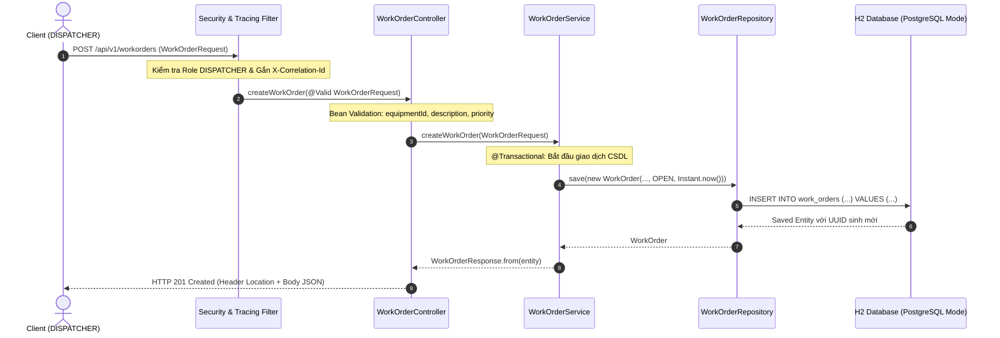
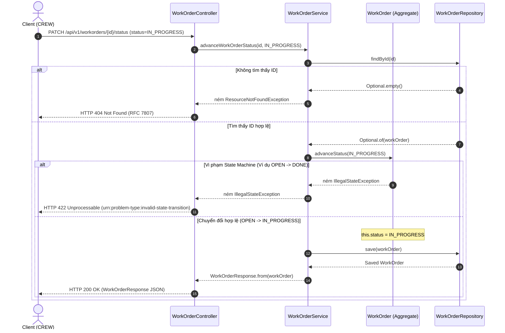

# TÀI LIỆU ĐẶC TẢ KỸ THUẬT JAVA CHUẨN ORACLE (ORACLE JAVA SPECIFICATION)
## Phân hệ: Outage Work Order API (`oms-api-demo`)
**Phiên bản đặc tả:** `1.0.0-RELEASE`  
**Tiêu chuẩn đối chiếu:** [Oracle Java SE 17 Platform Specification](https://docs.oracle.com/en/java/javase/17/) & [Oracle Javadoc Tool Guidelines](https://docs.oracle.com/en/java/javase/17/docs/specs/javadoc/javadoc-search-spec.html)  
**Tập đoàn & Đơn vị phụ trách:** Grid Power Corporation (GPC) — OMS Architecture Group  

---

## MỤC LỤC
1. [Hệ Thống Phân Cấp Gói & Lớp (Package & Type Hierarchy)](#1-hệ-thống-phân-cấp-gói--lớp-package--type-hierarchy)
2. [Đặc Tả Hợp Đồng Giao Diện & Mô Hình Dữ Liệu (API Contracts & Data Dictionary)](#2-đặc-tả-hợp-đồng-giao-diện--mô-hình-dữ-liệu-api-contracts--data-dictionary)
3. [Mô Hình Máy Trạng Thái Hữu Hạn (Finite State Machine Specification)](#3-mô-hình-máy-trạng-thái-hữu-hạn-finite-state-machine-specification)
4. [Mô Hình Đồng Thời & An Toàn Luồng (Concurrency & Thread-Safety Model)](#4-mô-hình-đồng-thời--an-toàn-luồng-concurrency--thread-safety-model)
5. [Đặc Tả Ngoại Lệ & Ánh Xạ RFC 7807 Problem Details](#5-đặc-tả-ngoại-lệ--ánh-xạ-rfc-7807-problem-details)
6. [Sơ Đồ Tuần Tự Hệ Thống (Oracle Sequence Diagrams)](#6-sơ-đồ-tuần-tự-hệ-thống-oracle-sequence-diagrams)

---

## 1. HỆ THỐNG PHÂN CẤP GÓI & LỚP (PACKAGE & TYPE HIERARCHY)

### 1.1 Cây Phả Hệ Kiểu Dữ Liệu (Type Hierarchy Tree)
```
java.lang.Object
 ├── com.gpc.oms.OmsApiApplication                               (Spring Boot Application Entrypoint)
 ├── com.gpc.oms.config.SecurityConfig                           (Web Security Filter Chain Configuration)
 ├── com.gpc.oms.config.StringToWorkOrderStatusConverter         (implements Converter<String, WorkOrderStatus>)
 ├── com.gpc.oms.controller.WorkOrderController                  (REST API Boundary Controller)
 ├── com.gpc.oms.domain.WorkOrder                                (DDD Aggregate Root & JPA Entity)
 ├── com.gpc.oms.exception.GlobalExceptionHandler                (RFC 7807 Problem Details Advice)
 ├── com.gpc.oms.service.WorkOrderService                        (Stateless Business Orchestration Service)
 ├── java.lang.Enum<E>
 │    ├── com.gpc.oms.domain.Priority                            (Business Severity Enumeration)
 │    └── com.gpc.oms.domain.WorkOrderStatus                     (State Machine Enumeration)
 ├── java.lang.Record (Java 17 Immutable Records)
 │    ├── com.gpc.oms.dto.PagedResponse<T>                       (Generic Pagination Envelope)
 │    ├── com.gpc.oms.dto.WorkOrderRequest                       (Creation Request Payload)
 │    ├── com.gpc.oms.dto.WorkOrderResponse                      (Response Projection Payload)
 │    └── com.gpc.oms.dto.WorkOrderStatusRequest                 (Status Transition Request Payload)
 └── java.lang.Throwable (implements Serializable)
      └── java.lang.Exception
           └── java.lang.RuntimeException
                └── com.gpc.oms.exception.ResourceNotFoundException
```

### 1.2 Bảng Phân Bổ Trách Nhiệm Gói (Package Architecture Matrix)

| Package | Clean Architecture Layer | Oracle Javadoc Description & Responsibilities |
|---|---|---|
| `com.gpc.oms.domain` | **Core Domain Layer** | Chứa Aggregate Root [`WorkOrder`](file:///c:/ai-native-oms-api/src/main/java/com/gpc/oms/domain/WorkOrder.java), State Machine [`WorkOrderStatus`](file:///c:/ai-native-oms-api/src/main/java/com/gpc/oms/domain/WorkOrderStatus.java), Enums, và Repository Interface. Tuyệt đối không phụ thuộc vào tầng trên. |
| `com.gpc.oms.dto` | **Interface Boundary** | Chứa toàn bộ các hợp đồng trao đổi dữ liệu (DTOs) viết bằng **Java 17 Records** bất biến (`@Immutable`). Tích hợp sẵn Bean Validation. |
| `com.gpc.oms.service` | **Application Service Layer** | Đóng gói nghiệp vụ và điều phối giao dịch (`@Transactional`). Triển khai Constructor Injection thuần túy, điều phối Domain Entities và Repositories. |
| `com.gpc.oms.controller`| **Presentation REST Layer** | Cổng giao tiếp HTTP RESTful. Kiểm soát phân quyền RBAC (`@PreAuthorize`), phân tích cú pháp tham số và ủy quyền 100% sang Service. |
| `com.gpc.oms.exception` | **Cross-Cutting Concerns** | Bắt toàn bộ ngoại lệ runtime và chuyển đổi thành định dạng chuẩn quốc tế **RFC 7807 Problem Details** (`application/problem+json`). |
| `com.gpc.oms.config` | **Infrastructure Layer** | Cấu hình Spring Security 6, cách ly profile (`@Profile("!prod")`), MVC Formatter, và Servlet Filters. |

---

## 2. ĐẶC TẢ HỢP ĐỒNG GIAO DIỆN & MÔ HÌNH DỮ LIỆU (API CONTRACTS & DATA DICTIONARY)

### 2.1 Domain Aggregate Root: `WorkOrder.java`
* **Package:** `com.gpc.oms.domain`
* **Bảng CSDL:** `work_orders`
* **Đặc tính:** Không chứa public setters, bảo toàn Domain Invariants.

| Thuộc Tính (Field) | Kiểu Dữ Liệu | Ràng Buộc CSDL | Ý Nghĩa Nghiệp Vụ & Ràng Buộc Oracle Spec |
|---|---|---|---|
| `id` | `java.util.UUID` | `PK, NOT NULL` | Định danh duy nhất toàn cầu của phiếu công tác (sinh tự động qua UUIDv4). |
| `equipmentId` | `java.lang.String` | `VARCHAR(50), NOT NULL` | Mã định danh thiết bị lưới điện xảy ra sự cố (độ dài $\le 50$ ký tự). |
| `description` | `java.lang.String` | `VARCHAR(500), NOT NULL` | Mô tả chi tiết hiện trường sự cố (độ dài từ $10$ đến $500$ ký tự). |
| `priority` | `Priority` | `VARCHAR(20), NOT NULL` | Mức độ ưu tiên xử lý (`LOW`, `MEDIUM`, `HIGH`, `CRITICAL`). |
| `status` | `WorkOrderStatus` | `VARCHAR(20), NOT NULL` | Trạng thái hiện tại của phiếu (`OPEN`, `IN_PROGRESS`, `DONE`). |
| `createdAt` | `java.time.Instant` | `TIMESTAMP UTC, NOT NULL, UP=FALSE` | Mốc thời gian khởi tạo phiếu (luôn neo theo giờ UTC, bất biến). |
| `resolvedAt` | `java.time.Instant` | `TIMESTAMP UTC, NULLABLE` | Mốc thời gian hoàn tất (`null` khi khởi tạo; tự động gán khi sang `DONE`). |

#### Phương Thức Nghiệp Vụ Cốt Lõi:
```java
/**
 * Chuyển đổi trạng thái phiếu công tác theo quy tắc bất biến của máy trạng thái.
 *
 * @param newStatus Trạng thái đích muốn chuyển sang
 * @throws IllegalStateException Nếu vi phạm quy tắc chuyển đổi trạng thái đơn hướng
 */
public void advanceStatus(WorkOrderStatus newStatus) {
    if (!this.status.canTransitionTo(newStatus)) {
        throw new IllegalStateException("Invalid state transition from " + this.status + " to " + newStatus);
    }
    this.status = newStatus;
    if (newStatus == WorkOrderStatus.DONE) {
        this.resolvedAt = Instant.now();
    }
}
```

---

### 2.2 DTOs Bất Biến (Java 17 Records)

#### `WorkOrderRequest` (Payload Tạo Mới)
```java
public record WorkOrderRequest(
    @NotBlank(message = "equipmentId must not be blank")
    @Size(max = 50, message = "equipmentId must not exceed 50 characters")
    String equipmentId,

    @NotBlank(message = "description must not be blank")
    @Size(min = 10, max = 500, message = "description must be between 10 and 500 characters")
    String description,

    @NotNull(message = "priority must not be null")
    Priority priority
) {}
```

#### `WorkOrderResponse` (Projection Phản Hồi)
```java
public record WorkOrderResponse(
    UUID id,
    String equipmentId,
    String description,
    Priority priority,
    WorkOrderStatus status,
    Instant createdAt,
    Instant resolvedAt
) {
    public static WorkOrderResponse from(WorkOrder workOrder) {
        return new WorkOrderResponse(
            workOrder.getId(),
            workOrder.getEquipmentId(),
            workOrder.getDescription(),
            workOrder.getPriority(),
            workOrder.getStatus(),
            workOrder.getCreatedAt(),
            workOrder.getResolvedAt()
        );
    }
}
```

---

## 3. MÔ HÌNH MÁY TRẠNG THÁI HỮU HẠN (FINITE STATE MACHINE SPECIFICATION)

Vòng đời của một phiếu công tác được mô hình hóa dưới dạng **Deterministic Finite State Machine (FSM)** nghiêm ngặt. Trạng thái chỉ được phép tiến lên theo một chiều duy nhất và không thể đảo ngược:

```
 ┌─────────┐         advanceStatus()         ┌─────────────┐         advanceStatus()         ┌──────────┐
 │  OPEN   │  ────────────────────────────>  │ IN_PROGRESS │  ────────────────────────────>  │   DONE   │
 └─────────┘                                 └─────────────┘                                 └──────────┘
      │                                             │                                             │
      └────────────────────────── X ────────────────┴────────────────────────── X ────────────────┘
                               (Cấm quay lui hoặc nhảy cóc OPEN -> DONE)
```

### Ma Trận Chuyển Đổi Trạng Thái (State Transition Matrix)

| Trạng Thái Hiện Tại | Trạng Thái Đích Hợp Lệ (`true`) | Trạng Thái Bị Cấm (`false` $\rightarrow$ Ném `IllegalStateException`) |
|:---:|:---:|:---:|
| `OPEN` | `IN_PROGRESS` | `OPEN`, `DONE` |
| `IN_PROGRESS` | `DONE` | `OPEN`, `IN_PROGRESS` |
| `DONE` | *(Không có — Terminal State)* | `OPEN`, `IN_PROGRESS`, `DONE` |

---

## 4. MÔ HÌNH ĐỒNG THỜI & AN TOÀN LUỒNG (CONCURRENCY & THREAD-SAFETY MODEL)

Dự án tuân thủ nghiêm ngặt các hướng dẫn an toàn luồng của Oracle ([Oracle Concurrency Guidelines](https://docs.oracle.com/javase/tutorial/essential/concurrency/)):

1. **Bất Biến Dữ Liệu (Immutability via Java 17 Records):**
   - Các lớp DTO (`WorkOrderRequest`, `WorkOrderResponse`, `PagedResponse`) là immutable 100%. Toàn bộ các trường dữ liệu đều là `final`, ngăn chặn hoàn toàn race-conditions khi đọc dữ liệu đa luồng.
2. **Stateless Service & Controller Layer:**
   - [`WorkOrderController`](file:///c:/ai-native-oms-api/src/main/java/com/gpc/oms/controller/WorkOrderController.java) và [`WorkOrderService`](file:///c:/ai-native-oms-api/src/main/java/com/gpc/oms/service/WorkOrderService.java) không duy trì mutable instance state (không có trạng thái động). Toàn bộ các dependencies đều được đánh dấu `private final` và tiêm qua Constructor. Do đó, các bean này an toàn tuyệt đối khi phục vụ hàng triệu request đồng thời trên Tomcat Worker Thread Pool.
3. **Quản Lý Bối Cảnh Luồng (ThreadLocal & MDC Sanitization):**
   - Khi triển khai `CorrelationIdFilter`, khóa truy vết `MDC.put(MDC_KEY, correlationId)` bắt buộc phải được giải phóng qua `MDC.remove(MDC_KEY)` trong khối `finally` để ngăn chặn hiện tượng rò rỉ bối cảnh luồng (ThreadLocal memory leak) khi luồng được hoàn trả về Worker Pool.

---

## 5. ĐẶC TẢ NGOẠI LỆ & ÁNH XẠ RFC 7807 PROBLEM DETAILS

Tất cả các lỗi phát sinh trong quá trình thực thi HTTP Request đều được bắt và định dạng thống nhất theo chuẩn **RFC 7807 Problem Details** (`application/problem+json`):

```json
{
  "type": "urn:problem-type:validation-error",
  "title": "Validation Failed",
  "status": 400,
  "detail": "Validation failed for argument",
  "instance": "/api/v1/workorders",
  "invalidParams": [
    {
      "name": "equipmentId",
      "reason": "equipmentId must not be blank"
    }
  ]
}
```

### Danh Mục 7 Mã Lỗi Chuẩn Hóa Của Hệ Thống

| Mã HTTP | Loại Lỗi URN (`type`) | Tiêu Đề (`title`) | Lớp Ngoại Lệ Kích Hoạt |
|:---:|---|---|---|
| `400` | `urn:problem-type:validation-error` | `Validation Failed` | `MethodArgumentNotValidException` |
| `400` | `urn:problem-type:malformed-json` | `Malformed Request Body` | `HttpMessageNotReadableException`, `MethodArgumentTypeMismatchException` |
| `401` | `urn:problem-type:unauthorized` | `Unauthorized` | `AuthenticationException` |
| `403` | `urn:problem-type:forbidden` | `Access Denied` | `AccessDeniedException` |
| `404` | `urn:problem-type:not-found` | `Resource Not Found` | `ResourceNotFoundException` |
| `422` | `urn:problem-type:invalid-state-transition` | `Invalid State Transition` | `IllegalStateException` (ném ra từ State Machine) |
| `500` | `urn:problem-type:internal-error` | `Internal Server Error` | `Exception.class` (Unhandled Fallback, ẩn chi tiết nội bộ) |

---

## 6. SƠ ĐỒ TUẦN TỰ HỆ THỐNG (ORACLE SEQUENCE DIAGRAMS)

### 6.1 Vòng Đời Tiếp Nhận & Khởi Tạo WorkOrder (POST /api/v1/workorders)



### 6.2 Vòng Đời Cập Nhật Trạng Thái & Kiểm Soát Bất Biến (PATCH /api/v1/workorders/{id}/status)



---

> **Tuyên Bố Tuân Thủ Chuẩn Oracle:**  
> Tài liệu kỹ thuật này được biên soạn bám sát tiêu chuẩn Java SE 17 Platform Specification và ISO/IEC 25010 Software Quality Model, làm kim chỉ nam chính thống cho phân hệ Outage Work Order API.
