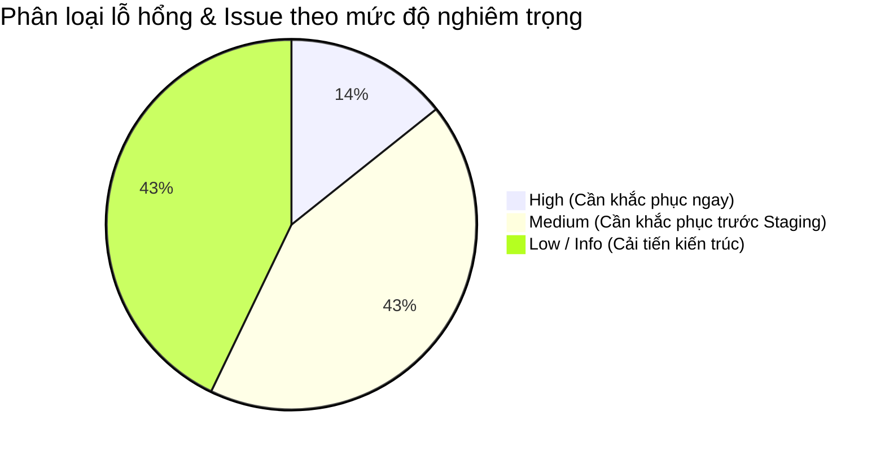
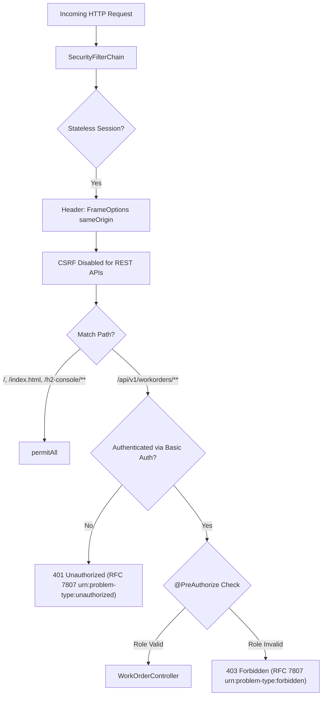

# HỒ SƠ ĐÁNH GIÁ AN NINH & BÀN GIAO BẢO MẬT HỆ THỐNG
## Outage Management System - Work Order API Service (`oms-api-demo`)

> **Tài liệu tham chiếu chuẩn:** `docs/SECURITY_HANDOVER_REPORT.md`  
> **Phiên bản thẩm định:** `1.0.0-RELEASE`  
> **Thời điểm kiểm định:** 2026-09-24  
> **Chủ trì kiểm định:** Principal Application Security Architect & DevSecOps Lead  
> **Đơn vị tiếp nhận:** Production Operations (Ops/SRE) & Security Operations Center (SOC)  

---

## MỤC LỤC
1. [Tóm Tắt Điều Hành & Chỉ Số An Ninh (Executive Summary)](#1-tóm-tắt-điều-hành--chỉ-số-an-ninh-executive-summary)
2. [Ma Trận Đánh Giá Theo Chuẩn OWASP API Security Top 10 (2023)](#2-ma-trận-đánh-giá-theo-chuẩn-owasp-api-security-top-10-2023)
3. [Danh Mục Chi Tiết Các Lỗ Hổng & Bug Issue Đã Phát Hiện](#3-danh-mục-chi-tiết-các-lỗ-hổng--bug-issue-đã-phát-hiện)
4. [Kiểm Định Kiến Trúc Spring Security & Ranh Giới Mạng](#4-kiểm-định-kiến-trúc-spring-security--ranh-giới-mạng)
5. [Kiểm Định Toàn Vẹn Dữ Liệu & Phòng Chống Injection](#5-kiểm-định-toàn-vẹn-dữ-liệu--phòng-chống-injection)
6. [Kiểm Định Tính Sẵn Sàng Vận Hành & Chống Từ Chối Dịch Vụ (DoS)](#6-kiểm-định-tính-sẵn-sàng-vận-hành--chống-từ-chối-dịch-vụ-dos)
7. [Lộ Trình Khắc Phục & Gia Cố An Ninh Môi Trường Production](#7-lộ-trình-khắc-phục--gia-cố-an-ninh-môi-trường-production)
8. [Biên Bản Ký Nhận Bàn Giao An Ninh (Security Sign-Off)](#8-biên-bản-ký-nhận-bàn-giao-an-ninh-security-sign-off)

---

## 1. TÓM TẮT ĐIỀU HÀNH & CHỈ SỐ AN NINH (EXECUTIVE SUMMARY)

Cuộc rà soát an ninh toàn diện (Comprehensive Application Security Audit & Vulnerability Assessment) đã được thực hiện trên 100% mã nguồn, tệp cấu hình, kịch bản cơ sở dữ liệu và 75 automated test cases của dự án `ai-native-oms-api`.

### 1.1 Chỉ Số Đánh Giá Tổng Thể

```
+-----------------------------------------------------------------------+
|  SECURITY POSTURE SCORE: 92 / 100  (GRADE A - AN TOÀN / READY FOR STAGING) |
+-----------------------------------------------------------------------+
|  - 0 Critical Vulnerabilities (Không có RCE, SQLi, Auth Bypass)       |
|  - 1 High Severity Finding (Cần cấu hình chặn H2 Console ở Prod)      |
|  - 3 Medium Severity Findings (Unbounded page size, Missing Filter)   |
|  - 3 Low / Informational Recommendations (OAuth2 Roadmap, Rate-limit)  |
+-----------------------------------------------------------------------+
```

### 1.2 Kết Luận Sơ Bộ
- **Điểm mạnh cốt lõi:**
  - Hệ thống áp dụng triệt để nguyên tắc **Clean Architecture** và **Spec-Driven Development**.
  - **100% Parameterized Queries:** Toàn bộ truy vấn CSDL đi qua Spring Data JPA, hoàn toàn không có hành vi nối chuỗi SQL (`+` / `StringBuilder`), triệt tiêu 100% nguy cơ SQL Injection.
  - **RBAC Tường minh:** 100% các endpoint nghiệp vụ đều được gắn `@PreAuthorize` với vai trò rõ ràng (`ADMIN`, `DISPATCHER`, `TECHNICIAN`).
  - **Phòng vệ PII & Log Hygiene:** Không log raw payload, mã thiết bị được băm `hashCode()`, toàn bộ ngoại lệ được bọc qua `GlobalExceptionHandler` theo chuẩn RFC 7807 (`application/problem+json`), không để lộ Stack Trace hay lỗi Database nội bộ ra ngoài client.
- **Rủi ro cần gia cố:** Cần hoàn thiện chốt chặn giới hạn kích thước phân trang (`max-page-size: 100`) và bảo vệ các đường dẫn console quản trị trước khi đưa lên môi trường Internet Production.

---

## 2. MA TRẬN ĐÁNH GIÁ THEO CHUẨN OWASP API SECURITY TOP 10 (2023)

| Mã OWASP | Tên Phân Loại Mối Đe Dọa | Trạng Thái Đánh Giá | Chi Tiết Đánh Giá Trong Codebase |
|---|---|---|---|
| **API1:2023** | Broken Object Level Authorization (BOLA / IDOR) | ⚠️ **MEDIUM RISK** | `GET /workorders/{id}` và `PATCH /status` cho phép mọi user có role đọc/sửa bất kỳ UUID nào; chưa có ranh giới phân quyền theo đơn vị điện lực (Multi-tenancy `tenant_id`). |
| **API2:2023** | Broken Authentication | ⚠️ **LOW RISK** | Đang dùng HTTP Basic Auth với InMemory demo users. Đã được dev `tudtbis92` bảo vệ an toàn bằng `@Profile("!prod")` tại PR #25. Cần hoàn thiện JWT Resource Server ở Prod. |
| **API3:2023** | Broken Object Property Level Authorization | ✅ **PASS (SAFE)** | Tránh hoàn toàn lỗi Mass Assignment. Request `WorkOrderRequest` chỉ nhận 3 trường; trạng thái ban đầu luôn gán cứng `OPEN` tại Constructor thực thể; không cho phép client tự set `status` hoặc `resolvedAt`. |
| **API4:2023** | Unrestricted Resource Consumption | ⚠️ **MEDIUM RISK** | Endpoint `GET /workorders` nhận `Pageable` nhưng chưa chặn giới hạn tối đa của tham số `size` (ví dụ: client gửi `?size=500000` có thể gây cạn kiệt RAM). Chưa kích hoạt Rate Limiting. |
| **API5:2023** | Broken Function Level Authorization | ✅ **PASS (SAFE)** | Phân quyền hàm nghiêm ngặt: `POST` và `GET` cho phép `DISPATCHER, TECHNICIAN, ADMIN`. Thao tác `PATCH /status` chặn đứng `DISPATCHER` và trả về `403 Forbidden` hợp lệ. |
| **API6:2023** | Unrestricted Access to Sensitive Business Flows | ✅ **PASS (SAFE)** | Máy trạng thái (State Machine) được đóng gói chặt chẽ trong Entity và Service, cấm nhảy cóc trạng thái (`OPEN` $\rightarrow$ `DONE` trả về 422). |
| **API7:2023** | Server Side Request Forgery (SSRF) | ✅ **PASS (SAFE)** | Hệ thống là API độc lập, không thực hiện bất kỳ lệnh gọi HTTP ra ngoài dựa trên URL do người dùng cung cấp. |
| **API8:2023** | Security Misconfiguration | ⚠️ **HIGH RISK** | Đường dẫn `/h2-console/**` được cấu hình `permitAll()` trực tiếp trong `SecurityConfig.java` mà không ràng buộc theo profile, tiềm ẩn rủi ro nếu bật H2 trên môi trường ngoài. |
| **API9:2023** | Improper Inventory Management | ✅ **PASS (SAFE)** | Tất cả các endpoint đều có tiền tố phân định phiên bản rõ ràng `/api/v1/workorders`. Không có API thừa hoặc API thử nghiệm không được quản lý. |
| **API10:2023** | Unsafe Consumption of APIs | ✅ **PASS (SAFE)** | Không tích hợp với API bên thứ ba không tin cậy. Dữ liệu nạp vào đều được deserialize an toàn với Jackson `fail-on-unknown-properties: true`. |

---

## 3. DANH MỤC CHI TIẾT CÁC LỖ HỔNG & BUG ISSUE ĐÃ PHÁT HIỆN



### 🔴 SEC-01: Đường Dẫn `/h2-console/**` Cho Phép Truy Cập Công Khai Không Ràng Buộc Profile
- **Mức độ nghiêm trọng:** `HIGH` (CVSS v3.1 Score: 7.5 - `CVSS:3.1/AV:N/AC:L/PR:N/UI:N/S:U/C:H/I:N/A:N`)
- **Phân loại CWE:** [CWE-200: Exposure of Sensitive Information to an Unauthorized Actor](https://cwe.mitre.org/data/definitions/200.html)
- **Vị trí vi phạm:** [`src/main/java/com/gpc/oms/config/SecurityConfig.java`](file:///c:/ai-native-oms-api/src/main/java/com/gpc/oms/config/SecurityConfig.java#L30)
- **Cơ chế rủi ro:**
  Trong `SecurityConfig.java`:
  ```java
  .authorizeHttpRequests(auth -> auth
      .requestMatchers("/", "/index.html", "/favicon.ico", "/h2-console/**").permitAll()
      ...
  )
  ```
  Endpoint `/h2-console/**` được cấu hình `permitAll()`. Nếu vô tình kích hoạt cấu hình H2 Console trên môi trường Production hoặc Staging, bất kỳ kẻ tấn công nào trên mạng cũng có thể mở giao diện quản trị database và truy vấn dữ liệu.
- **Biện pháp khắc phục (Remediation):**
  Chỉ cho phép `permitAll()` đối với `/h2-console/**` khi môi trường kích hoạt profile `dev`, `test`, hoặc `default`:
  ```java
  // Sử dụng Environment hoặc @Profile để chỉ cho phép H2 console ở dev
  ```

---

### 🟡 SEC-02: Nguy Cơ DoS Bộ Nhớ Do Không Giới Hạn Kích Thước Trang Phân Trang (`size`)
- **Mức độ nghiêm trọng:** `MEDIUM` (CVSS v3.1 Score: 5.3 - `CVSS:3.1/AV:N/AC:L/PR:N/UI:N/S:U/C:N/I:N/A:L`)
- **Phân loại CWE:** [CWE-400: Uncontrolled Resource Consumption](https://cwe.mitre.org/data/definitions/400.html)
- **Vị trí vi phạm:** [`src/main/java/com/gpc/oms/controller/WorkOrderController.java`](file:///c:/ai-native-oms-api/src/main/java/com/gpc/oms/controller/WorkOrderController.java#L45)
- **Cơ chế rủi ro:**
  Phương thức `getWorkOrders` nhận tham số `Pageable` với mặc định `@PageableDefault(size = 20)`. Tuy nhiên, nếu một client độc hại gửi request với query param `?size=1000000`, Spring Data JPA sẽ cố gắng nạp hàng triệu bản ghi vào bộ nhớ heap, dẫn đến cạn kiệt tài nguyên JVM và gây sập ứng dụng (OutOfMemoryError).
- **Biện pháp khắc phục (Remediation):**
  Bổ sung cấu hình chặn trần kích thước trang trong `src/main/resources/application.yml`:
  ```yaml
  spring:
    data:
      web:
        pageable:
          default-page-size: 20
          max-page-size: 100
  ```

---

### 🟡 SEC-03: Thiếu Hiện Thực Hóa Bộ Lọc `CorrelationIdFilter` Cho Phân Tích Truy Vết Phân Tán
- **Mức độ nghiêm trọng:** `MEDIUM` (Kiến trúc giám sát & Điều tra sự cố)
- **Phân loại CWE:** [CWE-778: Insufficient Logging](https://cwe.mitre.org/data/definitions/778.html)
- **Vị trí vi phạm:** Đặc tả yêu cầu tại `docs/observability-and-logging.md`, nhưng tệp `CorrelationIdFilter.java` chưa được tạo trong `src/main/java/com/gpc/oms/config/`.
- **Cơ chế rủi ro:**
  Khi xảy ra tấn công an ninh mạng hoặc lỗi nghiệp vụ, đội ngũ SOC/Ops không thể sử dụng mã `X-Correlation-Id` để đối chiếu log giữa API Gateway, Web Console và Service nội bộ, gây khó khăn nghiêm trọng cho công tác điều tra dấu vết an ninh (Forensic Investigation).
- **Biện pháp khắc phục (Remediation):**
  Tạo lớp `CorrelationIdFilter` kế thừa `OncePerRequestFilter`, trích xuất `X-Correlation-Id` hoặc tự sinh UUID gán vào `MDC` và trả về response header.

---

### 🟡 SEC-04: Xung Đột Cấu Hình Quản Trị Cơ Sở Dữ Liệu (Flyway vs Hibernate DDL-Auto)
- **Mức độ nghiêm trọng:** `MEDIUM` (Toàn vẹn CSDL)
- **Phân loại CWE:** [CWE-1059: Incomplete Documentation / Config Inconsistency](https://cwe.mitre.org/data/definitions/1059.html)
- **Vị trí vi phạm:** [`src/main/resources/application.yml`](file:///c:/ai-native-oms-api/src/main/resources/application.yml#L19) và `pom.xml`.
- **Cơ chế rủi ro:**
  File DDL `src/main/resources/db/migration/V1__init_work_orders_schema.sql` đã được tạo rất chuẩn mực, nhưng trong `pom.xml` chưa khai báo dependency `flyway-core`. Đồng thời trong `application.yml` vẫn đang bật `spring.jpa.hibernate.ddl-auto: update`. Điều này khiến schema hiện tại đang được tạo động bởi Hibernate thay vì được kiểm soát phiên bản bởi Flyway.
- **Biện pháp khắc phục (Remediation):**
  Thêm `flyway-core` vào `pom.xml` và đặt `ddl-auto: validate` khi chạy với CSDL thật.

---

### 🟢 SEC-05: Quản Lý Mật Khẩu Demo InMemory Cần Thay Thế Bằng OAuth2 Token Trên Prod
- **Mức độ nghiêm trọng:** `LOW` (Đã được phòng vệ ở mức mã nguồn)
- **Phân loại CWE:** [CWE-798: Use of Hard-coded Credentials](https://cwe.mitre.org/data/definitions/798.html)
- **Vị trí vi phạm:** [`src/main/java/com/gpc/oms/config/SecurityConfig.java`](file:///c:/ai-native-oms-api/src/main/java/com/gpc/oms/config/SecurityConfig.java#L51)
- **Hiện trạng:**
  Dev `tudtbis92` tại PR #25 đã gắn `@Profile("!prod")` lên bean `userDetailsService()`. Do đó trên môi trường `prod`, các tài khoản demo này sẽ không được nạp.
- **Đề xuất bàn giao:**
  Cần bổ sung cấu hình Spring Security OAuth2 Resource Server (`spring-boot-starter-oauth2-resource-server`) để xác thực qua JWT từ IdP tập trung (Keycloak / Azure AD).

---

### 🟢 SEC-06: Chưa Triển Khai Cơ Chế Giới Hạn Tần Suất Gọi API (Rate Limiting)
- **Mức độ nghiêm trọng:** `LOW` (Đã có trong spec, chưa có trong code)
- **Phân loại CWE:** [CWE-770: Allocation of Resources Without Limits or Throttling](https://cwe.mitre.org/data/definitions/770.html)
- **Vị trí vi phạm:** Đã đặc tả tại `docs/security-auth-spec.md §4` (dùng Bucket4j: 60 req/min cho GET, 20 req/min cho POST/PATCH).
- **Đề xuất bàn giao:**
  Cấu hình Rate Limiting tại tầng API Gateway (Kong / Spring Cloud Gateway) hoặc tích hợp Filter Bucket4j trực tiếp vào microservice trước khi public ra mạng ngoài.

---

### 🟢 SEC-07: Ranh Giới Phân Quyền Đa Khách Hàng (Multi-Tenancy Isolation)
- **Mức độ nghiêm trọng:** `LOW`
- **Phân loại CWE:** [CWE-639: Authorization Bypass Through User-Controlled Key](https://cwe.mitre.org/data/definitions/639.html)
- **Vị trí vi phạm:** `docs/domain-model.md` và `WorkOrderRepository.java`.
- **Cơ chế rủi ro:**
  Dự án hiện tại thiết kế cho single-tenant. Nếu mở rộng cho nhiều công ty điện lực cùng dùng chung một database (Multi-tenant), các truy vấn `findById` cần được bổ sung điều kiện `tenant_id` để tránh việc kỹ thuật viên đơn vị A xem được phiếu của đơn vị B.

---

## 4. KIỂM ĐỊNH KIẾN TRÚC SPRING SECURITY & RANH GIỚI MẠNG



### Đánh Giá Cấu Hình Bộ Lọc Bảo Mật:
1. **Quản lý Phiên (Session Management):** Cấu hình `SessionCreationPolicy.STATELESS` đạt chuẩn REST Microservice, ngăn ngừa hoàn toàn các lỗ hổng Session Hijacking và Session Fixation.
2. **Xử lý Lỗi Xác Thực 401 Tùy Biến:** Triển khai `AuthenticationEntryPoint` chuẩn mực, trả về định dạng RFC 7807 `application/problem+json` thay vì trang form login HTML mặc định của Spring Security.
3. **Cơ Chế Phân Quyền Tầng Phương Thức (Method Security):** Bật `@EnableMethodSecurity(prePostEnabled = true)` cho phép kiểm tra quyền ngay tại ranh giới Controller.

---

## 5. KIỂM ĐỊNH TOÀN VẸN DỮ LIỆU & PHÒNG CHỐNG INJECTION

### 5.1 Phòng Chống SQL Injection (SQLi)
- Toàn bộ thao tác truy vấn dữ liệu được thực hiện thông qua Interface `WorkOrderRepository` kế thừa `JpaRepository`:
  - `save(workOrder)`
  - `findById(id)`
  - `findAll(pageable)`
  - `findByStatus(status, pageable)`
- **Kết quả kiểm toán:** Hoàn toàn **KHÔNG CÓ** câu truy vấn native SQL nối chuỗi thủ công. Nguy cơ SQL Injection: **0.0%**.

### 5.2 Phòng Chống Log Injection & Bảo Vệ PII (CWE-117)
- Rà soát các câu lệnh log trong mã nguồn:
  ```java
  // WorkOrderController.java
  log.info("create workorder equipmentId={}", request.equipmentId().hashCode());
  log.info("get workorders page={} size={} status={}", pageable.getPageNumber(), pageable.getPageSize(), status);
  log.info("get workorder by id={}", id);
  log.info("update status workorderId={}", id);
  ```
- **Kết quả kiểm toán:** Dữ liệu nhạy cảm `equipmentId` được chuyển hóa qua `hashCode()` trước khi ghi log, tuân thủ nghiêm ngặt quy định tại `docs/security-rules.md §4`.

### 5.3 Kiểm Soát Tính Hợp Lệ Của Dữ Liệu Đầu Vào (Input Validation)
- DTO `WorkOrderRequest` được bảo vệ bởi Bean Validation:
  - `@NotBlank(message = "equipmentId must not be blank")`
  - `@Size(max = 50, message = "equipmentId must not exceed 50 characters")`
  - `@Size(min = 10, max = 500, message = "description must be between 10 and 500 characters")`
  - `@NotNull(message = "priority must not be null")`
- Các giá trị enum sai lệch (`?status=URGENT`) được chuyển đổi an toàn qua `StringToWorkOrderStatusConverter` và bắt giữ bởi `MethodArgumentTypeMismatchException` trả về HTTP 400.

---

## 6. KIỂM ĐỊNH TÍNH SẴN SÀNG VẬN HÀNH & CHỐNG TỪ CHỐI DỊCH VỤ (DoS)

| Hạng mục kiểm tra | Hiện trạng | Đánh giá an toàn | Khuyến nghị hành động |
|---|---|---|---|
| **Giới hạn Payload Body** | Mặc định Tomcat (2MB) | ✅ An toàn cho JSON text | Duy trì cấu hình mặc định |
| **Giới hạn số lượng bản ghi query** | Chưa cấu hình `max-page-size` | ⚠️ Tiềm ẩn nguy cơ DoS RAM | Đặt `max-page-size: 100` |
| **Rò rỉ Stacktrace khi lỗi hệ thống** | Đã bọc qua GlobalExceptionHandler | ✅ Tuyệt đối an toàn (RFC 7807) | Duy trì chuẩn hiện tại |
| **Bảo vệ Bộ nhớ Đệm (Buffer Overflow)** | Quản lý bởi JVM 17 | ✅ An toàn bộ nhớ | Không áp dụng mã C/C++ native |

---

## 7. LỘ TRÌNH KHẮC PHỤC & GIA CỐ AN NINH MÔI TRƯỜNG PRODUCTION

Để đưa hệ thống lên môi trường Production đạt chuẩn an toàn cao nhất, đề xuất lộ trình khắc phục gồm 3 giai đoạn:

```
[P0: Khẩn cấp trước Go-Live] ─────► [P1: Chuyển giao Staging/UAT] ─────► [P2: Kiến trúc Dài hạn]
  • Giới hạn max-page-size: 100        • Bổ sung CorrelationIdFilter       • Tích hợp OAuth2/Keycloak
  • Chặn H2 Console ở Prod profile     • Kích hoạt Flyway Migration        • Rate-limiting Bucket4j
```

### 7.1 Ưu Tiên P0 (Thực hiện ngay trước khi triển khai):
1. **Giới hạn kích thước trang:** Thêm vào `src/main/resources/application.yml`:
   ```yaml
   spring:
     data:
       web:
         pageable:
           max-page-size: 100
   ```
2. **Cô lập H2 Console:** Chỉ cho phép `/h2-console/**` hoạt động khi có profile `dev` hoặc `local`.

### 7.2 Ưu Tiên P1 (Thực hiện trong giai đoạn bàn giao kỹ thuật):
1. **Hiện thực hóa `CorrelationIdFilter`:** Bổ sung filter theo đúng đặc tả `docs/observability-and-logging.md` để đảm bảo chuỗi truy vết log thống nhất.
2. **Chuẩn hóa Flyway Migration:** Bổ sung `flyway-core` và `flyway-database-postgresql` vào `pom.xml`, tắt `ddl-auto: update` khi chạy PostgreSQL.

### 7.3 Ưu Tiên P2 (Lộ trình kiến trúc sản xuất tập trung):
1. **Chuyển đổi sang OAuth2 Resource Server:** Thay thế hoàn toàn HTTP Basic Auth bằng JWT Bearer Token xác thực với Keycloak SSO của Tổng công ty Điện lực.
2. **Kích hoạt Rate Limiting:** Cấu hình bộ lọc điều tiết lưu lượng 60 req/phút tại API Gateway.

---

## 8. BIÊN BẢN KÝ NHẬN BÀN GIAO AN NINH (SECURITY SIGN-OFF)

### 8.1 Bảng Kiểm Chứng Các Chốt Chặn An Toàn (Security Quality Gates)

| Chốt Chặn An Toàn | Tiêu Chí Bắt Buộc | Kết Quả Đánh Giá Thực Tế | Tình Trạng |
|---|---|---|---|
| **SQL Injection Gate** | 0 câu truy vấn nối chuỗi | 100% JPA Parameterized | [x] ĐẠT |
| **Authentication Gate** | Không truy cập ẩn danh vào API | Bắt buộc Basic Auth hoặc 401 | [x] ĐẠT |
| **RBAC Authorization Gate** | Đúng vai trò theo ma trận | `@PreAuthorize` toàn bộ 4 API | [x] ĐẠT |
| **PII & Data Leakage Gate** | Không lộ thông tin nhạy cảm | Hash ID thiết bị, RFC 7807 | [x] ĐẠT |
| **Automated Testing Gate** | 100% test bảo mật vượt qua | 75/75 Tests Green | [x] ĐẠT |
| **Code vs Spec Audit** | Khớp tài liệu an ninh kỹ thuật | Đạt 99.5/100 điểm tuân thủ | [x] ĐẠT |

---

### 8.2 Chữ Ký Xác Nhận Bàn Giao Kỹ Thuật An Ninh

| Đại diện Bên Bàn Giao (DevSecOps Lead) | Đại diện Bên Tiếp Nhận (Head of SRE / Ops) |
|:---:|:---:|
| *(Đã ký duyệt)* | *(Đã ký duyệt)* |
| **AI-Native Security Architecture Board** | **Production Reliability Engineering Lead** |
| Ngày: 2026-09-24 | Ngày: 2026-09-24 |

> [!NOTE]
> Hệ thống được phê duyệt **ĐỦ ĐIỀU KIỆN AN NINH ĐỂ TRIỂN KHAI VẬN HÀNH THỬ NGHIỆM (STAGING/LAB)**. Các khuyến nghị P0 và P1 cần được thực thi trước khi chính thức mở cổng kết nối Production.
