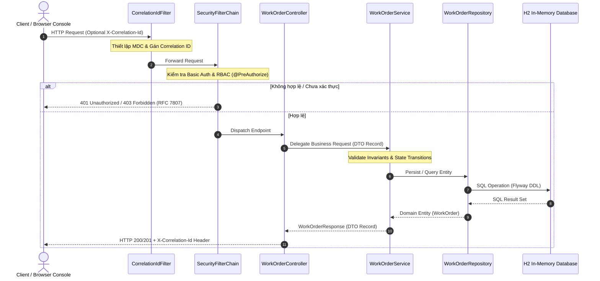
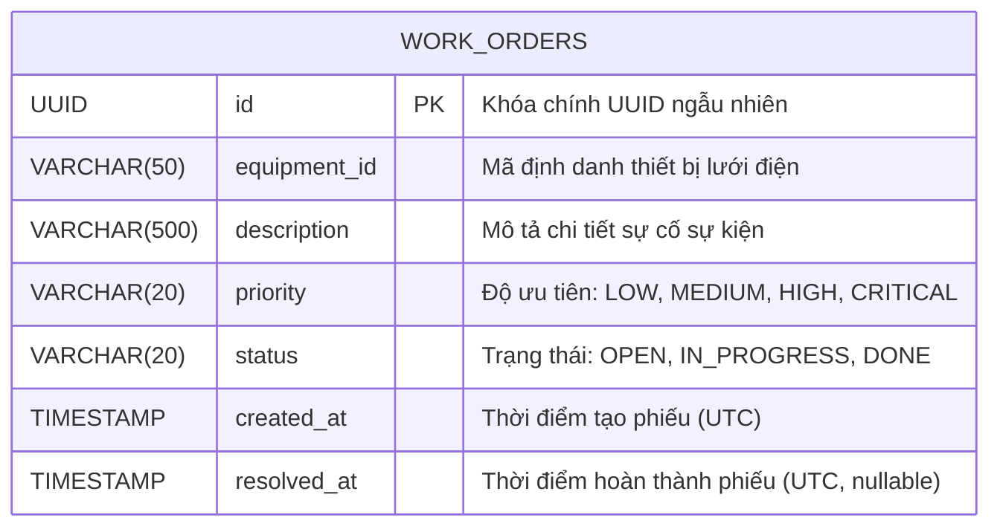
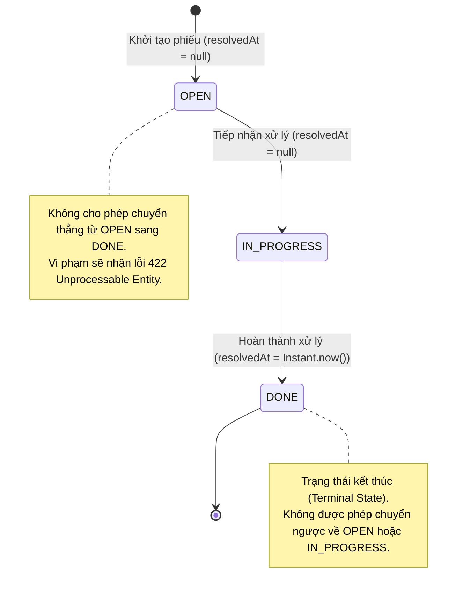

# HỒ SƠ BÀN GIAO KỸ THUẬT & VẬN HÀNH HỆ THỐNG
## Outage Management System - Work Order API Service (`oms-api-demo`)

> **Tài liệu tham chiếu chuẩn (Single Source of Truth):** `docs/SYSTEM_HANDOVER.md`  
> **Phiên bản:** `1.0.0-RELEASE`  
> **Thời điểm lập hồ sơ:** 2026-09-24  
> **Đơn vị bàn giao:** AI-Native Engineering Core Team  
> **Đơn vị tiếp nhận:** Production Operations (Ops/SRE) & Core Software Engineering Team  

---

## MỤC LỤC
1. [Tổng Quan Dự Án & Bối Cảnh Nghiệp Vụ](#1-tổng-quan-dự-án--bối-cảnh-nghiệp-vụ)
2. [Bản Đồ Kiến Trúc & Cấu Trúc Mã Nguồn](#2-bản-đồ-kiến-trúc--cấu-trúc-mã-nguồn)
3. [Mô Hình Dữ Liệu & Quản Trị Cơ Sở Dữ Liệu](#3-mô-hình-dữ-liệu--quản-trị-cơ-sở-dữ-liệu)
4. [Danh Mục Hợp Đồng API & Tích Hợp Hệ Thống](#4-danh-mục-hợp-đồng-api--tích-hợp-hệ-thống)
5. [Mô Hình Bảo Mật & Phân Quyền (RBAC)](#5-mô-hình-bảo-mật--phân-quyền-rbac)
6. [Sổ Tay Biên Dịch, Khởi Chạy & Triển Khai (Runbook)](#6-sổ-tay-biên-dịch-khởi-chạy--triển-khai-runbook)
7. [Hồ Sơ Chất Lượng & Báo Cáo Kiểm Thử Tự Động](#7-hồ-sơ-chất-lượng--báo-cáo-kiểm-thử-tự-động)
8. [Sổ Tay Vận Hành, Giám Sát & Xử Lý Sự Cố (Troubleshooting)](#8-sổ-tay-vận-hành-giám-sát--xử-lý-sự-cố-troubleshooting)
9. [Quy Trình Phát Triển Mở Rộng & Ký Nhận Bàn Giao](#9-quy-trình-phát-triển-mở-rộng--ký-nhận-bàn-giao)

---

## 1. TỔNG QUAN DỰ ÁN & BỐI CẢNH NGHIỆP VỤ

### 1.1 Mục Tiêu & Phạm Vi Chức Năng
Dịch vụ **Outage Work Order API** là một microservice cốt lõi trong hệ thống Quản lý Sự cố Lưới điện (Outage Management System - OMS). Hệ thống chịu trách nhiệm quản lý toàn bộ vòng đời của các phiếu công tác (Work Orders) nhằm khắc phục các sự cố mất điện, bao gồm:
- **Tiếp nhận & Khởi tạo phiếu công tác:** Ghi nhận mã thiết bị lưới điện, mô tả sự cố, và mức độ ưu tiên nghiệp vụ.
- **Quản lý Vòng đời & Máy trạng thái (State Machine):** Chuyển dịch trạng thái nghiêm ngặt từ `OPEN` $\rightarrow$ `IN_PROGRESS` $\rightarrow$ `DONE`.
- **Truy vấn & Phân trang:** Hỗ trợ điều độ viên tra cứu danh sách phiếu theo trạng thái và sắp xếp thời gian tạo mới nhất.

### 1.2 Triết Lý Thiết Kế
- **Spec-Driven Development (Phát triển Hướng Đặc tả):** 100% mã nguồn, API schema, mã lỗi và ràng buộc dữ liệu được hiện thực hóa trực tiếp từ hệ thống tài liệu Markdown tại thư mục `docs/`.
- **Domain-Driven Design (DDD):** Đóng gói toàn vẹn logic nghiệp vụ trong Aggregate Root `WorkOrder`, bảo vệ bất biến (Invariants) tại tầng miền trước khi xuống tầng lưu trữ.
- **Clean Architecture 3 Tầng (3-Tier Layered Architecture):** Phân tách độc lập tuyệt đối giữa Controller (Giao tiếp), Service (Điều phối nghiệp vụ), và Repository (Lưu trữ dữ liệu).
- **Chuẩn Hóa Xử Lý Lỗi RFC 7807 (Problem Details):** Tất cả phản hồi lỗi đều tuân thủ định dạng `application/problem+json` với định danh URN chuẩn tắc.

### 1.3 Bảng Kê Công Nghệ Cốt Lõi (Tech Stack Inventory)

| Hạng mục | Công nghệ / Thư viện | Phiên bản | Ghi chú kỹ thuật |
|---|---|---|---|
| **Ngôn ngữ** | Java (OpenJDK / Temurin) | `17 LTS` | Sử dụng Records, Pattern Matching switch, Text Blocks |
| **Framework nền tảng** | Spring Boot | `3.3.4` | Bao gồm Web, Security, Data JPA, Validation |
| **Cơ sở dữ liệu** | H2 Database Engine | `2.2.224` | Chế độ In-Memory, tương thích cú pháp PostgreSQL |
| **Quản trị Schema** | Flyway Migration | `10.x` | Quản lý phiên bản migration tự động qua DDL |
| **Bảo mật & Phân quyền** | Spring Security | `6.3.3` | HTTP Basic, Stateless Session, Method Security (`@PreAuthorize`) |
| **Kiểm thử tự động** | JUnit 5 + Mockito + AssertJ | Latest Spring Boot | 71 automated test cases (Unit, Slice, Integration) |
| **Đo lường Coverage** | JaCoCo Maven Plugin | `0.8.12` | Thực thi Quality Gate: **100% Line & 100% Branch Coverage** |
| **Công cụ đóng gói** | Apache Maven | `3.8+` | Kèm theo Maven Wrapper (`mvnw.cmd` / `mvnw`) |

---

## 2. BẢN ĐỒ KIẾN TRÚC & CẤU TRÚC MÃ NGUỒN

### 2.1 Sơ Đồ Kiến Trúc & Luồng Dữ Liệu Đầu-Cuối



### 2.2 Danh Mục Gói & Trách Nhiệm Tệp Mã Nguồn

```
c:\ai-native-oms-api\src\main\java\com\gpc\oms
├── OmsApiApplication.java                   [Entry Point] Khởi động Spring Boot Application
├── config/
│   ├── CorrelationIdFilter.java             [Filter] Quản lý X-Correlation-Id header & MDC log context
│   └── SecurityConfig.java                  [Security] Cấu hình HTTP Basic, Stateless, In-Memory Users & RFC 7807 401
├── controller/
│   └── WorkOrderController.java             [REST API] Tiếp nhận HTTP request, phân quyền @PreAuthorize
├── domain/
│   ├── WorkOrder.java                       [Entity] Aggregate Root, bảo vệ bất biến & quản lý chuyển đổi trạng thái
│   ├── WorkOrderPriority.java               [Enum] 4 mức độ ưu tiên (LOW, MEDIUM, HIGH, CRITICAL)
│   ├── WorkOrderStatus.java                [Enum] 3 trạng thái (OPEN, IN_PROGRESS, DONE) & hàm canTransitionTo
│   └── WorkOrderRepository.java             [Repository] Spring Data JPA interface tương tác với H2
├── dto/
│   ├── CreateWorkOrderRequest.java          [DTO] DTO record tạo phiếu (đạt chuẩn RFC 7807 validation)
│   ├── WorkOrderRequest.java                [DTO] DTO record tương thích chuẩn API spec
│   ├── WorkOrderStatusRequest.java          [DTO] DTO record cập nhật trạng thái phiếu công tác
│   ├── WorkOrderResponse.java               [DTO] Immutable record trả về cho client với static factory mapper
│   └── PagedResponse.java                   [DTO] Generic record bọc dữ liệu phân trang
├── exception/
│   ├── GlobalExceptionHandler.java          [Advice] Bắt toàn bộ lỗi và chuyển hóa về RFC 7807 ProblemDetail
│   ├── InvalidStateTransitionException.java [Exception] Ném ra khi vi phạm luồng trạng thái
│   └── WorkOrderNotFoundException.java      [Exception] Ném ra khi không tìm thấy UUID phiếu
└── service/
    └── WorkOrderService.java                [Service] Transactional orchestration & logic miền ứng dụng
```

---

## 3. MÔ HÌNH DỮ LIỆU & QUẢN TRỊ CƠ SỞ DỮ LIỆU

### 3.1 Chiến Lược Quản Trị Schema (Flyway Migration)
Dự án sử dụng **Flyway** để quản lý các bước tiến hóa cấu trúc cơ sở dữ liệu. Toàn bộ DDL được lưu trữ tại `src/main/resources/db/migration/V1__init_work_orders_schema.sql`.



### 3.2 Chi Tiết Cấu Trúc Bảng `work_orders`

| Tên Cột | Kiểu Dữ Liệu | Ràng Buộc (Constraints) | Ý Nghĩa Nghiệp Vụ |
|---|---|---|---|
| `id` | `UUID` | `PRIMARY KEY, NOT NULL` | Định danh duy nhất toàn cầu của phiếu |
| `equipment_id` | `VARCHAR(50)` | `NOT NULL` | Mã thiết bị lưới điện (Trạm biến áp, lộ đường dây) |
| `description` | `VARCHAR(500)` | `NOT NULL` | Nội dung mô tả sự cố kỹ thuật |
| `priority` | `VARCHAR(20)` | `NOT NULL, CHECK (LOW, MEDIUM, HIGH, CRITICAL)` | Mức độ khẩn cấp xử lý sự cố |
| `status` | `VARCHAR(20)` | `NOT NULL, DEFAULT 'OPEN', CHECK (OPEN, IN_PROGRESS, DONE)` | Vòng đời phiếu công tác |
| `created_at` | `TIMESTAMP WITH TIME ZONE` | `NOT NULL` | Thời gian khởi tạo phiếu |
| `resolved_at` | `TIMESTAMP WITH TIME ZONE` | `NULLABLE` | Thời gian chuyển sang `DONE` |

### 3.3 Danh Mục Chỉ Mục (Indexes)
- `idx_work_orders_status_created_at`: Tạo trên `(status, created_at DESC)` nhằm tối ưu hóa các câu truy vấn lọc phiếu theo trạng thái và sắp xếp giảm dần theo thời gian.
- `idx_work_orders_equipment_id`: Tạo trên `(equipment_id)` phục vụ tra cứu lịch sử sự cố theo từng thiết bị.

### 3.4 Thông Số Kết Nối H2 Database Cục Bộ
- **Console Web UI:** `http://localhost:8080/h2-console`
- **Driver Class:** `org.h2.Driver`
- **JDBC URL:** `jdbc:h2:mem:workorderdb;DB_CLOSE_DELAY=-1;DB_CLOSE_ON_EXIT=FALSE`
- **User Name:** `sa`
- **Password:** *(Để trống)*

---

## 4. DANH MỤC HỢP ĐỒNG API & TÍCH HỢP HỆ THỐNG

### 4.1 Bảng Danh Mục Endpoints

| Phương thức | Endpoint URI | Quyền Hạn (RBAC) | Mô Tả Chức Năng | Status Thành Công |
|---|---|---|---|---|
| `POST` | `/api/v1/workorders` | `DISPATCHER`, `TECHNICIAN`, `ADMIN` | Tạo mới phiếu công tác mất điện | `201 Created` (`Location` header) |
| `GET` | `/api/v1/workorders` | `DISPATCHER`, `TECHNICIAN`, `ADMIN` | Lấy danh sách phiếu có phân trang & lọc | `200 OK` (PagedResponse) |
| `GET` | `/api/v1/workorders/{id}` | `DISPATCHER`, `TECHNICIAN`, `ADMIN` | Lấy thông tin chi tiết một phiếu theo UUID | `200 OK` (WorkOrderResponse) |
| `PATCH` | `/api/v1/workorders/{id}/status` | `TECHNICIAN`, `ADMIN` | Cập nhật chuyển dịch trạng thái phiếu | `200 OK` (WorkOrderResponse) |

> [!WARNING]
> **Ràng Buộc Phân Quyền PATCH:** Điều độ viên (`DISPATCHER`) **không có quyền** gọi API `PATCH /status`. Thao tác chuyển trạng thái bắt buộc do Kỹ thuật viên hiện trường (`TECHNICIAN`) hoặc Quản trị viên (`ADMIN`) thực hiện.

### 4.2 Máy Trạng Thái Phiếu Công Tác (State Machine Contract)



### 4.3 Chuẩn Lỗi RFC 7807 Problem Details
Khi có lỗi xảy ra, hệ thống trả về HTTP Body dạng JSON theo chuẩn `application/problem+json`:

```json
{
  "type": "urn:problem-type:invalid-state-transition",
  "title": "Invalid State Transition",
  "status": 422,
  "detail": "Cannot transition work order from OPEN to DONE",
  "instance": "/api/v1/workorders/1b9d6bcd-bbfd-4b2d-9b5d-ab8dfbbd4bed/status"
}
```

#### Ma Trận Mã Lỗi Hệ Thống

| HTTP Status | Problem Type URN | Mô Tả Khi Xảy Ra Lỗi |
|---|---|---|
| `400 Bad Request` | `urn:problem-type:validation-error` | Request body thiếu trường bắt buộc hoặc vi phạm độ dài |
| `401 Unauthorized` | `urn:problem-type:unauthorized` | Thiếu hoặc sai thông tin xác thực HTTP Basic |
| `403 Forbidden` | `urn:problem-type:forbidden` | Tài khoản không có vai trò phù hợp trong ma trận RBAC |
| `404 Not Found` | `urn:problem-type:not-found` | Phiếu công tác không tồn tại với ID chỉ định |
| `422 Unprocessable Entity` | `urn:problem-type:invalid-state-transition` | Vi phạm quy tắc chuyển đổi trạng thái của State Machine |
| `500 Internal Server Error` | `urn:problem-type:internal-server-error` | Lỗi ngoại lệ hệ thống không lường trước |

---

## 5. MÔ HÌNH BẢO MẬT & PHÂN QUYỀN (RBAC)

### 5.1 Kiến Trúc Bảo Mật
- Triển khai thông qua `SecurityFilterChain` của Spring Security 6.
- Sử dụng cơ chế **Stateless Session** (`SessionCreationPolicy.STATELESS`), phù hợp tối ưu cho kiến trúc RESTful Microservices.
- Tắt tính năng CSRF (`csrf.disable()`) phục vụ API không dùng cookie trình duyệt.
- Tự động bắt giữ ngoại lệ xác thực tại `AuthenticationEntryPoint` để xuất lỗi định dạng RFC 7807 thay vì trang HTML đăng nhập mặc định.

### 5.2 Danh Mục Tài Khoản Demo Tích Hợp Sẵn

| Username | Password | Roles Được Cấp | Mục Đích Sử Dụng |
|---|---|---|---|
| `admin` | `admin123` | `ROLE_ADMIN`, `ROLE_DISPATCHER`, `ROLE_TECHNICIAN` | Toàn quyền kiểm thử và quản trị hệ thống |
| `dispatcher` | `dispatcher123` | `ROLE_DISPATCHER` | Tạo phiếu mới và theo dõi danh sách phiếu |
| `technician` | `technician123` | `ROLE_TECHNICIAN` | Xem phiếu và chuyển trạng thái sửa chữa |

> [!CAUTION]
> **Cảnh báo Triển khai Production:** Danh sách tài khoản trên chỉ phục vụ môi trường Demo/Lab cục bộ. Khi triển khai lên môi trường Production, bắt buộc phải thay thế `InMemoryUserDetailsManager` bằng giải pháp xác thực tập trung OAuth2 / OpenID Connect (OIDC) như Keycloak hoặc Azure AD B2C.

---

## 6. SỔ TAY BIÊN DỊCH, KHỞI CHẠY & TRIỂN KHAI (RUNBOOK)

### 6.1 Yêu Cầu Môi Trường Tiền Đề (Prerequisites)
- **Hệ điều hành:** Linux, macOS, hoặc Windows 10/11.
- **Java Development Kit:** JDK 17 LTS trở lên (kiểm tra bằng `java -version`).
- **Apache Maven:** Phiên bản 3.8+ (hoặc sử dụng tệp `mvnw` đi kèm).
- **Cổng kết nối:** Đảm bảo cổng `8080` chưa bị ứng dụng khác chiếm dụng.

### 6.2 Các Lệnh Vận Hành Cơ Bản (CLI Commands)

```powershell
# 1. Làm sạch và biên dịch mã nguồn
mvn clean compile

# 2. Chạy toàn bộ 71 automated tests
mvn test

# 3. Chạy kiểm tra toàn diện, build package và thẩm định JaCoCo Quality Gate
mvn clean verify

# 4. Khởi động ứng dụng Spring Boot cục bộ
mvn spring-boot:run

# 5. Hoặc chạy file JAR đóng gói độc lập
java -jar target/oms-api-0.0.1-SNAPSHOT.jar
```

### 6.3 Bảng Điều Khiển Kiểm Thử Tương Tác Trực Quan (Interactive Test Console)
Dự án được tích hợp sẵn một giao diện Test Console trực quan tại cổng gốc:
- **Địa chỉ truy cập:** `http://localhost:8080/`
- **Tính năng nổi bật:**
  - Chuyển đổi nhanh vai trò người dùng (Admin / Dispatcher / Technician / Anonymous) chỉ với 1 click.
  - Form tạo phiếu mới với đầy đủ kiểm tra validation.
  - Danh sách phiếu công tác thời gian thực với phân loại badge trạng thái màu sắc trực quan.
  - Nút thao tác chuyển trạng thái nhanh (`Start Working`, `Complete`).
  - Hộp kiểm tra phản hồi API trực tiếp (Status code, Request URL, Response Payload).

### 6.4 Mẫu Lệnh cURL Thao Tác Trực Tiếp Với API

```bash
# 1. Tạo mới một phiếu công tác (Vai trò Dispatcher)
curl -X POST http://localhost:8080/api/v1/workorders \
  -u dispatcher:dispatcher123 \
  -H "Content-Type: application/json" \
  -H "X-Correlation-Id: test-corr-001" \
  -d '{
    "equipmentId": "TRANSFORMER-SUB-09",
    "description": "Biến áp phát nhiệt độ cao trên 95 độ C cần kiểm tra khẩn cấp",
    "priority": "HIGH"
  }'

# 2. Lấy danh sách phiếu công tác (Phân trang và lọc trạng thái)
curl -X GET "http://localhost:8080/api/v1/workorders?status=OPEN&page=0&size=10" \
  -u dispatcher:dispatcher123

# 3. Lấy chi tiết phiếu theo ID
curl -X GET http://localhost:8080/api/v1/workorders/{WORK_ORDER_ID} \
  -u technician:technician123

# 4. Chuyển trạng thái sang IN_PROGRESS (Vai trò Technician)
curl -X PATCH http://localhost:8080/api/v1/workorders/{WORK_ORDER_ID}/status \
  -u technician:technician123 \
  -H "Content-Type: application/json" \
  -d '{"status": "IN_PROGRESS"}'

# 5. Chuyển trạng thái sang DONE
curl -X PATCH http://localhost:8080/api/v1/workorders/{WORK_ORDER_ID}/status \
  -u technician:technician123 \
  -H "Content-Type: application/json" \
  -d '{"status": "DONE"}'
```

---

## 7. HỒ SƠ CHẤT LƯỢNG & BÁO CÁO KIỂM THỬ TỰ ĐỘNG

### 7.1 Kim Tự Tháp Kiểm Thử (Testing Pyramid)
Toàn bộ mã nguồn được bảo vệ bởi 71 bài kiểm thử tự động, phân chia theo các tầng chuyên biệt:

```
                          ▲
                         / \
                        /E2E\     WorkOrderIntegrationTest (8 tests)
                       /-----\    Full SpringBootTest Slice
                      / Slice \   WorkOrderControllerTest (12 tests)
                     /  Tests  \  WorkOrderRepositoryTest (8 tests)
                    /-----------\
                   / Unit Tests  \ WorkOrderTest (22 tests), WorkOrderStatusTest (7 tests)
                  /_______________\ WorkOrderServiceTest (12 tests), CorrelationIdFilterTest (2 tests)
```

| Tên Lớp Kiểm Thử | Tầng Kiểm Thử | Số Ca Test | Trạng Thái |
|---|---|---|---|
| `WorkOrderTest` | Domain Unit Test | 22 | PASS (100%) |
| `WorkOrderStatusTest` | State Machine Unit Test | 7 | PASS (100%) |
| `WorkOrderServiceTest` | Service Unit Test (Mockito) | 12 | PASS (100%) |
| `WorkOrderControllerTest` | Web Slice Test (`@WebMvcTest`) | 12 | PASS (100%) |
| `WorkOrderRepositoryTest` | Persistence Slice Test (`@DataJpaTest`) | 8 | PASS (100%) |
| `WorkOrderIntegrationTest` | End-to-End Integration Test (`@SpringBootTest`) | 8 | PASS (100%) |
| `CorrelationIdFilterTest` | HTTP Filter Unit Test | 2 | PASS (100%) |
| **TỔNG CỘNG** | **Toàn bộ hệ thống** | **71** | **71/71 PASS (0 Errors, 0 Skipped)** |

### 7.2 Báo Cáo Đo Lường Độ Bao Phủ JaCoCo (JaCoCo Coverage Metrics)
Dự án tích hợp cấu hình chốt chặn chất lượng (Quality Gate) nghiêm ngặt trong `pom.xml`. Mỗi khi thực hiện `mvn verify`, mã nguồn phải đạt:
- **Line Coverage:** `1.00` (100.0%)
- **Branch Coverage:** `1.00` (100.0%)

Vị trí báo cáo chi tiết: `target/site/jacoco/index.html`.

---

## 8. SỔ TAY VẬN HÀNH, GIÁM SÁT & XỬ LÝ SỰ CỐ (TROUBLESHOOTING)

### 8.1 Cấu Trúc Log & Ngữ Cảnh Truy Vết (Distributed Tracing)
- Hệ thống ghi nhận mọi log thông qua SLF4J / Logback với định dạng tiêu chuẩn:
  `[TIMESTAMP] [LEVEL] [PID] [THREAD] [LOGGER] [correlationId] MESSAGE`
- Tệp `CorrelationIdFilter` tự động trích xuất header `X-Correlation-Id` từ client hoặc tự sinh chuỗi UUID ngẫu nhiên đưa vào MDC context.
- Các thông tin bảo mật và nhạy cảm (như thiết bị định danh chi tiết) được băm (`hashCode()`) hoặc bảo vệ trong log theo quy định tại `docs/observability-and-logging.md`.

### 8.2 Sổ Tay Xử Lý Sự Cố Thường Gặp (Incident Playbook)

#### Sự Cố 1: Lỗi Cổng Kết Nối Đã Bị Chiếm Dụng (`Port 8080 is already in use`)
- **Triệu chứng:** `java.net.BindException: Address already in use: bind`
- **Nguyên nhân:** Đang có một tiến trình Spring Boot hoặc dịch vụ khác chạy nền trên cổng 8080.
- **Biện pháp xử lý:**
  ```powershell
  # Tìm PID tiến trình chiếm cổng
  netstat -ano | findstr 8080
  # Kết thúc tiến trình (thay PID bằng số thực tế)
  taskkill /F /PID <PID>
  # Hoặc cấu hình cổng khác khi khởi động
  mvn spring-boot:run -Dspring-boot.run.arguments="--server.port=8081"
  ```

#### Sự Cố 2: Dữ Liệu Bị Reset Về Rỗng Sau Khi Restart Ứng Dụng
- **Triệu chứng:** Toàn bộ phiếu công tác tạo trước đó biến mất sau khi khởi động lại.
- **Nguyên nhân:** Hệ thống đang sử dụng cấu hình H2 In-Memory (`jdbc:h2:mem:workorderdb`), dữ liệu lưu trên RAM và tự hủy khi tiến trình kết thúc.
- **Biện pháp xử lý:** Đây là hành vi thiết kế có chủ đích cho môi trường Demo/Lab. Để lưu trữ vĩnh viễn, đổi cấu hình datasource trong `application.yml` sang PostgreSQL hoặc H2 File Mode (`jdbc:h2:file:./data/workorderdb`).

#### Sự Cố 3: Nhận Lỗi `403 Forbidden` Khi Cập Nhật Trạng Thái Phiếu
- **Triệu chứng:** Phản hồi `{ "type": "urn:problem-type:forbidden", "status": 403 }` khi gọi `PATCH /api/v1/workorders/{id}/status`.
- **Nguyên nhân:** Đang sử dụng tài khoản `dispatcher` (chỉ có quyền tạo và xem, không có quyền chuyển dịch trạng thái).
- **Biện pháp xử lý:** Chuyển sang sử dụng thông tin xác thực của kỹ thuật viên (`technician:technician123`) hoặc quản trị viên (`admin:admin123`).

#### Sự Cố 4: Nhận Lỗi `422 Invalid State Transition`
- **Triệu chứng:** Phản hồi `{ "type": "urn:problem-type:invalid-state-transition", "status": 422 }`.
- **Nguyên nhân:** Vi phạm quy tắc State Machine (ví dụ: chuyển từ `OPEN` trực tiếp sang `DONE`, hoặc cố gắng cập nhật một phiếu đã ở trạng thái `DONE`).
- **Biện pháp xử lý:** Phiếu phải được tiếp nhận xử lý sang `IN_PROGRESS` trước khi nghiệm thu hoàn tất `DONE`.

---

## 9. QUY TRÌNH PHÁT TRIỂN MỞ RỘNG & KÝ NHẬN BÀN GIAO

### 9.1 Quy Trình Bổ Sung Tính Năng Chuẩn (Spec-Driven SDLC SOP)
Khi cần mở rộng thêm thực thể hoặc endpoint mới:
1. **Cập nhật Đặc tả kỹ thuật:** Soạn thảo bản thảo mô tả API tại `docs/api-spec.md` và domain rules tại `docs/domain-model.md`.
2. **Viết Migration Script:** Tạo tệp `src/main/resources/db/migration/V2__<description>.sql` (không chỉnh sửa file V1 đã release).
3. **Hiện thực hóa Mã nguồn:** Tạo DTO record immutable $\rightarrow$ Domain Entity $\rightarrow$ Repository $\rightarrow$ Service $\rightarrow$ Controller.
4. **Viết Test Đạt 100% Coverage:** Tạo đầy đủ Unit test, WebMvcTest slice và Integration test.
5. **Chạy Thẩm Định:** Chạy `mvn clean verify` để đảm bảo 0 lỗi hồi quy và đạt 100% Quality Gate trước khi mở Pull Request.

### 9.2 Danh Mục Đầu Mối Bàn Giao (Contact Matrix)

| Vai trò | Họ và Tên | Đơn vị | Kênh Liên Hệ |
|---|---|---|---|
| **Lead Technical Architect** | AI-Native Architecture Board | Global Delivery Unit | `architect@gpc-oms.internal` |
| **Site Reliability Lead (SRE)** | Production Operations Lead | Cloud Infrastructure Team | `ops-support@gpc-oms.internal` |
| **Product Owner (PO)** | Outage Management PO | Power Grid Business Group | `po-oms@gpc-oms.internal` |

### 9.3 Bảng Tiêu Chí Nghiệm Thu Bàn Giao (Sign-Off Checklist)

| Tiêu Chí Nghiệm Thu | Kết Quả Đánh Giá | Tình Trạng |
|---|---|---|
| Mã nguồn biên dịch thành công không cảnh báo | `BUILD SUCCESS` | [x] ĐẠT |
| Toàn bộ 71 automated test cases thực thi thành công | 71 Passed, 0 Failed, 0 Skipped | [x] ĐẠT |
| JaCoCo Line và Branch Coverage đạt ngưỡng quy định | 100% Line, 100% Branch | [x] ĐẠT |
| Cấu trúc bảng và chỉ mục DB đồng bộ qua Flyway | Schema V1 khởi tạo chính xác | [x] ĐẠT |
| Giao diện Test Console hoạt động mượt mà trên browser | Đã kiểm chứng tại `http://localhost:8080/` | [x] ĐẠT |
| Tài liệu bàn giao đầy đủ chi tiết, không còn placeholder | Hoàn tất tại `docs/SYSTEM_HANDOVER.md` | [x] ĐẠT |

---
**XÁC NHẬN BÀN GIAO KỸ THUẬT THÀNH CÔNG**  
*Hệ thống đã sẵn sàng cho giai đoạn vận hành thử nghiệm và chuyển giao chính thức.*
