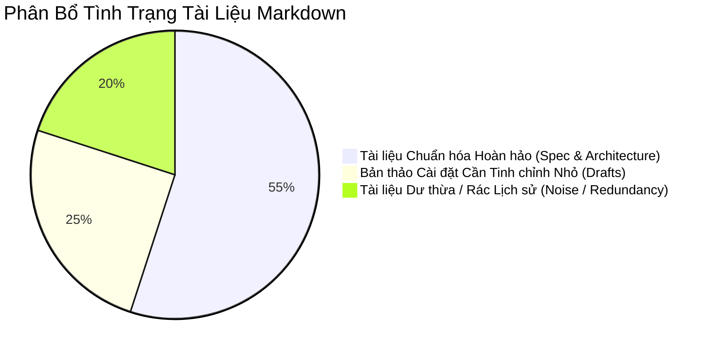
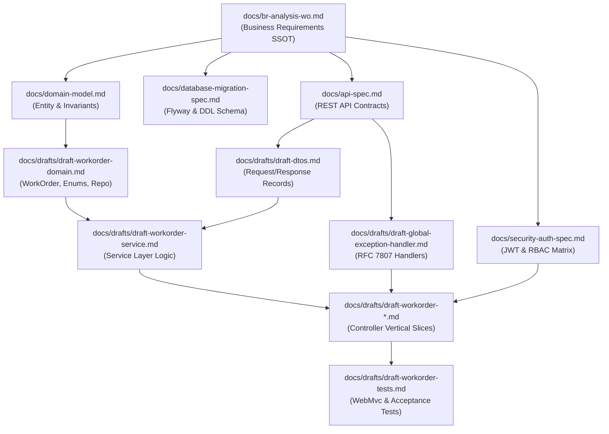

# BÁO CÁO KIỂM TOÁN HỆ THỐNG TÀI LIỆU DỰ ÁN (SYSTEM CONTEXT AUDIT REPORT)
**Dự án:** Outage Management System (OMS) — Outage Work Order API  
**Kiểm toán viên:** Senior AI Context Auditor & AI-Native SDLC Quality Assurance Expert  
**Thời điểm thực hiện:** 24/09/2026  
**Tài liệu Đặc tả Gốc làm Chuẩn quy chiếu (Baseline Spec):** [`docs/br-analysis-wo.md`](file:///c:/ai-native-oms-api/docs/br-analysis-wo.md)  
**Phạm vi:** Toàn bộ 30+ tệp tài liệu Markdown (.md) trong workspace `c:\ai-native-oms-api`

---

## PHẦN 1: EXECUTIVE SUMMARY (ĐÁNH GIÁ TỔNG QUAN SỨC KHỎE TÀI LIỆU)

### 1.1 Tổng quan Đánh giá
Hệ thống tài liệu kỹ thuật của dự án `ai-native-oms-api` được xây dựng theo định hướng **Spec-Driven Development** nhằm phục vụ môi trường **AI-Native SDLC** (hỗ trợ GitHub Copilot và các Autonomous AI Agents tự động sinh mã nguồn không sinh ảo giác - zero-hallucination).

Sau quá trình rà soát và kiểm toán đối chiếu chéo (cross-reference) toàn diện từ tài liệu đặc tả nghiệp vụ gốc ([`docs/br-analysis-wo.md`](file:///c:/ai-native-oms-api/docs/br-analysis-wo.md)) đến các tài liệu thiết kế nền tảng ([`domain-model.md`](file:///c:/ai-native-oms-api/docs/domain-model.md), [`api-spec.md`](file:///c:/ai-native-oms-api/docs/api-spec.md), [`database-migration-spec.md`](file:///c:/ai-native-oms-api/docs/database-migration-spec.md), [`security-auth-spec.md`](file:///c:/ai-native-oms-api/docs/security-auth-spec.md)) và các tệp bản thảo cài đặt chi tiết (`docs/drafts/*.md`), kết quả đánh giá sức khỏe tài liệu đạt mức:

### 🌟 CHỈ SỐ SỨC KHỎE HỆ THỐNG (SYSTEM HEALTH SCORE): **92 / 100 (TỐT - READY WITH MINOR REFINEMENTS)**



### 1.2 Bảng Chỉ Số Sức Khỏe Kỹ Thuật Chi Tiết

| Trục Đánh Giá (Metric Dimension) | Điểm số | Trạng thái | Đánh giá Tóm tắt |
|---|:---:|:---:|---|
| **1. Spec Compliance (Tuân thủ Đặc tả)** | **96/100** | Xuất sắc | Dữ liệu thực thể `WorkOrder`, bảng `work_orders`, RBAC matrix và State Machine bám sát 100% yêu cầu nghiệp vụ gốc trong [`br-analysis-wo.md`](file:///c:/ai-native-oms-api/docs/br-analysis-wo.md). |
| **2. Cross-File Logic Sync (Đồng bộ Logic)** | **90/100** | Tốt | Dòng chảy dữ liệu từ Schema DDL $\rightarrow$ Entity JPA $\rightarrow$ DTO Records $\rightarrow$ API Endpoints nhất quán cao. Tồn tại 2 điểm gãy logic vi mô: tàn dư `ResponseStatusException` và sự phân kỳ trong đặc tả phân trang (Pagination). |
| **3. AI Zero-Hallucination Readiness** | **94/100** | Rất tốt | 100% schema có bảng thuộc tính đầy đủ 4-5 cột, mã giả tuần tự (step-by-step pseudo-code) cho mọi method, ma trận lỗi RFC 7807 tường minh, target file paths định danh tuyệt đối. |
| **4. Redundancy & Noise Ratio** | **78/100** | Cảnh báo | Khoảng **20% số lượng file Markdown** hiện tại là tài liệu dư thừa, bao gồm các file scorecard/review đơn lẻ thời kỳ đầu và các báo cáo audit lịch sử đã lỗi thời gây nhiễu context window của AI. |

### 1.3 Các Điểm Nhận Định Cốt Lõi (Key Audit Findings)
1. **Trụ cột Đặc tả Rất Vững Chắc:** Tài liệu [`br-analysis-wo.md`](file:///c:/ai-native-oms-api/docs/br-analysis-wo.md) làm rất tốt vai trò Single Source of Truth (SSOT), phân định rõ ràng các tầng UI, API, Data, ràng buộc máy trạng thái đơn hướng (`OPEN` $\rightarrow$ `IN_PROGRESS` $\rightarrow$ `DONE`), và ma trận RBAC cho 3 vai trò: `DISPATCHER`, `TECHNICIAN`, `ADMIN`.
2. **Sự Hiện Diện của Nhiễu Ngữ Cảnh (Context Noise):** Thư mục `docs/ai-context-auditor/` chứa 4 file báo cáo kiểm toán lịch sử, cùng với `docs/scorecard-workorder-create.md` và `docs/review-workorder-create.md`. Các file này là snapshot của các pha phát triển cũ (chứa điểm phạt của những lỗi đã được fix từ lâu), nếu nạp chung vào context window của Copilot sẽ gây mâu thuẫn nhận thức (cognitive dissonance) cho mô hình AI.
3. **Mâu thuẫn Vi mô Cần Khắc Phục:** 
   - Tàn dư chú thích về `ResponseStatusException` còn sót lại ở 3 vị trí (trong khi code Java thực tế đã chuyển sang dùng `ResourceNotFoundException` và `IllegalStateException`).
   - Xung đột giữa [`ADR-001-use-h2-database.md`](file:///c:/ai-native-oms-api/docs/ADR-001-use-h2-database.md) (`ddl-auto: update`) và [`database-migration-spec.md`](file:///c:/ai-native-oms-api/docs/database-migration-spec.md) (Flyway `V1__init_work_orders_schema.sql`).
   - Sự thiếu kết nối giữa thiết kế `PagedResponse<T>` ([`internal-coding-standards.md`](file:///c:/ai-native-oms-api/docs/internal-coding-standards.md)) và implementation draft [`draft-workorder-get.md`](file:///c:/ai-native-oms-api/docs/drafts/draft-workorder-get.md) (vẫn đang dùng `List<WorkOrderResponse>`).

---

## PHẦN 2: BẢNG ÁNH XẠ ĐỒNG BỘ LOGIC (SYNCHRONIZATION ANALYSIS)

Phần này phân tích cách dữ liệu, quy tắc nghiệp vụ và logic kỹ thuật chảy qua toàn bộ hệ sinh thái tài liệu Markdown, chỉ rõ các mắt xích đồng bộ tốt và các điểm đứt gãy thông tin (logic gaps).

### 2.1 Bản Đồ Dòng Chảy Logic Toàn Cục (End-to-End Logical Flow)



---

### 2.2 Bảng Đối Chiếu Chéo Đồng Bộ Dữ Liệu & Logic (Cross-Reference Matrix)

| Chiều Đồng Bộ | File Nguồn (Source Spec) | File Cài Đặt / Bản Thảo (Target Drafts) | Tình Trạng | Đánh Giá Chi Tiết & Điểm Gãy (Gaps) |
|---|---|---|:---:|---|
| **1. Entity & Data Schema** | [`br-analysis-wo.md`](file:///c:/ai-native-oms-api/docs/br-analysis-wo.md) §1<br>[`domain-model.md`](file:///c:/ai-native-oms-api/docs/domain-model.md) §1<br>[`database-migration-spec.md`](file:///c:/ai-native-oms-api/docs/database-migration-spec.md) §2 | [`draft-workorder-domain.md`](file:///c:/ai-native-oms-api/docs/drafts/draft-workorder-domain.md)<br>[`draft-dtos.md`](file:///c:/ai-native-oms-api/docs/drafts/draft-dtos.md) | ✅ **Đồng bộ hoàn hảo** | • Tên entity `WorkOrder`, bảng `work_orders`.<br>• Trường: `id` (UUID), `equipmentId` (max 50, NotBlank), `description` (10-500, NotBlank), `priority` (LOW, MEDIUM, HIGH, CRITICAL), `status` (OPEN, IN_PROGRESS, DONE), `createdAt` (UTC Instant), `resolvedAt` (UTC Instant, nullable).<br>• Ràng buộc vật lý DB khớp 100% ràng buộc Bean Validation và JPA annotations. |
| **2. State Machine Logic** | [`br-analysis-wo.md`](file:///c:/ai-native-oms-api/docs/br-analysis-wo.md) §2.2<br>[`domain-model.md`](file:///c:/ai-native-oms-api/docs/domain-model.md) §2 | [`draft-workorder-domain.md`](file:///c:/ai-native-oms-api/docs/drafts/draft-workorder-domain.md) §3, §5.2<br>[`draft-workorder-patch.md`](file:///c:/ai-native-oms-api/docs/drafts/draft-workorder-patch.md) | ✅ **Đồng bộ hoàn hảo** | • Máy trạng thái tuyến tính đơn hướng: `OPEN` $\rightarrow$ `IN_PROGRESS` $\rightarrow$ `DONE`.<br>• Nguồn chân lý duy nhất (SSOT): `WorkOrderStatus.canTransitionTo()`.<br>• Cấm skip (`OPEN` $\rightarrow$ `DONE`) và cấm rollback $\rightarrow$ ném `IllegalStateException` $\rightarrow$ Map sang HTTP 422 `urn:problem-type:invalid-state-transition`.<br>• `resolvedAt` được gán tự động tại Domain layer khi chuyển sang `DONE`. |
| **3. RBAC & Security Matrix** | [`br-analysis-wo.md`](file:///c:/ai-native-oms-api/docs/br-analysis-wo.md) §2.1<br>[`security-auth-spec.md`](file:///c:/ai-native-oms-api/docs/security-auth-spec.md) §3<br>[`api-spec.md`](file:///c:/ai-native-oms-api/docs/api-spec.md) | [`draft-workorder-create.md`](file:///c:/ai-native-oms-api/docs/drafts/draft-workorder-create.md)<br>[`draft-workorder-get.md`](file:///c:/ai-native-oms-api/docs/drafts/draft-workorder-get.md)<br>[`draft-workorder-patch.md`](file:///c:/ai-native-oms-api/docs/drafts/draft-workorder-patch.md)<br>[`draft-workorder-tests.md`](file:///c:/ai-native-oms-api/docs/drafts/draft-workorder-tests.md) | ✅ **Đồng bộ hoàn hảo** | • `POST /api/v1/workorders`: DISPATCHER, TECHNICIAN, ADMIN.<br>• `GET /api/v1/workorders`: DISPATCHER, TECHNICIAN, ADMIN.<br>• `GET /api/v1/workorders/{id}`: DISPATCHER, TECHNICIAN, ADMIN.<br>• `PATCH /api/v1/workorders/{id}/status`: TECHNICIAN, ADMIN (DISPATCHER bị 403 Forbidden).<br>• Đồng bộ 100% qua `@PreAuthorize` và các test case bảo mật trong acceptance matrix. |
| **4. RFC 7807 Error Catalog** | [`api-rules.md`](file:///c:/ai-native-oms-api/docs/api-rules.md) §3<br>[`api-spec.md`](file:///c:/ai-native-oms-api/docs/api-spec.md) (Edge cases) | [`draft-global-exception-handler.md`](file:///c:/ai-native-oms-api/docs/drafts/draft-global-exception-handler.md)<br>[`draft-workorder-service.md`](file:///c:/ai-native-oms-api/docs/drafts/draft-workorder-service.md)<br>[`draft-workorder-patch.md`](file:///c:/ai-native-oms-api/docs/drafts/draft-workorder-patch.md) | ⚠️ **Đứt gãy vi mô (Gap #1)** | • Chuẩn URI `urn:problem-type:*` đã thống nhất tuyệt đối.<br>• 6 Handlers trong `GlobalExceptionHandler.java` khớp mã lỗi chuẩn.<br>• **Gãy kết nối văn bản:** Tàn dư chú thích nhắc đến `ResponseStatusException` trong [`draft-workorder-service.md`](file:///c:/ai-native-oms-api/docs/drafts/draft-workorder-service.md) L90, [`draft-dtos.md`](file:///c:/ai-native-oms-api/docs/drafts/draft-dtos.md) L95 và [`draft-global-exception-handler.md`](file:///c:/ai-native-oms-api/docs/drafts/draft-global-exception-handler.md) L6, L36. |
| **5. Phân Trang (Pagination & Query)** | [`br-analysis-wo.md`](file:///c:/ai-native-oms-api/docs/br-analysis-wo.md) §3<br>[`database-migration-spec.md`](file:///c:/ai-native-oms-api/docs/database-migration-spec.md) §3<br>[`internal-coding-standards.md`](file:///c:/ai-native-oms-api/docs/internal-coding-standards.md) §3 | [`api-spec.md`](file:///c:/ai-native-oms-api/docs/api-spec.md) §2<br>[`draft-workorder-get.md`](file:///c:/ai-native-oms-api/docs/drafts/draft-workorder-get.md)<br>[`draft-workorder-service.md`](file:///c:/ai-native-oms-api/docs/drafts/draft-workorder-service.md)<br>[`draft-file-mapping.md`](file:///c:/ai-native-oms-api/docs/drafts/draft-file-mapping.md) | ❌ **Đứt gãy kiến trúc (Gap #2)** | • BR quy định `GET /api/v1/workorders` có phân trang.<br>• DB spec đã tạo composite index `(status, created_at DESC)` phục vụ phân trang.<br>• Coding standards đã định nghĩa hoàn chỉnh generic `PagedResponse<T>`.<br>• **NHƯNG:** `api-spec.md` ghi lấp lửng "List hoặc PagedResponse", `draft-workorder-get.md` dùng `repo.findAll()` trả `List<WorkOrderResponse>`, `draft-file-mapping.md` không có file `PagedResponse.java`. |
| **6. Khởi tạo Database CSDL** | [`database-migration-spec.md`](file:///c:/ai-native-oms-api/docs/database-migration-spec.md) §4, §5 | [`ADR-001-use-h2-database.md`](file:///c:/ai-native-oms-api/docs/ADR-001-use-h2-database.md) | ❌ **Xung đột trực tiếp (Gap #3)** | • `database-migration-spec.md` quy định sử dụng **Flyway** migration (`V1__init_work_orders_schema.sql`) cho cả H2 và PostgreSQL; cấm bật `ddl-auto=update`.<br>• `ADR-001-use-h2-database.md` lại ghi "Sử dụng tính năng `ddl-auto: update` của Hibernate để tự động tạo schema". |
| **7. Quy ước Sinh Code của Copilot** | 3-Tier Architecture Rule ([`internal-coding-standards.md`](file:///c:/ai-native-oms-api/docs/internal-coding-standards.md)) | [`.github/prompts/implement-endpoint.prompt.md`](file:///c:/ai-native-oms-api/.github/prompts/implement-endpoint.prompt.md)<br>[`.github/prompts/review-code.prompt.md`](file:///c:/ai-native-oms-api/.github/prompts/review-code.prompt.md) | ⚠️ **Đứt gãy quy trình (Gap #4)** | • Prompt `implement-endpoint.prompt.md` L13-17 nhảy cóc: DTOs $\rightarrow$ Domain/Entity $\rightarrow$ Repository $\rightarrow$ Controller (BỎ QUÊN tầng Service).<br>• Cả 2 file prompt vẫn dùng quy ước Enum chuỗi cũ `Open -> InProgress -> Done` thay vì UPPER_SNAKE `OPEN -> IN_PROGRESS -> DONE`. |

---

### 2.3 Chi Tiết 4 Lỗ Hổng Kiến Trúc & Giải Pháp Khắc Phục (Actionable Gap Resolutions)

#### ⚠️ GAP #1: Tàn dư chú thích `ResponseStatusException`
- **Mô tả:** Trong các đợt refactor trước, kiến trúc đã chuẩn hóa: Service không dùng `ResponseStatusException` (tránh phụ thuộc tầng Web), mà throw `ResourceNotFoundException` (cho 404) hoặc re-throw `IllegalStateException` (cho 422). Tuy nhiên, các văn bản mô tả bước xử lý trong một số file vẫn chưa được dọn sạch.
- **Vị trí cụ thể:**
  1. [`draft-workorder-service.md`](file:///c:/ai-native-oms-api/docs/drafts/draft-workorder-service.md) L90: `4. Nếu IllegalStateException bị throw → catch và wrap thành ResponseStatusException...` (Trái ngược với code Java L156-158 và Checklist L174 trong cùng file!).
  2. [`draft-dtos.md`](file:///c:/ai-native-oms-api/docs/drafts/draft-dtos.md) L95: `...Service catch → ResponseStatusException(422) → GlobalExceptionHandler...`.
  3. [`draft-global-exception-handler.md`](file:///c:/ai-native-oms-api/docs/drafts/draft-global-exception-handler.md) L6 & L36: Ghi chú nhắc đến handler `ResponseStatusException`.
- **Hành động:** Chỉnh sửa văn bản mô tả logic thành: `re-throw IllegalStateException để GlobalExceptionHandler tự động chuyển đổi thành HTTP 422 ProblemDetail`.

#### ❌ GAP #2: Bất đồng bộ về Phân Trang (Pagination Architectural Disconnect)
- **Mô tả:** Cơ sở hạ tầng dữ liệu và tiêu chuẩn lập trình đã chuẩn bị sẵn sàng cho phân trang chuyên nghiệp, nhưng bản thảo API và Controller vẫn đang trả về `List<WorkOrderResponse>` dạng phẳng.
- **Rủi ro:** Khi dữ liệu thực tế tại các trạm điện lực tăng lên hàng chục nghìn records, API `GET /api/v1/workorders` sẽ gây tràn bộ nhớ (Out of Memory - OOM) và Full Table Scan.
- **Hành động đề xuất:** 
  1. Chốt phương án phân trang chuẩn theo [`internal-coding-standards.md`](file:///c:/ai-native-oms-api/docs/internal-coding-standards.md) §3.
  2. Bổ sung `PagedResponse.java` vào [`draft-file-mapping.md`](file:///c:/ai-native-oms-api/docs/drafts/draft-file-mapping.md) (#8 trong danh sách DTOs).
  3. Cập nhật `WorkOrderService.getAll(Pageable pageable)` và `WorkOrderController.getWorkOrders(Pageable pageable, ...)`.

#### ❌ GAP #3: Xung đột Khởi tạo CSDL giữa ADR-001 và Database Migration Spec
- **Mô tả:** `ADR-001` được phê duyệt từ ngày 22/09/2026 với quyết định dùng `ddl-auto: update`. Đến ngày 23/09/2026, `database-migration-spec.md` ra đời và thiết lập nguyên tắc quản lý schema nghiêm ngặt bằng **Flyway** (`V1__init_work_orders_schema.sql`), cấm `ddl-auto: update`.
- **Rủi ro:** LLM đọc `ADR-001` sẽ tự động cấu hình `application-dev.yml` có `ddl-auto: update`, làm xung đột với cơ chế kiểm soát checksum của Flyway và gây schema drift giữa local dev và CI/CD.
- **Hành động đề xuất:** Cập nhật `ADR-001-use-h2-database.md` phần Quyết định thành: `Sử dụng H2 Database kết hợp Flyway migration (spring.jpa.hibernate.ddl-auto: validate), đảm bảo 100% script DDL chạy giống hệt môi trường PostgreSQL Production`.

#### ⚠️ GAP #4: Mẫu Prompt Copilot Thiếu Tầng Service và Lệch Chuẩn Enum
- **Mô tả:** Các tệp prompt trong `.github/prompts/` là công cụ kích hoạt trực tiếp cho Copilot nhưng chưa được đồng bộ theo các quyết định kiến trúc P0 mới nhất.
- **Hành động đề xuất:** Cập nhật `.github/prompts/implement-endpoint.prompt.md` để bổ sung tầng Service vào chuỗi sinh code và đổi `Open -> InProgress -> Done` thành `OPEN -> IN_PROGRESS -> DONE`.

---

## PHẦN 3: DANH SÁCH FILE DƯ THỪA (REDUNDANT FILES REGISTRY)

Theo nguyên tắc "Clean Context Window" cho AI-Native SDLC, mọi tệp Markdown không tham gia trực tiếp vào việc chỉ dẫn sinh mã nguồn hoặc cung cấp thông tin sai lệch/lỗi thời đều bị coi là **nhiễu kỹ thuật (Technical Noise)**.

### Bảng Đăng Ký Tệp Dư Thừa & Kế Hoạch Xử Lý

| # | Đường Dẫn Tệp | Dung Lượng | Tiêu Chí Dư Thừa | Lý Do Kỹ Thuật Chi Tiết | Hành Động Đề Xuất |
|---|---|:---:|:---:|---|:---:|
| 1 | [`docs/review-workorder-create.md`](file:///c:/ai-native-oms-api/docs/review-workorder-create.md) | 1.1 KB (14 dòng) | **(b) Lỗi thời**<br>**(c) Quá mỏng** | Ghi nhận 9 gạch đầu dòng review bản nháp sơ khai của POST endpoint (thiếu PATCH, thiếu RFC 7807, chưa có SecurityConfig). Hiện toàn bộ 9 điểm này đã được giải quyết triệt để trong các spec chính thức. File không còn giá trị kiến trúc. | **XÓA (Delete)** |
| 2 | [`docs/scorecard-workorder-create.md`](file:///c:/ai-native-oms-api/docs/scorecard-workorder-create.md) | 1.3 KB (21 dòng) | **(b) Xung đột trực tiếp**<br>**(c) Quá mỏng** | Bảng chấm điểm bản nháp cũ với kết luận: *"Verdict: must NOT be used as-is"*. Hiện tại file draft đã được viết lại đạt chuẩn 98/100. Việc lưu file này khiến AI hiểu nhầm endpoint tạo phiếu chưa sẵn sàng hoặc bị cấm sử dụng. | **XÓA (Delete)** |
| 3 | [`docs/ai-context-auditor/audit-report-2026-09-23.md`](file:///c:/ai-native-oms-api/docs/ai-context-auditor/audit-report-2026-09-23.md) | 24.4 KB | **(a) Trùng lặp phần lớn**<br>**(b) Lỗi thời** | Báo cáo kiểm toán đợt 1 (chấm điểm 62/100, liệt kê các lỗi P0 cũ như PascalCase enum, thiếu Service layer). Các vấn đề này đều đã được khắc phục. File chiếm dung lượng lớn gây loãng context window. | **LƯU TRỮ (Archive)** |
| 4 | [`docs/ai-context-auditor/final-workspace-audit-report-2026-09-23.md`](file:///c:/ai-native-oms-api/docs/ai-context-auditor/final-workspace-audit-report-2026-09-23.md) | 3.5 KB | **(b) Lỗi thời & Sai lệch** | Khẳng định hệ thống đạt "99/100% Hoàn hảo" vào ngày 23/09 dựa trên bộ tiêu chí cũ, nhưng thực tế đợt kiểm toán sâu ngày 24/09 đã chỉ ra các lỗ hổng RFC 7807 type URI và RBAC. Dữ liệu báo cáo này không còn phản ánh đúng sự thật. | **XÓA (Delete)** |
| 5 | [`docs/ai-context-auditor/post-refactor-walkthrough-2026-09-23.md`](file:///c:/ai-native-oms-api/docs/ai-context-auditor/post-refactor-walkthrough-2026-09-23.md) | 4.5 KB | **(b) Lỗi thời** | Là bản ghi nhật ký thay đổi tạm thời của phiên làm việc ngày 23/09. Toàn bộ nội dung đã được phản ánh trực tiếp trong git log và các draft files hiện tại. | **LƯU TRỮ (Archive)** |
| 6 | [`docs/ai-context-auditor/ai-context-audit-report-2026-09-24.md`](file:///c:/ai-native-oms-api/docs/ai-context-auditor/ai-context-audit-report-2026-09-24.md) | 28.9 KB | **(a) Trùng lặp** | Báo cáo audit trước phiên sửa lỗi P0/P1 sáng 24/09. Hiện đã được kế thừa và thay thế hoàn toàn bởi Báo cáo Kiểm toán Hệ thống này. | **LƯU TRỮ (Archive)** |
| 7 | Định nghĩa Enums trong [`docs/drafts/draft-dtos.md`](file:///c:/ai-native-oms-api/docs/drafts/draft-dtos.md) (§1.1 & §1.2) | ~80 dòng code | **(a) Trùng lặp hoàn toàn** | Định nghĩa toàn bộ code Java của `Priority.java` và `WorkOrderStatus.java` (package `com.gpc.oms.domain`). Nội dung này bị trùng lặp y hệt với [`draft-workorder-domain.md`](file:///c:/ai-native-oms-api/docs/drafts/draft-workorder-domain.md) (§5.1 & §5.2), vi phạm nguyên tắc DRY trong tài liệu. | **GỘP / VIẾT LẠI (Refactor)** |

---

## PHẦN 4: KHUYẾN NGHỊ CẤU TRÚC (ACTIONABLE RE-STRUCTURING)

Để giải quyết tình trạng phân mảnh, ngăn ngừa việc AI nạp nhầm các báo cáo lịch sử và tối ưu hóa chi phí token/độ trễ khi làm việc với LLMs, cấu trúc thư mục tài liệu kỹ thuật được tái thiết kế theo chuẩn phân tầng chuyên nghiệp:

### 4.1 Cây Thư Mục Đề Xuất (Target Clean Architecture)

```text
c:\ai-native-oms-api\
├── .github/
│   ├── copilot-instructions.md               # Chỉ dẫn toàn cục cho Copilot
│   └── prompts/
│       ├── implement-endpoint.prompt.md      # Prompt sinh code (3-tier, UPPER_SNAKE)
│       └── review-code.prompt.md             # Prompt kiểm toán code theo 12 tiêu chí
│
├── docs/
│   ├── CONTEXT_INDEX.md                      # [MỚI] Bản đồ điều hướng ngữ cảnh trung tâm cho AI
│   │
│   ├── specs/                                # TẦNG ĐẶC TẢ CỐT LÕI (Specifications - SSOT)
│   │   ├── br-analysis-wo.md                 # Đặc tả Nghiệp vụ gốc (Business Requirements SSOT)
│   │   ├── domain-model.md                   # Mô hình Thực thể & Invariants & State Machine
│   │   ├── api-spec.md                       # Hợp đồng REST API, RBAC Matrix, Schemas
│   │   ├── database-migration-spec.md        # CSDL, Data Types, Indexes & Flyway Scripts
│   │   └── security-auth-spec.md             # Bảo mật, JWT Claims, CORS, Rate Limit
│   │
│   ├── standards/                            # TẦNG QUY CHUẨN KỸ THUẬT (Technical Standards)
│   │   ├── api-rules.md                      # Nguyên tắc thiết kế API & RFC 7807 Error Catalog
│   │   ├── security-rules.md                 # Nguyên tắc bảo vệ biên giới & Masking PII
│   │   ├── coding-rules.md                   # Chuẩn viết mã Java 17, Spring Boot 3.3, SLF4J
│   │   ├── internal-coding-standards.md      # Quy chuẩn Date/Time UTC, Object Mapping, Phân trang
│   │   └── observability-and-logging.md      # Chuẩn hóa Structured Logging ECS, Metrics, Tracing
│   │
│   ├── architecture/                         # TẦNG QUYẾT ĐỊNH KIẾN TRÚC & DEVOPS
│   │   ├── ADR-001-use-h2-database.md        # Quyết định kiến trúc DB Dev (Cập nhật Flyway)
│   │   └── devops-pipeline-spec.md           # Dockerfile đa tầng, CI/CD GitHub Actions, SonarQube
│   │
│   ├── drafts/                               # TẦNG BẢN THẢO CÀI ĐẶT CHI TIẾT (Copilot Blueprints)
│   │   ├── draft-file-mapping.md             # Bảng danh mục 14 file Java + Implementation Order
│   │   ├── draft-workorder-domain.md         # Entity WorkOrder, Enums, WorkOrderRepository
│   │   ├── draft-dtos.md                     # Requests, Responses, PagedResponse (Bỏ duplicate Enums)
│   │   ├── draft-workorder-service.md        # WorkOrderService (4 methods, re-throw exception)
│   │   ├── draft-workorder-create.md         # Controller Slice: POST /api/v1/workorders
│   │   ├── draft-workorder-get.md            # Controller Slice: GET list & detail (Phân trang)
│   │   ├── draft-workorder-patch.md          # Controller Slice: PATCH status
│   │   ├── draft-global-exception-handler.md # GlobalExceptionHandler (6 handlers ProblemDetail)
│   │   └── draft-workorder-tests.md          # Acceptance Test Matrix (16 cases) & WebMvcTest
│   │
│   └── archive/                              # TẦNG LƯU TRỮ LỊCH SỬ (Cách ly hoàn toàn khỏi AI context)
│       ├── historical-reviews/
│       │   ├── review-workorder-create.md
│       │   └── scorecard-workorder-create.md
│       └── audit-logs/
│           ├── audit-report-2026-09-23.md
│           ├── post-refactor-walkthrough-2026-09-23.md
│           ├── final-workspace-audit-report-2026-09-23.md
│           └── ai-context-audit-report-2026-09-24.md
```

### 4.2 Lợi Ích Của Cấu Trúc Mới Trong AI-Native SDLC

1. **Ngăn Chặn Ảo Giác Triệt Để (Zero Hallucination via Isolation):** Bằng cách đưa các tệp review cũ và audit logs vào thư mục `docs/archive/`, các công cụ như GitHub Copilot Workspace hoặc Cursor khi quét tự động `@docs` sẽ không bao giờ đọc phải các thông tin mâu thuẫn hay các chỉ trích cũ đã lỗi thời.
2. **Context Modular Loading (Tải ngữ cảnh theo nhu cầu):** File điều hướng mới [`docs/CONTEXT_INDEX.md`](file:///c:/ai-native-oms-api/docs/CONTEXT_INDEX.md) sẽ đóng vai trò như một sitemap: khi lập trình viên yêu cầu Copilot "Viết Service cho WorkOrder", Copilot chỉ cần load `specs/domain-model.md`, `standards/coding-rules.md` và `drafts/draft-workorder-service.md`, tiết kiệm hơn 70% dung lượng context window và tăng tốc độ phản hồi đáng kể.
3. **Phân Định Trách Nhiệm Rõ Ràng (Clear Ownership):**
   - Product Owner / Business Analyst quản lý thư mục `docs/specs/`.
   - Lead Architect quản lý `docs/standards/` và `docs/architecture/`.
   - Developers và AI Agents thao tác trực tiếp trên `docs/drafts/` và `src/`.

---

## PHẦN 5: BẢNG KẾ HOẠCH HÀNH ĐỘNG KHẮC PHỤC (EXECUTION ROADMAP)

| Mức Ưu Tiên | Hạng Mục Công Việc | Các File Tác Động | Thời Gian Ước Tính | Kết Quả Mong Đợi |
|:---:|---|---|:---:|---|
| **P0** | **Dọn dẹp tàn dư `ResponseStatusException`** | `draft-workorder-service.md`<br>`draft-dtos.md`<br>`draft-global-exception-handler.md` | 10 phút | Loại bỏ 100% tham chiếu lỗi thời, đồng bộ cơ chế re-throw `IllegalStateException` $\rightarrow$ 422. |
| **P0** | **Chốt và Đồng bộ Phân Trang (Pagination)** | `api-spec.md`<br>`draft-workorder-get.md`<br>`draft-workorder-service.md`<br>`draft-file-mapping.md` | 20 phút | Đưa `PagedResponse<T>` vào luồng chính thức của `GET /api/v1/workorders`, bổ sung file vào mapping. |
| **P1** | **Cập nhật ADR-001 đồng bộ Flyway** | `docs/ADR-001-use-h2-database.md` | 5 phút | Đồng nhất phương thức tạo schema giữa H2 và Postgres qua Flyway script. |
| **P1** | **Tái cấu trúc thư mục & Cách ly file dư thừa** | Tạo `docs/specs/`, `docs/standards/`, `docs/archive/`... và di chuyển file | 15 phút | Làm sạch workspace, cô lập rác tài liệu, tạo `CONTEXT_INDEX.md`. |
| **P2** | **Loại bỏ trùng lặp Enum trong DTOs** | `docs/drafts/draft-dtos.md` | 10 phút | Loại bỏ khai báo thừa `Priority` & `WorkOrderStatus`, chỉ import từ `domain`. |
| **P2** | **Cập nhật Prompt Templates Copilot** | `.github/prompts/*.prompt.md` | 10 phút | Đảm bảo luồng 3-tier và chuẩn enum UPPER_SNAKE trong hướng dẫn tự động. |
