<!--
Role: Software Architect
Task: Domain Model Design for CSV Order Processor Library (Java 17)
Constraints: Pure In-Memory Domain, Immutable Records, Zero ORM/JPA Annotations, BigDecimal for Money/Quantities, Dynamic Metadata Mapping
-->
# Thiết Kế Mô Hình Miền (Domain Model) Thư Viện CSV Order Processor

Tài liệu này định nghĩa chi tiết **Mô hình Miền (Domain Model)** cho thư viện tĩnh `csv-order-processor` trên nền tảng **Java 17**. Mô hình được thiết kế hoàn toàn độc lập với các framework ORM/JPA (Zero Database Dependencies), áp dụng triệt để nguyên tắc **Bất biến (Immutability)** thông qua Java 17 `record`, và sử dụng `BigDecimal` cho tất cả các phép tính số lượng, đơn giá, thuế suất và tiền tệ.

---

## 1. Triết Lý Thiết Kế Mô Hình Miền

1. **Bất biến Tuyệt đối (Immutability by Default):**
   - Mọi thực thể nghiệp vụ, đối tượng giá trị (Value Object) và cấu hình đều được đóng gói bằng Java 17 `record`.
   - Các thuộc tính tập hợp (`List`, `Map`) được bảo vệ bằng cơ chế Defensive Copying và bọc trong `Collections.unmodifiableList` / `Collections.unmodifiableMap`. Không tồn tại bất kỳ setter hay phương thức thay đổi trạng thái (mutation) nào.

2. **Phi phụ thuộc Hạ tầng (Pure In-Memory Domain):**
   - Không chứa bất kỳ annotation ORM/Database nào như `@Entity`, `@Table`, `@Column`, `@Id`. Thư viện xử lý hoàn toàn trong bộ nhớ RAM, cho phép tái sử dụng trong mọi môi trường (Standalone CLI, Batch Job, Spring Boot, Quarkus, Micronaut).

3. **Chính xác Tuyệt đối trong Tài chính (Financial Precision):**
   - Mọi thuộc tính số lượng (`quantity`), đơn giá (`unitPrice`), thành tiền (`lineTotal`), thuế suất (`vatRate`), tiền VAT (`vatAmount`) và các chỉ số tổng cộng (`subtotal`, `totalVat`, `finalTotal`) bắt buộc dùng `java.math.BigDecimal`.
   - Áp dụng chuẩn làm tròn siêu thị: `scale = 2`, `RoundingMode.HALF_UP`.
   - Tổng tiền đơn hàng (`totalVat`, `subtotal`) được tính bằng tổng các dòng chi tiết đã được làm tròn để triệt tiêu sai số lũy kế (cumulative rounding errors).

4. **Ánh xạ Cấu hình Động (Dynamic Metadata Configuration):**
   - Khóa ánh xạ hỗ trợ kiểu `Object`: chấp nhận `String` (tên tiêu đề cột khi `hasHeader = true`) hoặc `Integer` (vị trí chỉ số 0-based khi `hasHeader = false`).

---

## 2. Danh Sách Các Lớp Đối Tượng Trong Mô Hình Miền

### 2.1. `Order` (Aggregate Root)
Đại diện cho một đơn hàng hoàn chỉnh gồm danh sách các mặt hàng chi tiết và số liệu tổng hợp tài chính.

- **Loại:** Aggregate Root (Java 17 `record`)
- **Quan hệ:**
  - `Order` (1) --- (1..*) `OrderItem`: Chứa một hoặc nhiều dòng mặt hàng.
  - `Order` (1) --- (1) `OrderSummary`: Chứa một bảng tổng kết tài chính.
- **Bảng thuộc tính chi tiết:**

| Thuộc tính | Kiểu Dữ liệu | Ràng buộc & Bất biến | Mô tả Nghiệp vụ |
|---|---|---|---|
| `orderId` | `String` | Non-null, Non-blank | Mã định danh duy nhất của đơn hàng (hoặc tên file CSV). |
| `items` | `List<OrderItem>` | Non-null, Unmodifiable | Danh sách các mặt hàng chi tiết trong đơn hàng. |
| `summary` | `OrderSummary` | Non-null | Bảng tổng hợp tài chính (Tổng trước thuế, VAT, Tổng thanh toán). |

---

### 2.2. `OrderItem` (Entity / Line Item)
Đại diện cho một dòng mặt hàng trong tệp CSV đơn hàng sau khi được phân tích cú pháp và tính toán thuế.

- **Loại:** Domain Entity / Line Item (Java 17 `record`)
- **Quan hệ:**
  - Nằm trong `Order` (n - 1) hoặc `CsvProcessingResult` (n - 1).
- **Bảng thuộc tính chi tiết:**

| Thuộc tính | Kiểu Dữ liệu | Ràng buộc & Bất biến | Mô tả Nghiệp vụ |
|---|---|---|---|
| `lineNumber` | `int` | `>= 1` (1-indexed) | Số thứ tự dòng trong file CSV gốc, phục vụ truy vết lỗi chính xác. |
| `rawValues` | `List<String>` | Non-null, Unmodifiable | Toàn bộ mảng chuỗi gốc của các cột trên dòng CSV. |
| `quantity` | `BigDecimal` | Optional (`null` nếu có `TOTAL`) | Số lượng sản phẩm mua. |
| `unitPrice` | `BigDecimal` | Optional (`null` nếu có `TOTAL`) | Đơn giá sản phẩm trước thuế. |
| `lineTotal` | `BigDecimal` | Non-null, scale=2, HALF_UP | Tổng tiền trước thuế của dòng (`quantity * unitPrice` hoặc lấy từ cột `TOTAL`). |
| `vatRate` | `BigDecimal` | Non-null, `>= 0` | Mức thuế suất VAT (%) của mặt hàng (ví dụ: `5.00`, `8.00`, `10.00`). |
| `vatAmount` | `BigDecimal` | Non-null, scale=2, HALF_UP | Tiền thuế VAT của dòng: `round(lineTotal * vatRate / 100)`. |
| `lineTotalWithVat` | `BigDecimal` | Non-null, scale=2, HALF_UP | Tổng thanh toán của dòng đã có VAT: `lineTotal + vatAmount`. |

---

### 2.3. `OrderSummary` (Value Object)
Bảng tổng kết 3 chỉ số tài chính cốt lõi của đơn hàng theo Chuẩn Siêu Thị.

- **Loại:** Value Object (Java 17 `record`)
- **Quan hệ:**
  - `OrderSummary` (1) --- (1) `Order`: Bảng số liệu tổng hợp của một đơn hàng.
  - `OrderSummary` (1) --- (1) `CsvProcessingResult`: Trả về kèm kết quả xử lý CSV.
- **Bảng thuộc tính chi tiết:**

| Thuộc tính | Kiểu Dữ liệu | Ràng buộc & Bất biến | Mô tả Nghiệp vụ |
|---|---|---|---|
| `subtotal` | `BigDecimal` | Non-null, scale=2, HALF_UP | Tổng tiền hàng trước thuế = $\sum \text{lineTotal}_i$. |
| `totalVat` | `BigDecimal` | Non-null, scale=2, HALF_UP | Tổng tiền thuế VAT = $\sum \text{vatAmount}_i$ (tổng các dòng đã làm tròn). |
| `finalTotal` | `BigDecimal` | Non-null, scale=2, HALF_UP | Tổng tiền thanh toán cuối cùng = `subtotal + totalVat`. |

- **Phương thức đặc biệt:**
  - `OrderSummary.zero()`: Factory method khởi tạo nhanh đối tượng với các giá trị mặc định `0.00`.

---

### 2.4. `CsvConfig` / `MetadataConfig` (Specification / Configuration)
Đối tượng cấu hình quy định cách thức đọc, phân giải vị trí các cột nghiệp vụ và định dạng đầu ra của thư viện.

- **Loại:** Configuration / Value Object (Java 17 `record`)
- **Quan hệ:**
  - `CsvConfig` (1) --- (1..*) `ColumnKey`: Ánh xạ các cột vật lý sang khóa định danh nghiệp vụ.
  - `CsvConfig` (1) --- (1) `OutputMode`: Thiết lập chế độ kết xuất đầu ra.
- **Bảng thuộc tính chi tiết:**

| Thuộc tính | Kiểu Dữ liệu | Mặc định | Mô tả Nghiệp vụ |
|---|---|---|---|
| `hasHeader` | `boolean` | `true` | Xác định file CSV có dòng tiêu đề cột hay không. |
| `delimiter` | `char` | `','` | Ký tự phân tách giữa các trường (hỗ trợ `,`, `;`, `\t`...). |
| `columnMapping` | `Map<Object, ColumnKey>` | Bắt buộc | Bản đồ ánh xạ: Key là tên cột (`String`) hoặc chỉ số 0-based (`Integer`), Value là enum `ColumnKey`. |
| `outputMode` | `OutputMode` | `DATA_MODE` | Chế độ kết xuất kết quả (`REPORT_MODE` hoặc `DATA_MODE`). |

- **Bộ dựng (Builder Pattern):**
  - Hỗ trợ `CsvConfig.builder().hasHeader(...).delimiter(...).mapColumn(...).outputMode(...).build()` theo phong cách Fluent API.

---

### 2.5. `ColumnKey` (Enumeration)
Định danh các cột nghiệp vụ bắt buộc hoặc tùy chọn mà động cơ xử lý cần nhận biết.

| Giá trị Enum | Bắt buộc? | Mô tả Nghiệp vụ |
|---|:---:|---|
| `QUANTITY` | Bắt buộc nếu thiếu `TOTAL` | Cột chỉ số lượng sản phẩm. |
| `UNIT_PRICE` | Bắt buộc nếu thiếu `TOTAL` | Cột chỉ đơn giá sản phẩm trước thuế. |
| `TOTAL` | Bắt buộc nếu thiếu `QUANTITY` & `UNIT_PRICE` | Cột tổng tiền dòng có sẵn từ file CSV nguồn. |
| `VAT_RATE` | **Bắt buộc** | Cột tỷ lệ thuế VAT (%) (chấp nhận số `10` hoặc có ký hiệu `%` như `10%`). |

---

### 2.6. `OutputMode` (Enumeration)
Xác định cách thức kết xuất chuỗi CSV đầu ra sau khi xử lý:

| Giá trị Enum | Ý nghĩa Nghiệp vụ | Cấu trúc Dữ liệu Đầu ra |
|---|---|---|
| `REPORT_MODE` | Dành cho xuất báo cáo tổng hợp | Chuỗi CSV được chèn thêm 3 dòng Footer ở cuối trang: `Tổng trước thuế`, `Tổng VAT`, `Tổng thanh toán`. |
| `DATA_MODE` | Dành cho tích hợp dữ liệu hệ thống (API / MQ) | Chuỗi CSV chỉ thuần chứa các dòng mặt hàng (kèm cột `Tiền VAT`), các giá trị tổng được tách rời trong `OrderSummary`. |

---

### 2.7. `CsvProcessingResult` (Result Data Carrier)
Đại diện cho kết quả hoàn chỉnh sau khi xử lý một tệp CSV đơn hàng.

- **Loại:** Result Value Object (Java 17 `record`)
- **Quan hệ:**
  - `CsvProcessingResult` (1) --- (1) `OrderSummary`: Chứa kết quả tính tổng 3 chỉ số tài chính.
  - `CsvProcessingResult` (1) --- (0..*) `OrderItem`: Chứa danh sách các dòng chi tiết đã xử lý.
  - `CsvProcessingResult` (1) --- (1) `OutputMode`: Ghi nhận chế độ kết xuất đã áp dụng.
- **Bảng thuộc tính chi tiết:**

| Thuộc tính | Kiểu Dữ liệu | Ràng buộc | Mô tả Nghiệp vụ |
|---|---|---|---|
| `outputCsvContent` | `String` | Non-null | Nội dung chuỗi CSV đã được làm giàu cột `Tiền VAT` (và footer nếu ở REPORT_MODE). |
| `summary` | `OrderSummary` | Non-null | Đối tượng chứa 3 giá trị tổng tài chính đã làm tròn. |
| `lineItems` | `List<OrderItem>` | Non-null, Unmodifiable | Danh sách các đối tượng mặt hàng chi tiết trong bộ nhớ RAM. |
| `outputMode` | `OutputMode` | Non-null | Chế độ xuất kết quả tương ứng. |

---

## 3. Biểu Đồ Lớp (PlantUML Class Diagram)

Dưới đây là mã PlantUML mô tả biểu đồ quan hệ tĩnh giữa các lớp đối tượng trong Mô hình Miền:

```plantuml
@startuml
!theme plain
skinparam classAttributeIconSize 0
skinparam monochrome false
skinparam roundcorner 8
skinparam shadowing false
skinparam linetype ortho

title Biểu Đồ Mô Hình Miền (Domain Model) - Thư Viện Xử Lý CSV (Java 17)

package "com.gpc.order.processor.api.model" {

  class Order <<record>> {
    + orderId: String
    + items: List<OrderItem>
    + summary: OrderSummary
    --
    + Order(orderId: String, items: List<OrderItem>, summary: OrderSummary)
  }

  class OrderItem <<record>> {
    + lineNumber: int
    + rawValues: List<String>
    + quantity: BigDecimal
    + unitPrice: BigDecimal
    + lineTotal: BigDecimal
    + vatRate: BigDecimal
    + vatAmount: BigDecimal
    + lineTotalWithVat: BigDecimal
    --
    + OrderItem(lineNumber: int, rawValues: List<String>, ...)
  }

  class OrderSummary <<record>> {
    + subtotal: BigDecimal
    + totalVat: BigDecimal
    + finalTotal: BigDecimal
    --
    + OrderSummary(subtotal: BigDecimal, totalVat: BigDecimal, finalTotal: BigDecimal)
    + {static} zero(): OrderSummary
  }

  class CsvProcessingResult <<record>> {
    + outputCsvContent: String
    + summary: OrderSummary
    + lineItems: List<OrderItem>
    + outputMode: OutputMode
    --
    + CsvProcessingResult(outputCsvContent: String, summary: OrderSummary, ...)
  }
}

package "com.gpc.order.processor.api.config" {

  enum ColumnKey <<enum>> {
    QUANTITY
    UNIT_PRICE
    TOTAL
    VAT_RATE
  }

  enum OutputMode <<enum>> {
    REPORT_MODE
    DATA_MODE
  }

  class CsvConfig <<record>> {
    + hasHeader: boolean
    + delimiter: char
    + columnMapping: Map<Object, ColumnKey>
    + outputMode: OutputMode
    --
    + CsvConfig(hasHeader: boolean, delimiter: char, ...)
    + {static} builder(): Builder
  }

  class "CsvConfig.Builder" as Builder {
    - hasHeader: boolean
    - delimiter: char
    - columnMapping: Map<Object, ColumnKey>
    - outputMode: OutputMode
    --
    + hasHeader(hasHeader: boolean): Builder
    + delimiter(delimiter: char): Builder
    + mapColumn(identifier: Object, key: ColumnKey): Builder
    + columnMapping(mapping: Map<?, ColumnKey>): Builder
    + outputMode(outputMode: OutputMode): Builder
    + build(): CsvConfig
  }
}

package "com.gpc.order.processor.api.exception" {
  class CsvProcessingException <<exception>> {
    - lineNumber: int
    - columnIdentifier: Object
    --
    + CsvProcessingException(lineNumber: int, columnIdentifier: Object, message: String)
    + CsvProcessingException(lineNumber: int, columnIdentifier: Object, message: String, cause: Throwable)
    + getLineNumber(): int
    + getColumnIdentifier(): Object
  }
}

' ===================================
' Mối quan hệ giữa các thành phần
' ===================================

Order "1" *-- "1..*" OrderItem : contains >
Order "1" *-- "1" OrderSummary : aggregated into >

CsvProcessingResult "1" *-- "1" OrderSummary : summary >
CsvProcessingResult "1" *-- "0..*" OrderItem : lineItems >
CsvProcessingResult "1" --> "1" OutputMode : uses >

CsvConfig "1" --> "1..*" ColumnKey : maps to >
CsvConfig "1" --> "1" OutputMode : configures >
CsvConfig +-- Builder : creates >

OrderItem ..> OrderSummary : calculated into >

note right of Order
  <b>Aggregate Root</b>
  Tập hợp bất biến, đại diện
  toàn vẹn cho 1 đơn hàng
  hoàn chỉnh trong bộ nhớ.
end note

note right of OrderSummary
  <b>Value Object</b>
  Các thuộc tính đều có:
  scale = 2, RoundingMode.HALF_UP.
  Triệt tiêu sai số lũy kế theo Chuẩn Siêu Thị.
end note

note right of CsvConfig
  <b>Metadata Mapping</b>
  Key là String (Header name) khi hasHeader = true
  Key là Integer (0-based Index) khi hasHeader = false
end note

@enduml
```

---

## 4. Tóm Tắt Mối Quan Hệ và Bậc Tương Tác (Cardinality Summary)

| Thực thể nguồn | Quan hệ | Thực thể đích | Bản số (Cardinality) | Ý nghĩa Nghiệp vụ |
|---|:---:|---|:---:|---|
| `Order` | Composition (`*--`) | `OrderItem` | `1` đến `1..*` | Một đơn hàng chứa một hoặc nhiều mặt hàng chi tiết. |
| `Order` | Composition (`*--`) | `OrderSummary` | `1` đến `1` | Một đơn hàng chỉ có một bộ 3 chỉ số tài chính tổng hợp duy nhất. |
| `CsvProcessingResult` | Composition (`*--`) | `OrderSummary` | `1` đến `1` | Kết quả xử lý luôn đóng gói kèm một đối tượng tóm tắt tài chính rời rạc. |
| `CsvProcessingResult` | Composition (`*--`) | `OrderItem` | `1` đến `0..*` | Kết quả xử lý cung cấp danh sách mặt hàng đã được làm giàu dữ liệu trong RAM. |
| `CsvProcessingResult` | Association (`-->`) | `OutputMode` | `1` đến `1` | Phản ánh chế độ định dạng kết quả đã áp dụng (`REPORT` hay `DATA`). |
| `CsvConfig` | Association (`-->`) | `ColumnKey` | `1` đến `1..*` | Cấu hình ánh xạ nhiều cột vật lý CSV về các khóa nghiệp vụ cốt lõi. |
| `CsvConfig` | Association (`-->`) | `OutputMode` | `1` đến `1` | Thiết lập chế độ kết xuất đầu ra mong muốn của client. |
| `OrderItem` | Dependency (`..>`) | `OrderSummary` | `n` đến `1` | Từng dòng mặt hàng đóng góp giá trị đã làm tròn vào việc tính tổng đơn hàng. |
