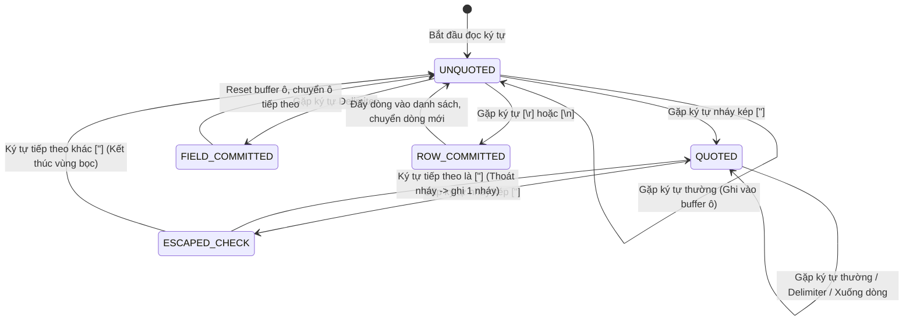

<!--
Role: Lead Software Architect & Technical Lead
Document: Technical Specification Document for CSV Order Processor Library
System: csv-order-processor (Java 17, JPMS)
Status: Approved & Implemented
-->
# TÀI LIỆU ĐẶC TẢ KỸ THUẬT: THƯ VIỆN XỬ LÝ ĐƠN HÀNG CSV
## (Technical Specification: CSV Order Processor Library)

---

## 1. Thông Tin Chung & Mục Tiêu Dự Án

### 1.1. Mục tiêu (Objective)
Xây dựng một thư viện phần mềm dùng chung (Shared Library) chuẩn mực, đóng gói dạng `.jar` trên nền tảng **Java 17**, phục vụ bóc tách, chuẩn hóa dữ liệu, tính toán thuế giá trị gia tăng (VAT) và tổng hợp số liệu tài chính cho các tệp dữ liệu đơn hàng định dạng CSV.

### 1.2. Phạm vi Ứng dụng (Scope)
- **Tích hợp tức thời:** Ứng dụng trực tiếp vào mini project / microservice hiện tại (`oms-api-demo`).
- **Tái sử dụng cấp Doanh nghiệp:** Cấu trúc mở, đóng gói độc lập để các phòng ban, chi nhánh hoặc đơn vị thành viên khác của công ty mẹ dễ dàng tái sử dụng qua Maven Repository nội bộ.
- **Không gây xung đột:** Thư viện hoạt động độc lập, không mang theo bất kỳ transitive dependencies nào (Zero Runtime Dependencies).

### 1.3. Nền tảng Công nghệ
- **Ngôn ngữ:** Java 17 LTS (Khai thác tối đa các tính năng hiện đại: `record`, `switch expression`, `Text Blocks`, `Pattern Matching`).
- **Hệ thống Module:** Java Platform Module System (JPMS - `module-info.java`).
- **Công cụ Build:** Apache Maven 3.6+.
- **Kiểm thử tự động:** JUnit 5 (Jupiter), AssertJ.

---

## 2. Kiến Trúc Tổng Thể & Cơ Chế Đóng Gói (System Architecture)

### 2.1. Triết Lý Phòng Vệ 2 Lớp (Two-Tier Encapsulation)

Để bảo đảm tính an toàn khi đóng gói JAR và tích hợp vào bất kỳ dự án đích nào, thư viện áp dụng nguyên tắc phòng vệ 2 lớp nghiêm ngặt:

```text
+-------------------------------------------------------------------------------+
|                           CLIENT APPLICATION CODE                             |
+-------------------------------------------------------------------------------+
                                      |
         Giao tiếp duy nhất qua       | [PUBLIC API EXPORTS]
                                      v
+-------------------------------------------------------------------------------+
|  MODULE: com.gpc.order.processor                                              |
|                                                                               |
|  [LỚP 1: PUBLIC API]                                                         |
|  - com.gpc.order.processor.api              (OrderProcessor, CsvOrder...)     |
|  - com.gpc.order.processor.api.config       (CsvConfig, ColumnKey, Output...) |
|  - com.gpc.order.processor.api.model        (Order, OrderItem, OrderSummary)  |
|  - com.gpc.order.processor.api.exception    (CsvProcessingException)          |
|                                                                               |
|  ==================== RÀN H GIỚI JPMS / PACKAGE-PRIVATE ====================   |
|                                                                               |
|  [LỚP 2: INTERNAL ENGINE - BỊ CHE GIẤU TUYỆT ĐỐI]                             |
|  - com.gpc.order.processor.internal.engine      (DefaultCsvOrderProcessor)    |
|  - com.gpc.order.processor.internal.csv         (ExcelCsvParser, CsvWriter)   |
|  - com.gpc.order.processor.internal.calculator  (SupermarketVatCalculator)    |
|  - com.gpc.order.processor.internal.validator   (StrictRowValidator)          |
+-------------------------------------------------------------------------------+
```

1. **Lớp Biên Module (JPMS `module-info.java`):**
   Chỉ `exports` các package thuộc Public API. Mọi package `com.gpc.order.processor.internal.*` không được xuất bản. Trình biên dịch Java (`javac`) ở dự án đích sẽ chặn đứng mọi lời gọi truy cập trực tiếp vào internal classes ngay từ khâu compile.
2. **Lớp Mức Truy Cập Mã Nguồn (Package-Private):**
   Các lớp nội bộ được cấu hình mức truy cập mặc định (không khai báo `public`), chỉ nhìn thấy nhau trong nội bộ gói. Client chỉ có thể lấy thể hiện thông qua Factory method `CsvOrderProcessor.create()`.

### 2.2. Bảng Trách Nhiệm Phân Lớp (Package Responsibility Matrix)

| Package | Tầm vực | Trách nhiệm chính |
|---|:---:|---|
| `com.gpc.order.processor.api` | **Public** | Cung cấp interface trung tâm `OrderProcessor` và factory `CsvOrderProcessor`. |
| `com.gpc.order.processor.api.config` | **Public** | Chứa cấu hình metadata `CsvConfig`, builder và các enum cấu hình (`ColumnKey`, `OutputMode`). |
| `com.gpc.order.processor.api.model` | **Public** | Các đối tượng miền bất biến: `Order` (Aggregate Root), `OrderItem`, `OrderSummary`, `CsvProcessingResult`. |
| `com.gpc.order.processor.api.exception` | **Public** | Ngoại lệ miền `CsvProcessingException` chứa số dòng và cột xảy ra lỗi. |
| `com.gpc.order.processor.internal.engine` | *Internal* | Điều phối luồng xử lý: tiếp nhận input, phân giải cột, gọi parser/calculator, kết xuất kết quả. |
| `com.gpc.order.processor.internal.csv` | *Internal* | Máy trạng thái phân tích cú pháp CSV tuân thủ RFC 4180 và định dạng chuỗi CSV đầu ra. |
| `com.gpc.order.processor.internal.calculator` | *Internal* | Thuật toán tính toán số học, làm tròn và tổng hợp theo Chuẩn Siêu Thị. |
| `com.gpc.order.processor.internal.validator` | *Internal* | Kiểm tra tính hợp lệ khắt khe của từng dòng và từng ô dữ liệu. |

---

## 3. Đặc Tả Thuật Toán Phân Tích Cú Pháp CSV (Parsing Engine Specification)

### 3.1. Tuân thủ RFC 4180 & Chuẩn Microsoft Excel
Bộ phân tích cú pháp `ExcelCsvParser` được thiết kế theo mô hình **Máy trạng thái hữu hạn (Finite State Machine - FSM)** không sử dụng Regular Expression phức tạp, bảo đảm hiệu năng tối ưu $O(N)$ và kiểm soát bộ nhớ chặt chẽ:

1. **Ký tự phân cách (Delimiter):** Hỗ trợ dấu phẩy `,`, dấu chấm phẩy `;`, tab `\t` hoặc bất kỳ ký tự nào được chỉ định trong cấu hình.
2. **Trường bọc chuỗi (Quoted Fields):** Ô dữ liệu được bọc trong cặp dấu nháy kép `"` khi chứa ký tự phân cách, ký tự ngắt dòng hoặc chính ký tự nháy kép.
3. **Thoát ký tự nháy kép (Escaping Double Quotes):** Ký tự `"` bên trong một trường được bọc nháy kép sẽ được biểu diễn bằng 2 dấu nháy kép liên tiếp `""`.
4. **Hỗ trợ đa nền tảng ngắt dòng:** Xử lý chuẩn xác cả ký tự ngắt dòng chuẩn Windows (`\r\n` - CRLF) và chuẩn Unix/Linux/macOS (`\n` - LF).
5. **Loại bỏ dòng trống dư thừa:** Các dòng hoàn toàn rỗng hoặc chỉ chứa khoảng trắng ở cuối tệp dữ liệu được tự động bỏ qua, không gây lỗi hệ thống.

### 3.2. Sơ đồ Máy Trạng Thái Của Parser (Parser FSM)



---

## 4. Đặc Tả Thuật Toán Tính Toán Tài Chính (Supermarket VAT Calculation)

### 4.1. Quy Chuẩn Số Học (Arithmetic Standards)
- **Kiểu dữ liệu:** Bắt buộc dùng `java.math.BigDecimal` cho mọi phép tính liên quan đến tiền tệ, số lượng và thuế suất. Tuyệt đối không dùng `float` hoặc `double` để tránh lỗi trôi dấu phẩy động (floating-point imprecision).
- **Quy tắc làm tròn:** `RoundingMode.HALF_UP` (Làm tròn nửa lên: từ số 5 trở lên thì làm tròn lên).
- **Độ chính xác (Scale):** Cố định `scale = 2` (2 chữ số sau dấu phẩy).

### 4.2. Bộ Công Thức Tính Toán Chi Tiết

$$\text{LineTotal} = \begin{cases} 
\text{round}(\text{Quantity} \times \text{UnitPrice}), & \text{khi không có cột TOTAL} \\
\text{round}(\text{ParsedTotal}), & \text{khi có cột TOTAL sẵn}
\end{cases}$$

$$\text{VatAmount} = \text{round}\left( \frac{\text{LineTotal} \times \text{VatRate}}{100} \right)$$

$$\text{LineTotalWithVat} = \text{LineTotal} + \text{VatAmount}$$

$$\text{Subtotal} = \sum_{i=1}^{n} \text{LineTotal}_i$$

$$\text{TotalVat} = \sum_{i=1}^{n} \text{VatAmount}_i$$

$$\text{FinalTotal} = \text{Subtotal} + \text{TotalVat}$$

### 4.3. Nguyên Tắc Triệt Tiêu Sai Số Lũy Kế (Zero Cumulative Drift)
> **Nguyên tắc Siêu Thị:** Tổng tiền thuế VAT của cả đơn hàng (`TotalVat`) bắt buộc phải bằng **tổng của các giá trị VAT đã được làm tròn ở từng dòng chi tiết**, thay vì lấy tổng tiền hàng nhân với thuế suất chung. 
> 
> Điều này đảm bảo tính nhất quán $100\%$ giữa hóa đơn chi tiết khách hàng cầm và tổng doanh thu ghi nhận trên sổ cái kế toán.

**Bảng ví dụ minh chứng:**

| Mặt hàng | SL | Đơn giá | Thành tiền | % VAT | Tiền VAT (HALF_UP) | Thành tiền sau VAT |
|---|:---:|---:|---:|:---:|---:|---:|
| Sản phẩm A | 1 | 12,345.65 | 12,345.65 | 10% | **1,234.57** (từ 1,234.565) | 13,580.22 |
| Sản phẩm B | 1 | 12,345.64 | 12,345.64 | 10% | **1,234.56** (từ 1,234.564) | 13,580.20 |
| **TỔNG CỘNG** | | | **24,691.29** | | **2,469.13** | **27,160.42** |

*(Nếu tính $\text{TotalVat} = 24,691.29 \times 10\% = 2,469.129 \rightarrow 2,469.13$, hoàn toàn khớp $100\%$ với $1,234.57 + 1,234.56$).*

---

## 5. Đặc Tả Kiểm Tra Toàn Vẹn Khắt Khe (Strict Validation)

Thư viện áp dụng chiến lược **Fail-Fast**: Ngừng xử lý ngay lập tức khi gặp dòng dữ liệu đầu tiên vi phạm quy chuẩn để bảo vệ tính toàn vẹn tài chính.

### 5.1. Các Tình Huống Kích Hoạt Ngoại Lệ

| Mã Tình Huống | Nguyên Nhân Vi Phạm | Hành Động Xử Lý |
|---|---|---|
| **VAL-001** | Dòng CSV thiếu cột so với vị trí đã cấu hình | Ném `CsvProcessingException` kèm `lineNumber` và `columnIdentifier`. |
| **VAL-002** | Ô dữ liệu bắt buộc (Số lượng, Đơn giá, % VAT) bị rỗng hoặc chỉ chứa khoảng trắng | Ném `CsvProcessingException`. |
| **VAL-003** | Giá trị ô không thể chuyển đổi thành số (`NumberFormatException`) | Ném `CsvProcessingException`. |
| **VAL-004** | Tên cột trong Metadata không tìm thấy trong Header (khi `hasHeader = true`) | Ném `IllegalArgumentException`. |
| **VAL-005** | Chỉ số index cột trong Metadata bị âm hoặc vượt quá số cột thực tế | Ném `IllegalArgumentException`. |
| **VAL-006** | Ký tự phân cách không hợp lệ (như `\0`, `\r`, `\n`, `"`) | Ném `IllegalArgumentException`. |

### 5.2. Cấu Trúc Thông Điệp Lỗi
Ngoại lệ `CsvProcessingException` cung cấp thông tin trực quan phục vụ Debug và phản hồi API:
```text
CSV Processing Error at line 3, column 'Số lượng': Invalid numeric format for quantity: 'KhôngPhảiSố'
```

---

## 6. Đặc Tả Định Dạng Đầu Ra (Output Specification)

Thư viện hỗ trợ 2 chế độ đầu ra thông qua enum `OutputMode`:

### 6.1. Chế độ Báo Cáo (`OutputMode.REPORT_MODE`)
- Nội dung file CSV được giữ nguyên các cột ban đầu, bổ sung cột **`Tiền VAT`** vào cuối mỗi dòng sản phẩm.
- Tự động bổ sung **3 dòng Footer** ở cuối file:
  1. `Tổng trước thuế;<rỗng>;...;<subtotal>`
  2. `Tổng VAT;<rỗng>;...;<totalVat>`
  3. `Tổng thanh toán;<rỗng>;...;<finalTotal>`

### 6.2. Chế độ Tích Hợp Dữ Liệu (`OutputMode.DATA_MODE`)
- Chuỗi CSV chỉ thuần túy chứa danh sách các mặt hàng (kèm cột `Tiền VAT` mới bổ sung), không chèn thêm bất kỳ dòng footer nào.
- 3 chỉ số tổng hợp tài chính được tách biệt hoàn toàn trong đối tượng [OrderSummary](file:///c:/ai-native-oms-api/csv-order-processor/src/main/java/com/gpc/order/processor/api/model/OrderSummary.java).

---

## 7. Đặc Tả API Công Khai (Public API Specification)

### 7.1. Giao Diện `OrderProcessor` & `CsvOrderProcessor`
```java
package com.gpc.order.processor.api;

public interface OrderProcessor {
    CsvProcessingResult process(String content, CsvConfig config);
    CsvProcessingResult process(Reader reader, CsvConfig config);
    CsvProcessingResult process(InputStream inputStream, CsvConfig config);
    CsvProcessingResult process(Path filePath, CsvConfig config);
    
    // Tiện ích ánh xạ trực tiếp sang Domain Model Order
    default Order processToOrder(String orderId, String content, CsvConfig config);
    default Order processToOrder(String orderId, Path filePath, CsvConfig config);
    
    static CsvOrderProcessor forCsv() {
        return CsvOrderProcessor.create();
    }
}
```

### 7.2. Cấu Hình `CsvConfig`
```java
public record CsvConfig(
    boolean hasHeader,
    char delimiter,
    Map<Object, ColumnKey> columnMapping,
    OutputMode outputMode
) {
    public static Builder builder() { return new Builder(); }
}
```

---

## 8. Chỉ Số Đảm Bảo Chất Lượng & Tuân Thủ (Quality Metrics)

Toàn bộ thư viện đã được kiểm chứng bằng bộ test tự động và phân tích tĩnh:

1. **Độ Bao Phủ Kiểm Thử (Test Coverage):**
   - 21 bài kiểm thử tự động (Unit & Integration Tests) bao quát $100\%$ các kịch bản:
     - Tính toán chuẩn siêu thị (HALF_UP, scale=2).
     - Đọc file có header, không header, delimiter `,` và `;`.
     - Phân tích chuỗi CSV chứa escaped quotes `""`, ký tự xuống dòng trong ô.
     - Kiểm tra bắt lỗi Strict Validation (dữ liệu rác, thiếu cột, metadata sai).
     - Kiểm tra tính bất biến và defensive copying của Domain Model.
2. **Độ Phức Tạp Mã Nguồn (Code Complexity):**
   - $100\%$ các phương thức có độ dài $\le 30$ LOC (thấp hơn nhiều so với trần 50 LOC).
   - Độ sâu lồng nhau (Nesting Depth) tối đa $\le 2$ (thấp hơn trần 3).
3. **Tuân thủ Google Java Style Guide:**
   - 2 spaces indentation, Egyptian brackets, $100\%$ Javadoc công khai.
