# Sổ Tay Vận Hành AI-Native SDLC (Master Prompt Playbook)

Tài liệu này tổng hợp toàn bộ chuỗi Prompt chuẩn mực theo cấu trúc **Role - Task - Constraints - Done When** phục vụ xây dựng và phát triển một dự án phần mềm theo phương pháp **AI-Native Software Development Life Cycle (SDLC)**.

---

## 1. Sơ Đồ Quy Trình 17 Giai Đoạn Tuyến Tính (Pha 00 - 15 kèm 04B)

```mermaid
graph TD
    subgraph "Giai đoạn 0: Khởi tạo Nền móng & AI Governance"
        P0["Pha 0: Khởi tạo Scaffolding & AI Governance (00-project-scaffolding-and-governance.prompt.md)"]
    end

    subgraph "Giai đoạn 1-3: Đặc tả & Kiểm toán Ngữ cảnh (Spec-Driven)"
        P0 --> P1["Pha 1: Phân tích Nghiệp vụ & Mô hình hóa Miền (01-business-analysis-and-domain.prompt.md)"]
        P1 --> P2["Pha 2: Thiết kế Kiến trúc & Hợp đồng API (02-technical-architecture-and-api-spec.prompt.md)"]
        P2 --> P3["Pha 3: Kiểm toán Ngữ cảnh AI & Đồng bộ Đặc tả (03-ai-context-auditing-and-remediation.prompt.md)"]
    end

    subgraph "Giai đoạn 4-6: Hiện thực hóa & Nghiệm thu Chất lượng"
        P3 --> P4["Pha 4: Hiện thực hóa Mã nguồn theo Đặc tả (04-spec-driven-implementation.prompt.md)"]
        P4 --> P4B["Pha 4B: Đồng bộ Toàn diện Bản thảo Kỹ thuật (04b-supplementary-drafts-generation.prompt.md)"]
        P4B --> P5["Pha 5: Kiểm thử Tự động & 100% JaCoCo Coverage (05-automated-testing-and-jacoco-coverage.prompt.md)"]
        P5 --> P6["Pha 6: Nghiệm thu Trực quan & Test Console (06-interactive-verification-and-console.prompt.md)"]
    end

    subgraph "Giai đoạn 7-9: Đối soát Mã nguồn, Bàn giao & An ninh"
        P6 --> P7["Pha 7: Kiểm toán Toàn diện Mã nguồn vs Đặc tả (07-comprehensive-code-review-audit.prompt.md)"]
        P7 --> P8["Pha 8: Lập Hồ Sơ Bàn Giao Kỹ Thuật & Vận Hành (08-system-handover-documentation.prompt.md)"]
        P8 --> P9["Pha 9: Kiểm Định Bảo Mật & Lập Hồ Sơ An Ninh Bàn Giao (09-security-audit-and-vulnerability-assessment.prompt.md)"]
    end

    subgraph "Giai đoạn 10-15: Đóng gói Container, CI/CD, Tối ưu & Tự động Thẩm định"
        P9 --> P10["Pha 10: Đóng Gói Container & CI/CD Pipeline (10-docker-and-cicd-pipeline.prompt.md)"]
        P10 --> P11["Pha 11: Vòng Lặp Sửa Lỗi & Tiến Hóa Tính Năng (11-feature-evolution-and-bugfix.prompt.md)"]
        P11 --> P12["Pha 12: Đồng Bộ & Cập Nhật Tài Liệu Sau Khi Fix Code (12-post-fix-documentation-synchronization.prompt.md)"]
        P12 --> P13["Pha 13: Kiểm Tra & Triển Khai Coding Rules & Design Patterns (13-coding-rules-and-design-patterns-enforcement.prompt.md)"]
        P13 --> P14["Pha 14: Tối Ưu Cú Pháp, Hiệu Năng & Tái Sử Dụng Mã Nguồn (14-syntax-performance-and-code-reuse-optimization.prompt.md)"]
        P14 --> P15["Pha 15: Sinh Checklist Nghiêm Ngặt & Tự Động Xuất Bằng Chứng Kiểm Định (15-strict-checklist-and-automated-audit-generation.prompt.md)"]
    end
```

---

## 2. Danh Mục Các Prompt Chi Tiết

| STT | Tên Tệp Prompt | Vai Trò (Role) | Mục Tiêu Chính (Task) | Tiêu Chí Đo Lường (Done When) |
|---|---|---|---|---|
| **00** | [`00-project-scaffolding-and-governance.prompt.md`](00-project-scaffolding-and-governance.prompt.md) | Principal DevOps Architect & AI Context Engineer | Khởi tạo khung dự án từ số 0, `pom.xml`, `.gitignore`, `CONTRIBUTING.md`, và `.github/copilot-instructions.md` | `./mvnw clean compile` Green, AI Guardrails sẵn sàng, Git repo chuẩn hóa |
| **01** | [`01-business-analysis-and-domain.prompt.md`](01-business-analysis-and-domain.prompt.md) | Principal Business Analyst & DDD Strategic Architect | Phân tích bài toán, xác định Aggregate Root, Value Objects, và State Machine | Bảng thực thể 4 cột, ma trận 9 trạng thái không mơ hồ |
| **02** | [`02-technical-architecture-and-api-spec.prompt.md`](02-technical-architecture-and-api-spec.prompt.md) | Principal API Architect & Security Specialist | Thiết kế hợp đồng RESTful, bảo mật RBAC, và quy chuẩn lỗi RFC 7807 | Bảng Schema Request/Response, Step-by-step logic, Ma trận lỗi URN |
| **03** | [`03-ai-context-auditing-and-remediation.prompt.md`](03-ai-context-auditing-and-remediation.prompt.md) | Senior AI Context Auditor & Quality Assurance | Rà soát khoảng trống ngữ cảnh, vá điểm gãy vỡ, triệt tiêu ảo giác | Báo cáo kiểm toán, đồng bộ 100% tài liệu, tạo `03-CONTEXT_INDEX.md` |
| **04** | [`04-spec-driven-implementation.prompt.md`](04-spec-driven-implementation.prompt.md) | Principal Software Engineer & Spring Boot 3.3 Architect | Sinh toàn bộ mã nguồn Clean Architecture 3 tầng từ docs/ đã kiểm toán | Flyway SQL, Entity, DTO Record, Service, Controller, Exception Advice |
| **04B** | [`04b-supplementary-drafts-generation.prompt.md`](04b-supplementary-drafts-generation.prompt.md) | Principal Technical Documentation Architect & AI Context Engineer | Đồng bộ & sinh toàn diện các bản thảo kỹ thuật Markdown (Security, Filters, Shared, Tests) đạt 100% Zero-Draft-Drift | 39 Java files mapped 1:1 trong `draft-file-mapping.md`, 0 draft drift |
| **05** | [`05-automated-testing-and-jacoco-coverage.prompt.md`](05-automated-testing-and-jacoco-coverage.prompt.md) | Principal QA Automation Engineer & Testing Specialist | Xây dựng kim tự tháp kiểm thử (Unit, Slice, Repo, E2E) và Quality Gate | `mvn clean verify` 100% Green, 100% Line & Branch JaCoCo Coverage |
| **06** | [`06-interactive-verification-and-console.prompt.md`](06-interactive-verification-and-console.prompt.md) | Senior Full-Stack QA Engineer & UI Specialist | Xây dựng Web Test Console trực quan để nghiệm thu trên trình duyệt | UI Dark Slate/Glassmorphic, Role Switcher, API Inspector thời gian thực |
| **07** | [`07-comprehensive-code-review-audit.prompt.md`](07-comprehensive-code-review-audit.prompt.md) | Lead Software Quality Auditor & Principal Code Review Architect | Kiểm toán đối chiếu 100% dòng code với toàn bộ 9 tài liệu đặc tả markdown | Báo cáo kiểm toán, ma trận truy vết 1-1, điểm số tuân thủ, Production Verdict |
| **08** | [`08-system-handover-documentation.prompt.md`](08-system-handover-documentation.prompt.md) | Principal Technical Delivery Lead & SRE Architect | Tổng hợp mã nguồn, kiểm thử, cấu hình để lập Hồ Sơ Bàn Giao Kỹ Thuật Toàn Diện | File `08-SYSTEM_HANDOVER.md` 9 phần tiêu chuẩn, sẵn sàng vận hành & ký nghiệm thu |
| **09** | [`09-security-audit-and-vulnerability-assessment.prompt.md`](09-security-audit-and-vulnerability-assessment.prompt.md) | Principal Application Security Architect & DevSecOps Lead | Thẩm định OWASP API Top 10, CWE, dò quét bug issue và lập Hồ Sơ An Ninh Bàn Giao | File `09-SECURITY_HANDOVER_REPORT.md` 8 phần tiêu chuẩn, Hardening Roadmap P0-P2 |
| **10** | [`10-docker-and-cicd-pipeline.prompt.md`](10-docker-and-cicd-pipeline.prompt.md) | Lead DevSecOps Architect & Cloud-Native Engineer | Đóng gói Multi-Stage Dockerfile (non-root), Docker Compose và GitHub Actions CI/CD | `docker build` thành công, `.github/workflows/ci.yml` kiểm định tự động |
| **11** | [`11-feature-evolution-and-bugfix.prompt.md`](11-feature-evolution-and-bugfix.prompt.md) | Principal SRE & Spec-Driven Evolution Specialist | Quy trình tiếp nhận Issue, Spec-First Bugfix, Red-Green test, mở Atomic PR | Zero Regression, Spec đồng bộ 100% với Code, JaCoCo Coverage bảo toàn |
| **12** | [`12-post-fix-documentation-synchronization.prompt.md`](12-post-fix-documentation-synchronization.prompt.md) | Principal Technical Documentation Architect & Quality Compliance Auditor | Rà soát Git diff sau khi fix code, dò quét độ lệch và cập nhật đồng bộ toàn bộ tài liệu Markdown | Ma trận Spec Drift 100% resolved, docs/ và code đồng bộ tuyệt đối |
| **13** | [`13-coding-rules-and-design-patterns-enforcement.prompt.md`](13-coding-rules-and-design-patterns-enforcement.prompt.md) | Principal Java Software Architect & Code Quality Auditor | Kiểm tra và triển khai áp dụng bộ quy chuẩn Oracle Coding Rules & Design Patterns lên toàn bộ code và markdown | 100% code & docs tuân thủ chuẩn Oracle, JaCoCo 100% Green, Zero Regression |
| **14** | [`14-syntax-performance-and-code-reuse-optimization.prompt.md`](14-syntax-performance-and-code-reuse-optimization.prompt.md) | Principal Java Performance Architect & Code Quality Specialist | Tối ưu hóa cú pháp Java 17, hiệu năng máy ảo (JVM / GC), và thúc đẩy tái sử dụng mã nguồn (DRY, Test Fixture Pattern) | Ma trận tối ưu hóa 100%, JaCoCo 100% Green, Zero Regression, PR Atomic |
| **15** | [`15-strict-checklist-and-automated-audit-generation.prompt.md`](15-strict-checklist-and-automated-audit-generation.prompt.md) | Principal AI-Native SDLC Architect & Quality Gate Automation Lead | Chuyển hóa yêu cầu thành checklist dạng bảng/Boolean, tự động kiểm thử và xuất file `docs/audit-logs/checklist-[feature]-[date].md` | 100% tests pass, JaCoCo 100%, file checklist vật lý ghi nhận 100% `[x] PASS` với log evidence |

---

## 3. Nguyên Tắc Cốt Lõi Vận Hành AI-Native SDLC

1. **Table-Driven Data:** Toàn bộ thực thể dữ liệu, request body, response body, tham số truy vấn bắt buộc biểu diễn bằng Markdown Table 4 cột `[Tên trường, Kiểu dữ liệu, Bắt buộc/Nullable, Mô tả nghiệp vụ]`.
2. **One-Way Dependency Flow:** Code chỉ được sinh sau khi tài liệu đặc tả đã được kiểm toán (Giai đoạn 3). Không code trước đặc tả.
3. **Strict Gate Enforcement:** Mọi PR bắt buộc phải vượt qua các chốt chặn tự động (Automated Quality Gates):
   - Không còn xung đột ngữ cảnh.
   - Biên dịch 0 warning, 0 error.
   - JaCoCo Line và Branch Coverage đạt ngưỡng tối thiểu theo yêu cầu (100% cho các package nghiệp vụ cốt lõi).
