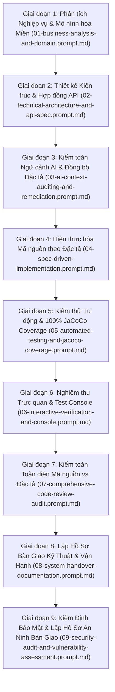

# Sổ Tay Vận Hành AI-Native SDLC (Master Prompt Playbook)

Tài liệu này tổng hợp toàn bộ chuỗi Prompt chuẩn mực theo cấu trúc **Role - Task - Constraints - Done When** phục vụ xây dựng và phát triển một dự án phần mềm theo phương pháp **AI-Native Software Development Life Cycle (SDLC)**.

---

## 1. Sơ Đồ Quy Trình 9 Giai Đoạn Tuyến Tính

---

## 2. Danh Mục Các Prompt Chi Tiết

| STT | Tên Tệp Prompt | Vai Trò (Role) | Mục Tiêu Chính (Task) | Tiêu Chí Đo Lường (Done When) |
|---|---|---|---|---|
| **01** | [`01-business-analysis-and-domain.prompt.md`](01-business-analysis-and-domain.prompt.md) | Principal Business Analyst & DDD Strategic Architect | Phân tích bài toán, xác định Aggregate Root, Value Objects, và State Machine | Bảng thực thể 4 cột, ma trận 9 trạng thái không mơ hồ |
| **02** | [`02-technical-architecture-and-api-spec.prompt.md`](02-technical-architecture-and-api-spec.prompt.md) | Principal API Architect & Security Specialist | Thiết kế hợp đồng RESTful, bảo mật RBAC, và quy chuẩn lỗi RFC 7807 | Bảng Schema Request/Response, Step-by-step logic, Ma trận lỗi URN |
| **03** | [`03-ai-context-auditing-and-remediation.prompt.md`](03-ai-context-auditing-and-remediation.prompt.md) | Senior AI Context Auditor & Quality Assurance | Rà soát khoảng trống ngữ cảnh, vá điểm gãy vỡ, triệt tiêu ảo giác | Báo cáo kiểm toán, đồng bộ 100% tài liệu, tạo `CONTEXT_INDEX.md` |
| **04** | [`04-spec-driven-implementation.prompt.md`](04-spec-driven-implementation.prompt.md) | Principal Software Engineer & Spring Boot 3.3 Architect | Sinh toàn bộ mã nguồn Clean Architecture 3 tầng từ docs/ đã kiểm toán | Flyway SQL, Entity, DTO Record, Service, Controller, Exception Advice |
| **05** | [`05-automated-testing-and-jacoco-coverage.prompt.md`](05-automated-testing-and-jacoco-coverage.prompt.md) | Principal QA Automation Engineer & Testing Specialist | Xây dựng kim tự tháp kiểm thử (Unit, Slice, Repo, E2E) và Quality Gate | `mvn clean verify` 100% Green, 100% Line & Branch JaCoCo Coverage |
| **06** | [`06-interactive-verification-and-console.prompt.md`](06-interactive-verification-and-console.prompt.md) | Senior Full-Stack QA Engineer & UI Specialist | Xây dựng Web Test Console trực quan để nghiệm thu trên trình duyệt | UI Dark Slate/Glassmorphic, Role Switcher, API Inspector thời gian thực |
| **07** | [`07-comprehensive-code-review-audit.prompt.md`](07-comprehensive-code-review-audit.prompt.md) | Lead Software Quality Auditor & Principal Code Review Architect | Kiểm toán đối chiếu 100% dòng code với toàn bộ 9 tài liệu đặc tả markdown | Báo cáo kiểm toán, ma trận truy vết 1-1, điểm số tuân thủ, Production Verdict |
| **08** | [`08-system-handover-documentation.prompt.md`](08-system-handover-documentation.prompt.md) | Principal Technical Delivery Lead & SRE Architect | Tổng hợp mã nguồn, kiểm thử, cấu hình để lập Hồ Sơ Bàn Giao Kỹ Thuật Toàn Diện | File `SYSTEM_HANDOVER.md` 9 phần tiêu chuẩn, sẵn sàng vận hành & ký nghiệm thu |
| **09** | [`09-security-audit-and-vulnerability-assessment.prompt.md`](09-security-audit-and-vulnerability-assessment.prompt.md) | Principal Application Security Architect & DevSecOps Lead | Thẩm định OWASP API Top 10, CWE, dò quét bug issue và lập Hồ Sơ An Ninh Bàn Giao | File `SECURITY_HANDOVER_REPORT.md` 8 phần tiêu chuẩn, Hardening Roadmap P0-P2 |

---

## 3. Nguyên Tắc Cốt Lõi Vận Hành AI-Native SDLC

1. **Table-Driven Data:** Toàn bộ thực thể dữ liệu, request body, response body, tham số truy vấn bắt buộc biểu diễn bằng Markdown Table 4 cột `[Tên trường, Kiểu dữ liệu, Bắt buộc/Nullable, Mô tả nghiệp vụ]`.
2. **One-Way Dependency Flow:** Code chỉ được sinh sau khi tài liệu đặc tả đã được kiểm toán (Giai đoạn 3). Không code trước đặc tả.
3. **Strict Gate Enforcement:** Mọi PR bắt buộc phải vượt qua các chốt chặn tự động (Automated Quality Gates):
   - Không còn xung đột ngữ cảnh.
   - Biên dịch 0 warning, 0 error.
   - JaCoCo Line và Branch Coverage đạt ngưỡng tối thiểu theo yêu cầu (100% cho các package nghiệp vụ cốt lõi).
